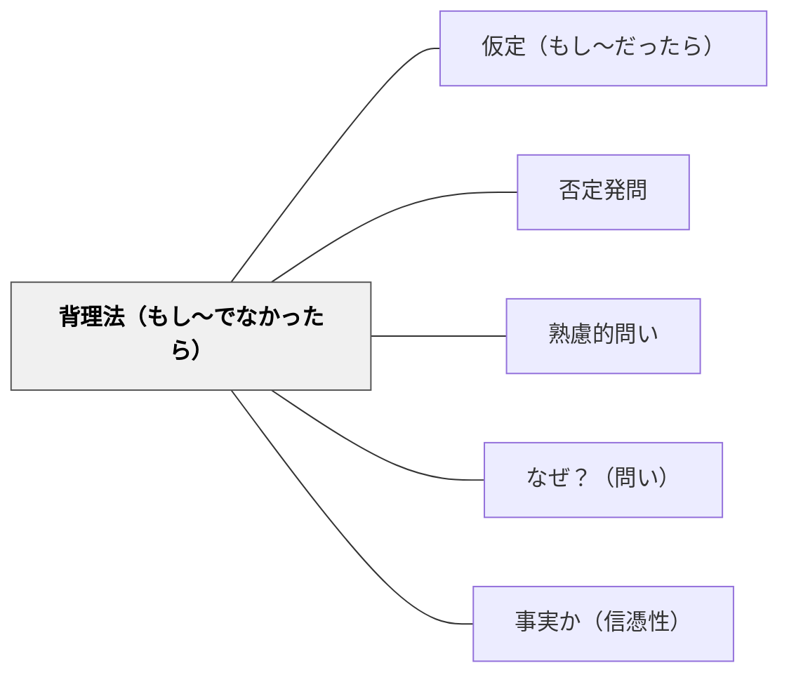

# 背理法（もし〜でなかったら）

> 否定的仮定から出発し、論理的矛盾を通じて真実に迫る問いの型。

## 背景（Context）
ある命題を直接証明することが難しいとき、その否定が真であると仮定して矛盾を導き出すことで、元の命題の真偽を証明できる。これが背理法（帰謬法）の論理である。この思考形式は数学に限らず、主張の根拠を試す批判的思考にも広く応用できる。

## 問題（Problem）
直接的に「なぜそうなるか」を示す証拠や論理が見つからないとき、思考が行き詰まる。また「もしそうでなかったら」という反実仮想の問いは、思考の柔軟性を高める重要な訓練になるが、意識的に使わないと見過ごされやすい。

## 力のかたち（Forces）
- 否定から出発することで、正面から見えなかった構造が見えることがある
- 矛盾を発見するプロセスが、問題の本質的な論理構造を明らかにする
- 反実仮想の思考は創造的な問題解決にも応用できる
- 仮定を明示することで、議論の前提を整理する効果もある

## 解決（Solution）
「もしこれが〇〇でなかったとしたら、どうなるだろう？」と問いかける。例えば「もし√2が有理数でなかったとしたら矛盾が生じるか試そう」と数学的背理法を導入する。また「もし地球温暖化が人為的でなかったとしたら、データをどう説明するか？」のように科学的推論にも応用できる。否定的仮定→論理的展開→矛盾の発見という手順を明示することが重要である。

## 結果（Consequences）
- 直接証明が困難な命題に対する新たなアプローチが開ける
- 論理的思考力と反実仮想の想像力が同時に鍛えられる
- 前提を疑う批判的思考の習慣が育つ

## 関連パタン
- [[パタン/仮定（もし〜だったら）]]
- [[パタン/否定発問]]
- [[パタン/熟慮的問い]] — 親パタン
- [[パタン/なぜ？（問い）]] — 理由・原因を深く問う補完的パタン
- [[パタン/事実か（信憑性）]] — 主張の根拠を問う批判的思考

## クラスター図

## Actionable Insight

- 主張を評価するとき「もしこれが正しくないとしたら、何が崩れるか？」と問いかける——否定から出発することで正面から見えなかった論理の構造が浮かび上がる
- 「否定的仮定→論理的展開→矛盾の発見」という手順を明示して学習者に使い方を教える——手順の可視化が背理法的思考を学習者自身の道具にする
- 「もしこのデータが○○を支持しないとしたら、どう説明するか？」のように具体的な文脈で問う——日常的なテーマに適用することで反実仮想の思考が批判的思考の習慣として育つ

## 出典
- [[文献/熟慮的問いのパターンリスト（動画記録）]]
