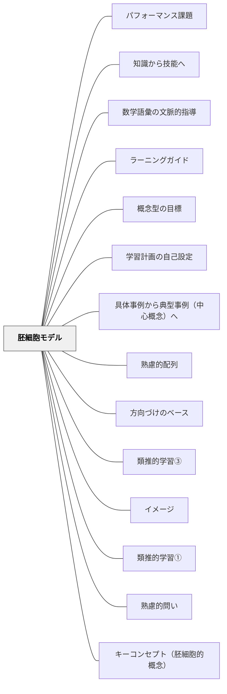

# 胚細胞モデル

**一文でいうと**：単元全体を貫く中心概念を見つけ、その核から活動や問いを展開する。

## 使いどころ・使いすぎ注意

| 観点         | 内容                                         |
| ------------ | -------------------------------------------- |
| 使いどころ   | 単元の核となる概念を見つけたいとき。         |
| 使いすぎ注意 | 核を一つに絞りすぎると、多様な見方を落とす。 |

> 観察可能な行動・手続きの背後にある原理を問え。胚細胞的な概念の理解によって、他の場面への転移が可能となる。

## 背景（Context）

「こうなりたい」という学習のイメージはある。しかし、なぜ・どのようにそうなるのか分からない。また、そのイメージはどこから来たのか、どこへ向かっていくのか。良いイメージを持てたとしても、その背景にある原理を理解していないということがある。

## 問題（Problem）

具体的なイメージだけでは、うまくいかなかったときに何をどう変えればよいかわからない。また、ある場面で学んだことが別の場面で応用できない。観察可能な行動や手続きを真似るだけでは、転移可能な力は育たない。

## 力のかたち（Forces）

- 教材研究・対象活動の徹底的な理解なしに良い教授は生まれない——そこに近道はない
- 背景原理を理解しないまま技術だけを教えると、状況が変わったときに応用できない
- 胚細胞的な概念（鍵となる概念）を軸に設計すると、目標・活動・評価が一貫してくる
- 抽象的な概念は具体的な事例と結びついてはじめて学習者に届く

## 解決（Solution）

**胚細胞的な概念を明らかにし、教育設計の軸に据えよ。**

胚細胞モデルとは、ユーリア・エンゲストロームが提唱する「方向づけベース」の一つである。学習には、強力な鍵となる胚細胞的な概念やモデルが必要だ。観察可能な行動・手続きの背後にある原理を問うことで、胚細胞的な概念やモデルの理解によって他の場面での転移（応用）が可能となる。

---

> 「学習を理解し、よい教授を生み出すには、何よりもまず、学習の対象となる活動を理解する必要がある。よい学習やよい教授というものは、対象活動の具体的・歴史的な内容や条件から独立して『一般的に』存在するわけではない。もし、生産的な仕事関連の学習を生み出したいのであれば、何よりも、特定の仕事活動そのものについて徹底的に調べる必要がある。そこに近道は存在しない。」  
> ——ユーリア・エンゲストローム「変革を生む研修のデザイン」鳳書房

> 「材料とそれらがどう作用するかを理解することなくケーキを焼くことは、目隠しされてケーキを焼くようなものです。時にはすべてうまくいきます。しかし、うまくいかなかったときには、それをどう変えればよいかを推測しなくてはなりません。この理解によってこそ、私は創造的になりうるのですし、成功することもできるのです。」  
> ——ローズ・レヴィ・ベレンバウム「ケーキのバイブル」

---

### 事例①：体育「ゴール型ゲーム」——スペースという胚細胞的概念

体育のゴール型ゲーム全てに通じる概念に**スペース**がある。ハンドボールでもサッカーでもバスケでも、突き詰めると「スペースを狙ってフリーでゴールと向き合える状態をどのように作るか」という話になってくる。

この「スペース」を鍵となる概念として教育設計の軸に置くと、生徒が何を学べばよいかのゴールデザインに役立つ。スペースという概念から必要な技能・動きを逆算できる：

**攻撃側**

- 狙った場所にボールを投げる・蹴る技能（正確なパス）
- スペースを作るボールを持っていない味方の動き
- スペースへ走り込む動き
- パスを受ける技術：サッカーのトラップ、バスケ・ハンドボールではキャッチ

**守備側**

- スペースが生まれないようにカバーし合う絞り
- スペースを消す動き

サッカーで身につけた「スペースを作る動き・スペースに走る動き・狙った場所にボールを出す技能・スペースを消す絞り」が、バスケやハンドボールなど他のゴール型ゲームでもそのまま生かせるようになる。スペースという胚細胞的概念があるからこそ、競技が変わっても転移できる。

---

### 事例②：国語「海の命」（6年生）——成長という胚細胞的概念

ある授業研究で関わった6年生の国語授業（「海の命」の読書会）の実践。授業の中で子どもたちはテーマ（話題）を自分たちで作り、そのテーマによって自分たちでグループを組んで話し合い、さらに授業内で目的に応じてグループを組み直して話し合っていた。

これができた理由は、**話し合う価値のあるテーマ選定に成功していた**からだったと思う。

教育設計の軸に据えた概念：**成長**——多くの物語・文学作品に共通する胚細胞的な鍵概念。

- 「成長とはどういうことか」「自分の成長を支えるものは何だろうか」
- テキストの解釈を深めることにも、成長という問いに答えることにも、自分自身の成長について考えることにも価値のあるテーマとして機能した
- 自分自身のこれまでの経験や読書とも結びつけて考えることを目指していた

授業で生まれた具体的なテーマ例：「**村一番と一人前にはどのような違いがあるのだろうか**」——あるグループの子どもたちはこのテーマに対して熱心に解釈を伝え合っていた。「成長」という胚細胞的概念が教育設計の軸にあったからこそ選ばれたテーマだった。

読書会のテーマ選定から授業全体を通じて「成長」という概念が貫いていたことが、子どもたちが自律的にグループを組み直し話し合いを深める原動力になっていた。

---

### 教育そのものの胚細胞的概念を考える

Dewey, J. (1938). _Experience and Education_. Macmillan.（邦訳：市村尚久訳（2004）『経験と教育』講談社学術文庫）より：

> 「何よりも重要なことは、持たれる経験の質にかかっているのである。経験の2つの側面がある：（1）快適と不快の側面、（2）経験がその後の経験にどのような影響を及ぼすのかという側面。教育者の基本的責任は、どのような環境が成長に導くような経験をする上で役立つかについて具体的に認識することである。」

**教育の胚細胞的概念：意図的に・目的的に設計・構造化された経験。**

教育のために設計・構造化された経験に含まれる概念——

> 目的・目標・説明・指示・質問（発問）・教材教具・教育方法・教育技術・評価・環境デザイン・配列（シークエンス）・学習形態・グループサイズなど

これらがそれぞれ「経験の設計」というレンズで統一されてくる。

---

**イメージというパタンと胚細胞モデルはセットで考える。** 抽象的な胚細胞的概念が具体的なイメージに結びつくよう、モデルとなる事例を複数示し、類推的学習にしていくことが重要だ。

胚細胞的概念は、ウィギンズらの言う「鍵となる概念（キーコンセプト）」とほぼ同じものと捉えている。少なくとも同じ方向にあり、物事の背後にあり転移可能な原理や概念を明らかにすることを目指している。

## 結果（Consequences）

- 学んだことが別の場面へ転移・応用できる力が育つ
- 目標・活動・評価が胚細胞的概念によって一貫し、教育設計が引き締まる
- 学習者が「なぜそうするのか」を理解することで、うまくいかなかったときに自分で修正できるようになる
- 話し合う価値のある問いが生まれ、子どもたちが自律的に学習を組み立てていく

## 関連パタン
- [[パタン/パフォーマンス課題]]
- [[パタン/知識から技能へ]]
- [[パタン/数学語彙の文脈的指導]]
- [[パタン/ラーニングガイド]]
- [[パタン/概念型の目標]]
- [[パタン/学習計画の自己設定]]
- [[パタン/具体事例から典型事例（中心概念）へ]]
- [[パタン/熟慮的配列]]
- [[パタン/方向づけのベース]]
- [[パタン/類推的学習③]]

- [[パタン/イメージ]] — 胚細胞モデルとセットで考える
- [[パタン/類推的学習①]] — 胚細胞的概念を複数の事例から帰納的に学ぶ
- [[パタン/熟慮的問い]] — 胚細胞的概念を問い起こす発問設計
- [[概念/概念型の目標と胚細胞モデル]]
- [[パタン/キーコンセプト（胚細胞的概念）]]

## クラスター図

## Actionable Insight

- 次の単元の「胚細胞（核となる概念）」を1つ言葉にする——その概念から他の全てが展開できるかどうかが教材研究の出発点
- 「この教材のエッセンスを1文で言うと？」と問う——言えなければ胚細胞がまだ見えていない
- 胚細胞モデルで教材を分析したら、それを学習者が自分で体験できる活動に変換する——概念の説明より体験が深い理解を生む
- 教材研究で「この単元の胚細胞は何か？」を同僚に1分で語ってみる——説明できれば胚細胞が見えている証拠
- 単元末に「今回の授業で一番大事だったことを1文で書こう」と問う——子どもの答えが胚細胞に近ければ概念が定着している
- 「この活動はどの核心的概念につながっているか？」と毎回確認する——枝葉の活動を胚細胞に根ざしたものにする設計の自己チェック

## 出典
- [[文献/一つの教育のパタン・ランゲージ]]
- [[文献/みるみる（個別最適な学び）]]

ユーリア・エンゲストローム「変革を生む研修のデザイン」鳳書房  
ローズ・レヴィ・ベレンバウム「ケーキのバイブル」  
Dewey, J. (1938). _Experience and Education_. Macmillan.（邦訳：市村尚久訳（2004）『経験と教育』講談社学術文庫）  
岩井輝久「岩井輝久『一つの教育のパタン・ランゲージ』」（2026-04-29 vault収録）  
岩井輝久「パタン　胚細胞モデル（動画記録）」https://youtu.be/SGlSZLoYp5I
