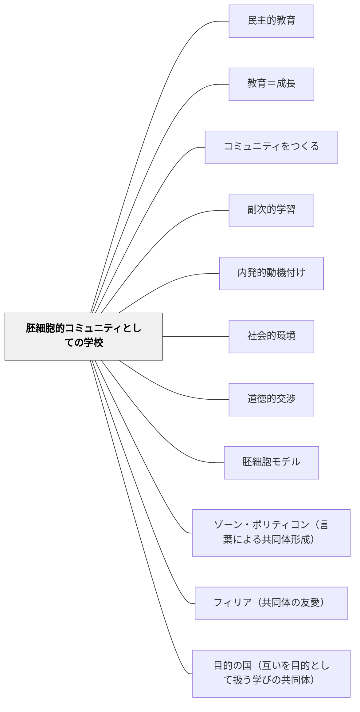

# 胚細胞的コミュニティとしての学校

> 学校は社会生活への準備ではなく、社会生活そのものである。

---

## Pattern Connection

**Dewey（1909）Moral Principles in Education 統合（2026-05-31）：**

本パタンはDeweyの *Moral Principles in Education*（1909）Ch.2の命題をパタン化したものである。Deweyはここで、学校教育の根本的な誤りとして「社会生活なしに社会的徳を育てようとすること」を挙げた。

> "The school must itself be a community in order that it may be genuinely educative. When the school introduces and trains each child of society into membership within such a little community, saturating him with the spirit of service, and providing him with the instruments of effective self-direction, we shall have the deepest and best guarantee of a larger society which is worthy, lovely, and harmonious."（Ch.2）

- **既存パタンとの関連**：[[パタン/民主的教育]]（Dewey, 1916）が「民主主義は共同生活の様式（a mode of associated living）」と定義するとき、その哲学的前提として本パタンが機能する。民主的教育の根拠は「学校それ自体がコミュニティであること」にある。
- **補強された点**：[[パタン/コミュニティをつくる]] に「なぜ学校コミュニティを作るのか」という哲学的根拠が加わる。「将来役立てるため」ではなく「社会的徳はコミュニティ生活の中でしか育たない」という論理的必然性。
- **修正・拡張された点**：「胚細胞モデル」は [[パタン/胚細胞モデル]]（教科の中心概念として機能する原理）と同じ比喩を用いる。学校は「社会生活の縮小版（胚細胞）」として、大きな社会の本質的構造を内包する。
- **他のパタンへの波及**：[[パタン/副次的学習]]（社会生活の中で形成される道徳的態度）・[[パタン/内発的動機付け]]（現在の社会的関心が内発的動機の源泉）・[[パタン/教育＝成長]]（成長の舞台としての学校コミュニティ）

---

## 背景（Context）

多くの学校が「将来の社会への準備」という枠組みで設計されている。子どもたちは「大人になったときに役立つ」知識や態度を習得する場として学校を経験する。道徳教育も同様に、将来の市民として必要な徳目を「教える」ものとして設計されがちである。

Deweyは1909年に「水なしに泳ぐことを教える」という比喩でこの発想の根本的な問題を指摘した：泳ぎ方の知識をいくら蓄積しても、水のない場所では泳げない。同様に、社会的な徳目をいくら「教えて」も、社会的生活の経験なしには徳は育たない。

## 問題（Problem）

「社会生活への準備」として学校を設計すると、社会生活そのものが欠如する。

- 道徳教育が「徳目の情報（道徳についての観念）」を伝えるだけになり、行為を変える「道徳的観念」が形成されない
- 「競争心と恐怖（fear and emulation）」が動機づけの主な手段になり、社会的関心が育たない
- 「大人になって役立つ」という遠い将来への動機は、子どもの現在の関与には届かない
- 個人としての徳の修得を目指すが、徳は本来社会的文脈の中でしか意味を持たない

## 力のかたち（Forces）

- 社会的知性・社会的力・社会的関心（道徳の三位一体）は、社会生活の中でしか育たない
- 「共に生活するプロセスそのものが教育する（The very process of living together educates）」——Dewey
- 子どもの現在の関心と問いに接続しない動機（未来のため・将来役立つ）は届かない
- 徳（character）は力・判断・共感の三要素を含み、どれも社会的経験なしには発達しない
- 競争心・恐怖は個人の行為を動かすが、社会的関心・共同体への献身は育てない

## 解決（Solution）

**学校それ自体を典型的なコミュニティとして設計する。社会生活の準備ではなく、社会生活そのものにする。**

Deweyの「道徳の三位一体（Moral Trinity of the School）」を解決の柱とする：

| 要素 | 内容 | 教室での実践 |
|---|---|---|
| **Social intelligence（社会的知性）** | 他者との関係の中で判断する力 | 対話・討論・共同問題解決 |
| **Social power（社会的力）** | 社会的目標に向けて行動する力 | 共同プロジェクト・役割分担・コミュニティへの貢献 |
| **Social interests（社会的関心）** | 他者と共同体への関心 | 他者の問いを自分の問いとして引き受ける経験 |

---

### 「水なしに泳ぐ」からの脱却

「将来の社会への準備」として設計された授業と、「現在のコミュニティ生活」として設計された授業の違い：

| 準備として | コミュニティ生活として |
|---|---|
| 徳目を「教える」——情報の伝達 | 社会的場面の中で徳を「経験する」 |
| 遠い将来への動機 | 現在の共同体への関心 |
| 競争心と恐怖で行動させる | 社会的関心と協力で行動する |
| 「個人の成績」を評価する | 「コミュニティへの貢献」を見取る |
| 規則を「守らせる」 | 規則を「一緒に作る」 |

---

### 実践例：胚細胞的コミュニティとしての学校設計

**例1：算数の「問題作り」**

子ども同士が算数問題を作り合い、互いに解く活動は「社会的関心」から出発する。「友達の問題を解く」という社会的動機が算数への内発的関与を生む。計算の練習という「将来の準備」より、今ここの協力関係が学習の質を高める。

**例2：クラス新聞・出版活動**

誰かに読まれる文章を書く（ライティング・ワークショップ）は、コミュニティの一員として情報を共有する社会的行為である。「国語のスキル習得」より「読み手であるクラスメートへの貢献」が動機の基盤になる。

**例3：クラス会議・共同ルール作り**

規則をトップダウンで「教える」のでなく、クラスが直面している社会的問題（揉め事・不公平感）を議題にして共同で解決策を考える——これが「胚細胞的コミュニティ」としての道徳教育。

---

### 道徳の三位一体と授業設計の問い

**Social intelligence（社会的知性）を育てる問い：**
- この活動で、子どもは他者の立場から判断する経験をするか
- 「自分だけの正解」ではなく「共に考えた答え」に向かっているか

**Social power（社会的力）を育てる問い：**
- この活動でのアウトプットは、コミュニティの中で実際に機能するか
- 子どもの行動が「クラスのため」「誰かのため」という社会的目標に向かっているか

**Social interests（社会的関心）を育てる問い：**
- 他者の問い・困り・喜びに関心を持つ機会が設計されているか
- 「自分の成績」より「他者との共同」が動機の中心になっているか

---

## 自己教育での適用例

岩井自身のWiki構築・パタン・ランゲージ研究は、「自分という小さなコミュニティの実践」として位置づけられる。

Deweyは「学校は胚細胞的コミュニティである」と論じたが、自己教育においても同様の問いが成立する：「自分が今参加しているコミュニティ（Obsidian Wiki・パタン研究コミュニティ・子どもたちの教室）の中で、何を社会的知性・社会的力・社会的関心として実践しているか」。

Wikiは孤独な情報蓄積でなく、「パタンを使う人・読む人・批判する人」との仮想的コミュニティへの参加として設計している——これが「社会生活そのものとしての自己学習」の実践例。

---

## 結果（Consequences）

- 道徳教育が「徳目の授業」から「コミュニティ生活の設計」へと転換する
- 子どもは社会生活の実際の参加者として、社会的知性・社会的力・社会的関心を育てる
- 「大人になってから役立つ」という遠い動機でなく、今ここのコミュニティへの関心が内発的動機になる
- 競争心・恐怖による管理でなく、共同体への貢献が行動の動機になる
- ただし、「コミュニティ生活として設計する」ことは、教科の系統的な指導と矛盾しない——共同活動を通じて教科の本質的な問いに迫ることができる

## 関連パタン

- [[パタン/民主的教育]] — 「学校＝胚細胞的コミュニティ」はDeweyの民主的教育の哲学的根拠
- [[パタン/教育＝成長]] — 成長の舞台としてのコミュニティ
- [[パタン/コミュニティをつくる]] — 本パタンが問う「なぜ」に対して「どのように」を答えるパタン
- [[パタン/副次的学習]] — 社会生活の中で副次的に形成される道徳的態度
- [[パタン/内発的動機付け]] — 現在の社会的関心（social interests）が内発的動機の源泉
- [[パタン/社会的環境]] — 学校コミュニティを環境として設計する
- [[パタン/道徳的交渉]] — 「行為を改善する観念（moral ideas）」の授受の場
- [[パタン/胚細胞モデル]] — 同じ「胚細胞」比喩の教科的応用
- [[パタン/ゾーン・ポリティコン（言葉による共同体形成）]] — ロゴスによるコミュニティ形成
- [[パタン/フィリア（共同体の友愛）]] — 友愛が共同体の基盤
- [[パタン/目的の国（互いを目的として扱う学びの共同体）]] — 互いを手段でなく目的として扱うコミュニティ

---

## クラスター図

## Actionable Insight

- 今週の授業で「この活動はコミュニティへの貢献になっているか」を一度問う——「個人の成績のため」から「誰かのために、みんなのために」という動機への転換の第一歩
- 道徳的な問いを「道徳の時間」だけでなく、国語・算数・社会の授業の中に日常的に埋め込む——「この登場人物の判断はどう思うか」「このルールは公平か」という問いが社会的知性を育てる
- 子どもが作ったもの・考えたものが「クラスの誰かの役に立つ」場面を意図的に設計する——出版・掲示・発表・互いに教え合う活動がコミュニティへの貢献を実体化する
- 「大人になって役立つ」という理由を減らし、「今のクラスでこれが必要だから」という現在の社会的動機に置き換える

---

## 出典

Dewey, J. (1909). *Moral Principles in Education*. Houghton Mifflin.

> "The moral and the intellectual are fundamentally the same—the school must itself be a community in order that it may be genuinely educative."（Ch.2）

> "The very process of living together educates."——Dewey（Ch.2）

[[文献/Moral Principles in Education（Dewey）]]  
[[文献/Democracy and Education（Dewey）]]  
[[文献/Experience and Education（Dewey）]]
