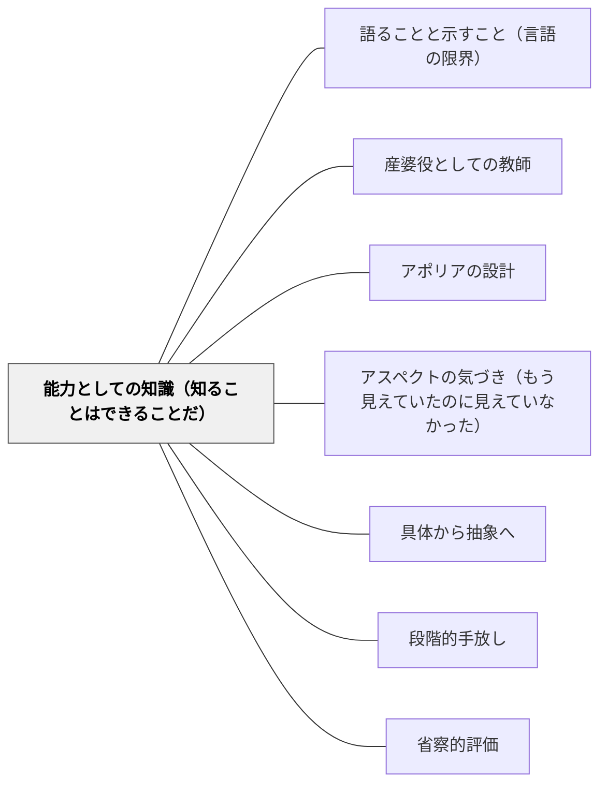

# 能力としての知識（知ることはできることだ）

> 「知る」の文法は「できる」の文法と密接に関連する。——ウィトゲンシュタイン（PI 150）  
> 知識は持つものではなく、発動するものだ。

## [Pattern Connection]

### Kern（2026）——知識-能力の視点：PI/OCからの展開

Andrea Kern *Wittgenstein and Skepticism*（2026）は、ウィトゲンシュタイン後期哲学（特にPI・OC）における「能力としての知識」の意味を詳細に分析する。

**「know」の文法は「can」に近い（PI 150）：**

ウィトゲンシュタインは「知るという語の文法は、明らかに『できる』『〜できる』という語の文法と密接に関係している（To have mastered a technique）」と述べる。これは知識が何であるかについての根本的な再記述である。

**知識は内的状態ではない：**

「知っている」という状態は、頭の中の隠れた記憶や信念の状態ではなく、共有された実践の中で顕れる能力の発動である。「リンゴが何かを知っている」とは「リンゴと言われたとき、リンゴを前にしたとき、適切に反応できる」という能力の保有を意味する。

**離接主義（Disjunctivism）：**

能力の発動には二つの形しかない——「完全な発動」（＝知識）か「阻害された発動」（＝知識でない）か。中間の「どちらにもなり得る共通状態」はない。たとえば「二つの手を見ている」とき、その知覚は「二つの手があることを知る完全な発動」か「何らかの阻害（暗さ・幻覚など）によって不完全な発動」かのどちらかである。「あいまいに知っている」という状態は、「阻害された発動」である。

**修復（restore）としての教育：**

懐疑論者は「知識は持てない」と自分の能力を否定する。Kernは、ウィトゲンシュタインの目的が懐疑論を「論駁（refute）」することではなく、懐疑論者が自分で使えなくしてしまった能力を「修復（restore）」することだと論じる。

これは教育に転換できる：学習者が「わからない」「できない」と感じているとき、教師の仕事は「情報を与えて論駁する」のではなく、その学習者がすでに持っている能力を自分で発動できる状態に「修復する」ことである。

**既存パタンとの関連：**

- **産婆役としての教師への接続**：産婆役が「知識は伝達し得べからず」（牧口）という命題から出発するとすれば、知識-能力の視点はその根拠を「能力の発動は外から注入できない」として明確にする
- **語ることと示すことへの接続**：「示す」ことは能力の発動を体現すること。示された体現が学習者の能力を呼び覚ます
- **波及するパタン**：[[パタン/アポリアの設計]] — アポリアは「能力の阻害された発動」が意識化される瞬間；[[パタン/産婆役としての教師]] — 産婆役の仕事は知識の注入ではなく能力発動の条件整備；[[パタン/アスペクトの気づき（もう見えていたのに見えていなかった）]] — アスペクト転換は能力の完全発動が突然起きる瞬間

---

## 背景（Context）

学校教育では「知識を持っているかどうか」という問いが評価・指導の中心を占めることが多い。テスト・確認問題・理解チェック——これらはすべて「知識を持っているか」という観点から設計されている。

しかし「知っている」という状態は何か。頭の中に情報が格納されていること？ある問いに正しく答えられること？——実はこの「知っている」という概念が教育実践で曖昧に使われている。

ウィトゲンシュタインは「know」の文法が「can（できる）」に近いことに気づいた（PI 150）。この観察は教育の実践に根本的な問い直しを迫る——学習者が「知っている」状態にあるとはどういうことか。

## 問題（Problem）

「知識を持っているかどうか」という視点から学習を設計すると、次の問題が生じる：

- 「わかった」「知っている」と言わせる形式的な確認が目的になる
- 「知っている状態」を外から確認できないという問題が生じ、テストが代理指標になる
- 学習者の「わからない」が「知識の不足」として扱われ、情報の追加で解決しようとする
- 「すでに知っているはず」なのに「できない」という矛盾が説明できない

## 力のかたち（Forces）

- 「知っている」状態は観察できないが、「できる」状態は観察できる
- 能力は発動の条件（環境・文脈・状態）に依存する——同じ学習者でも条件が変わると「できる」「できない」が変わる
- 「能力の阻害」として捉えると、「何が阻害しているか」という問いが可能になる
- 能力の発動は練習・経験によって安定していく——これが「習熟」の構造

## 解決（Solution）

**「知識を持っているか」ではなく「能力が発動できているか」を問いの軸に置く。学習者の「できない」は能力の欠如でなく能力の阻害として捉え、阻害要因を取り除く設計をする。評価は「知識の確認」ではなく「能力の発動の観察」として行う。**

---

### 実践のシフト①：問いを変える

| 知識の問い | 能力の問い |
|---|---|
| 「これを知っていますか？」 | 「これができますか？」 |
| 「答えはなんですか？」 | 「どうすればいいか説明できますか？」 |
| 「覚えていますか？」 | 「使えますか？」 |
| 「理解しましたか？」 | 「別の問題にも使えますか？」 |

---

### 実践のシフト②：「できない」の読み替え

学習者が「わからない」「できない」と言うとき：

❌「知識が足りないから情報を追加しよう」（知識-状態の視点）  
✅「何かが能力の発動を阻害している——何が阻害しているか」（知識-能力の視点）

阻害要因の例：
- 文脈の問題（学んだ文脈と違う文脈で問われている）
- 前提の問題（必要な前提能力がまだ発動していない）
- 心理的な問題（「できない」と感じることで能力が使えなくなっている）
- 表現の問題（能力はあるが、それを表現する言語的能力が阻害されている）

---

### 実践のシフト③：修復的な授業設計

能力-知識の視点では、授業の目的は「新しい知識を注入すること」ではなく「すでに持っている能力を発動できる状態を修復・育成すること」になる。

- 直角の概念を「教える」のではなく、学習者がすでに持っている「直角とはこういうもの」という感覚的理解を言語化・精密化する
- 物語の読み方を「教える」のではなく、子どもがすでに日常会話でやっている「人の気持ちを読む」能力を物語に発動できるようにする
- 掛け算の意味を「教える」のではなく、「同じものがたくさんある」という体験的な能力を数式として表現できるようにする

---

### 自己教育への適用

数学の自己学習において：
- 「この概念を知っているか」ではなく「この概念を使えるか」を自己確認の軸に置く
- 解けない問題に直面したとき「知識が足りない」より「何かが能力の発動を阻害している」と問い直す——阻害要因（前提の不足・文脈の違い・問いの読み間違い）を特定する
- 「わかった」は「使える」に置き換えて確認する——別の文脈・別の形式の問題に使えるかを試す

## 結果（Consequences）

- 「わからない」という学習者への見方が「知識のない人」から「能力が阻害されている人」に変わる——修復的な指導姿勢が生まれる
- 学習目標が「知識の習得」から「能力の安定した発動」に変わり、評価も観察可能な形になる
- 「できる人」「できない人」という固定的な見方が、「今・この文脈で・この条件で発動できるかどうか」という状況依存的な見方に変わる
- ただし：「能力の阻害」を探し過ぎると、「実際に前提知識が足りていないだけ」という場合を見逃す——能力の発動には前提能力の積み重ねが必要な場合もある

## 関連パタン

- [[パタン/語ることと示すこと（言語の限界）]] — 「示す」ことは能力の発動を体現すること
- [[パタン/産婆役としての教師]] — 産婆役＝知識注入でなく能力発動の助産
- [[パタン/アポリアの設計]] — アポリアは能力が阻害される瞬間の意識化
- [[パタン/アスペクトの気づき（もう見えていたのに見えていなかった）]] — アスペクト転換は能力の完全発動が突然起きる瞬間
- [[パタン/具体から抽象へ]] — 能力の発動は具体的な文脈から始まる
- [[パタン/段階的手放し]] — 能力が安定するにつれて足場を外す
- [[パタン/省察的評価]] — 能力の発動を自己観察する
- [[文献/Wittgenstein and Skepticism（Kern）]] — 本統合の出典

## クラスター図

## Actionable Insight

- 今週の授業の目標を「知識の習得」ではなく「能力の発動」として書き直してみる——「〜を知る」を「〜ができる」「〜を使って〜できる」に変換する
- 「できない」と言う学習者に「何かが邪魔をしている」と問い返す——「どこまではできる？」「どこで止まる？」と聞いて阻害点を特定する
- テストや確認問題を「持っている知識の確認」ではなく「能力の発動の観察」として設計し直す——「一度も見たことのない形式の問題で使えるか」を確認する

## 出典

Kern, A. (2026). *Wittgenstein and Skepticism*. Cambridge Elements: The Philosophy of Ludwig Wittgenstein. Cambridge University Press.  
DOI: https://doi.org/10.1017/9781009592567

> "The grammar of the word 'know' is evidently closely related to the grammar of the words 'can,' 'is able to.'" ——Wittgenstein, Philosophical Investigations §150
