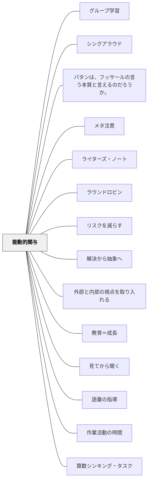

# 能動的関与

> 学習者が受け身でなく、自ら考え・問い・動くことで学習に能動的に関わる機会を意図的につくれ。

## [Pattern Connection]

### Dewey（1916）

**補強された点**：Dewey（1916）は能動的関与を「本物の知識の条件」として哲学的に根拠づける。「すること（doing）」なしに本物の知識はないという命題は、能動的関与を「効果的な学習戦略」としてではなく「知識の本質的条件」として捉え直す。

> "There is no such thing as genuine knowledge and fruitful understanding except as the offspring of doing."（Dewey, 1916, Ch.20）

**教師と学習者の教科内容の違い（Ch.14）**：能動的関与が重要な理由のひとつは、学習者にとっての知識が「①やり方の知識→②情報→③科学的知識」という段階を経るからだ。①は身体的・実践的な「すること」からしか始まらない。教師がすでに③の段階にいる概念を、①のない学習者に③のまま渡すことが「能動的関与のない授業の根本的問題」。

**身体を排除した授業への批判**：

> "The chief source of the 'problem of discipline' in schools is that the teacher has often to spend the larger part of the time in suppressing the bodily activities which take the mind away from its material."（Dewey, 1916, Ch.11）

Deweyによれば、身体活動を排除することで「心が逃げていく問題」が起きている——つまり「じっと座って集中させる」ことが能動的関与を生んでいない。身体を通じた「すること」が、心を素材に留める最も根本的な方法。

**社会的活動の意義**：能動的関与は孤立した活動でなく「社会的な起源と用途をもつ活動（active occupations having a social origin and use）」のときに最も豊かになる。共同調理・ガーデニング・木工・地域探索などは、単なる体験活動ではなく科学・社会・歴史への本物の入口として機能する（Dewey, 1916, Ch.14 Summary）。

**他のパタンへの波及**：[[メタパタン/経験から出発する]] の「doing+undergoing の結合」が能動的関与の条件を説明する。[[パタン/反省的思考の5段階]] は能動的関与を通じて起きる思考プロセスを示す。

---

### Bergin et al.（2012）

Bergin et al.（2012）*Pedagogical Patterns* は、能動的関与を実現するための具体的なパタン群（Active Learning category）として構造化されている。

- **補強点**：PPのActive Learningカテゴリの中核にある問いは「どうすれば学習者を能動的に関与させられるか」——[[パタン/見てから聞く]]（体験→講義）、[[パタン/グループ学習]]（グループが相互フィードバックの場）、[[パタン/自分で探求する]]（自律的探求）、[[パタン/省察]]（内省による自己主導）がその実装パタン群
- **拡張点**：PPでは「能動的関与」を引き出す最も強力な構造として [[パタン/非可視の教師]] を挙げる——教師が問題解決の窓口でなく「ピアへ向かわせる者」になると、クラス全体が相互作用する能動的学習環境になる
- **他のパタンへの波及**：[[パタン/問いを大切にする]] — 問いを歓迎する文化が能動的関与の心理的土台。[[パタン/チャレンジ理解]] — 理解を試す活動が能動的関与を生む。[[パタン/自分の言葉で]] — 説明する活動は能動的関与の典型的な形

---

## 背景（Context）

受け身の情報受容（聞くだけ・見るだけ）より、能動的な処理（考える・答える・作る・教える）の方が記憶への定着と理解の深さが異なることは認知科学の知見として蓄積されている。能動的関与（Active Engagement）は、学習者が学習プロセスに主体的に参加することを指す。

## 問題（Problem）

教師が説明し続け、子どもたちはただ聴いているだけの授業では表面的な学習にとどまる。「分かりましたか？」に「はい」と答えても、実際に使えるとは限らない。

## 力のかたち（Forces）

- 人は自分が考えたこと・選択したこと・作ったことを記憶に残しやすい
- 受動的な姿勢は習慣化すると主体性の低下につながる
- 能動的関与は心理的安全性が確保されていないと起きにくい

## 解決（Solution）

**学習者が「考える・選ぶ・作る・伝える・試す」機会を授業に意図的に組み込む。**

- 問いかけ→個人思考→ペア共有→全体共有の流れを設計する
- 選択肢を与えて子どもが選ぶ機会をつくる（[[パタン/自己選択自己決定]]）
- 作る活動・説明する活動・教え合う活動を組み込む（[[パタン/作ることで学ぶ]]）
- 沈黙の間を設けて、考える時間を保証する（[[パタン/沈黙の間の設計]]）

## 結果（Consequences）

- 理解が深まり、知識が定着しやすくなる
- 学習への主体性・意欲が高まる
- 自己調整学習の素地が育まれる

## 関連パタン
- [[特別支援/身体と学習]]
- [[教科/LowFloorHighCeilingタスク集]]
- [[教科/算数・数学で使うパタン]]
- [[特別支援/特別支援級の算数指導]]
- [[パタン/グループ学習]]
- [[パタン/シンクアラウド]]
- [[パタン/パタンは、フッサールの言う本質と言えるのだろうか。]]
- [[パタン/メタ注意]]
- [[パタン/ライターズ・ノート]]
- [[パタン/ラウンドロビン]]
- [[パタン/リスクを減らす]]
- [[パタン/解決から抽象へ]]
- [[パタン/内部と外部それぞれの視点を取り入れる]]
- [[パタン/教育＝成長]]
- [[パタン/見てから聞く]]
- [[パタン/語彙の指導]]
- [[パタン/作業活動の時間]]
- [[パタン/算数シンキング・タスク]]
- [[パタン/失敗を組み込む]]
- [[パタン/主体的行為者としての感覚]]
- [[パタン/重要性の見極め]]
- [[パタン/省察]]
- [[パタン/非可視の教師]]
- [[パタン/複雑指導（Complex Instruction）]]
- [[パタン/豊かな課題]]
- [[パタン/問いを大切にする]]
- [[パタン/問題解決的教材研究]]

- [[パタン/自己選択自己決定]] — 選択が能動的関与を生む
- [[パタン/作ることで学ぶ]] — 作ること自体が能動的関与
- [[パタン/自己調整]] — 能動的関与と自己調整は相互に支え合う
- [[パタン/沈黙の間の設計]] — 考える時間を保証する
- [[パタン/アドベンチャー]] — リスクと挑戦が能動性を引き出す
- [[パタン/反省的思考の5段階]] — 能動的関与を通じて起きる思考プロセス（Dewey）
## このパタンが働く実践
- [[実践/2列メモ（シンクシート）]]
- [[実践/カンファリング（読書会議）]]

| 実践パタン | どのように能動的関与をつくるか |
|------------|--------------------------------|
| [[パタン/ナンバートーク]] | 全員が暗算し、自分の解法を持ってから共有に参加する |
| [[パタン/数学ワークショップ]] | ウォームアップ、個人思考、学習チーム、ジャーナルによって、聞くだけでなく考え・選び・説明する時間をつくる |
| [[パタン/作ることで学ぶ]] | 制作・表現を通して、学習者が知識を自分で構成する |
| [[パタン/アドベンチャー]] | 挑戦や遊びの要素で、自分から動きたくなる状況をつくる |

- [[メタパタン/経験から出発する]] — doing+undergoingの結合が能動的関与の条件（Dewey）

## クラスター図

## Actionable Insight

- 「問いかけ→1分個人思考→ペア共有→全体共有」の流れを1つの授業に1回入れる——受動的な聴講に能動的な処理を挟むだけで定着が変わる
- 学習者が「選ぶ」機会を授業に1カ所作る（どちらのトピックで書くか、どの問題から解くか）——選択が能動的関与の最もシンプルな入り口
- 説明後に「教師に教えるとしたらどう説明するか」を2人で話させる——説明することが最も深い能動的関与の一形態

## 出典

スタブページ——詳細な出典・具体例は今後追記。
[[文献/Pedagogical Patterns Advice For Educators（Berginほか）]]
