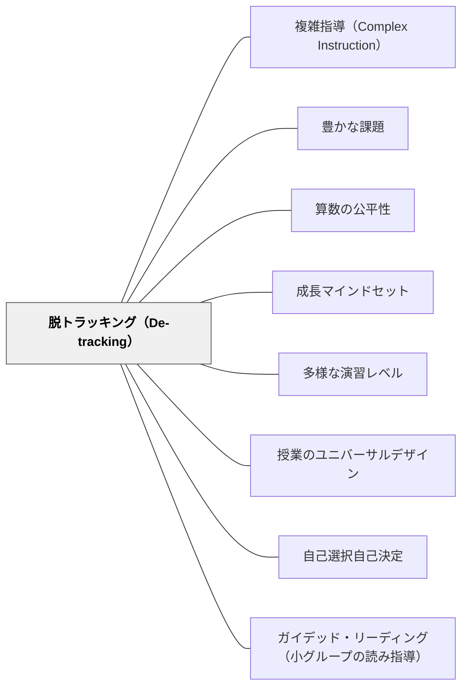

# 脱トラッキング（De-tracking）

> 能力別グループ分けは、「あなたはここまで」という最強の固定マインドセットメッセージである。

## [Pattern Connection]

Boaler（2016）Ch.7「From Tracking to Growth Mindset Grouping」が一次資料。Burris et al.（2006）のNY市実験・Boaler & Staples（2008）のRailside School研究が根拠。

- **既存パタンとの関連**: [[パタン/成長マインドセット]] の「能力は固定されていない」という信念を、グループ編成の実践レベルで実装する。[[パタン/複雑指導（Complex Instruction）]] は脱トラッキング後の混合グループを機能させる指導法
- **日本の文脈**: 「算数少人数指導」という名目で事実上の習熟度別グループ分けが行われることがある。支援級と通常学級の区分も最大のトラッキング構造として捉えられる
- **他のパタンへの波及**: Low Floor High Ceiling タスクなしに脱トラッキングはできない——[[パタン/豊かな課題]] が前提になる

---

## 背景（Context）

「追跡（Tracking）」= 学力別・習熟度別のグループ分け。算数・数学教育で最も広く使われる慣行の一つだが、800人の教師リーダーが「最も害のある教育慣行」として1位に選んだ（Jo Boaler 調査）。

追跡の前提は「同じレベルの子を集めた方が教えやすく、学べる」というものだが、研究はその前提を否定している。最高成績国（韓国・フィンランド・中国）は能力別グループ分けが最少である。

## 問題（Problem）

追跡は「能力は固定されている」というメッセージを制度として表現する。4歳でトラックに入れられた子どものうち88%が生涯そのトラックに留まる（Dixon, 2002、英国）。上位トラックに入ることも、「スマートであり続けなければ」というプレッシャーが失敗への恐れに変わり、生徒を傷つけることがある（Romero, 2013）。

## 力のかたち（Forces）

- 追跡は「学習の差」ではなく「機会の差」を固定化する——低位グループは探究より手順の練習が多くなる
- 早期の追跡は格差の原因でなく結果になる——「苦手だから下位グループ」ではなく「下位グループだからさらに苦手になる」
- 上位グループへの移動は現実にはほとんど起きない——一度入ったトラックで生涯を過ごす
- Low Floor High Ceiling タスクがあれば、混合グループでも全員が参加できる——追跡の必要がない

## 解決（Solution）

**能力別グループを廃止し、豊かな課題と複雑指導を使って混合グループで全員が参加できる設計にする。**

---

### 研究的根拠

**New York City 脱トラッキング実験**（Burris et al., 2006）:
- 中学校で全員に上位カリキュラムを提供（追跡なし）
- 結果：全員が1年早く州試験に合格
- 上位・中位・下位グループすべてで成績向上
- 格差は縮小——追跡がなくても上位生徒の成績は下がらなかった

**Railside School 4年間研究**（Boaler & Staples, 2008）:
- 追跡なし・Complex Instruction 導入
- 4年後に多くの人種的格差が消滅
- 上位生徒も他校の通常クラスと比較して最も成長した
- 生徒の言葉：「前の学校では自分の数学力だけを磨いていた。ここでは社会的にも成長し、助けたり助けられたりすることを学んだ」（Rico, Year 1）

---

### 代替策

| 方法 | 内容 | 参照パタン |
|------|------|----------|
| LFHC タスク設計 | 全員が入れるが探究に上限がない課題で、同じ問いに全員が取り組む | [[パタン/豊かな課題]] |
| Complex Instruction | 多次元性・役割・能力の割り当てで全員が貢献できる構造をつくる | [[パタン/複雑指導（Complex Instruction）]] |
| タスク選択制 | 全員が核となる問題を解いてから「自分でより難しい問いを作る」 | [[パタン/自己選択自己決定]] |
| SMILE 方式 | 個別カードで各自のペースを保ちながら混合グループで学ぶ | — |
| 放課後選択クラス | 追跡でなく選択として追加支援・発展学習を提供する | — |

---

### 日本の文脈での脱トラッキング

| トラッキングの形態 | 代替策 |
|-------------------|--------|
| 算数「少人数・習熟度別」指導 | 「少人数・探究型」指導に変換——同じ少人数でもLFHCタスクで混合グループ |
| 支援級と通常学級の分離 | 算数の交流授業でLFHCタスクを使う——フロアが低いから全員参加できる |
| 「算数が得意な子向け」発展学習 | 全員が「自分でより難しい問いを作る」——発展は誰にも開かれている |

---

## 結果（Consequences）

- 上位・下位どちらの生徒も、混合グループの方が成長する（複数の研究で確認）
- 「算数が得意な子・苦手な子」という固定されたアイデンティティが緩む
- 低位トラックに入れられることの社会的・心理的ダメージがなくなる
- ただし、混合グループを機能させるには LFHC タスクと複雑指導の設計が必須——これなしに混合にしてもうまくいかない

## 関連パタン
- [[教科/LowFloorHighCeilingタスク集]]
- [[教科/算数]]
- [[教科/算数・数学で使うパタン]]

- [[パタン/複雑指導（Complex Instruction）]] — 混合グループを機能させる指導法（最重要）
- [[パタン/豊かな課題]] — LFHC課題が脱トラッキングを可能にする前提条件
- [[パタン/算数の公平性]] — 追跡は格差を固定化する——公平性の実践的取り組み
- [[パタン/成長マインドセット]] — 「能力は固定されていない」という信念が追跡の根拠を崩す
- [[パタン/多様な演習レベル]] — 同一課題内で多様な深さを保証する設計との接続
- [[パタン/授業のユニバーサルデザイン]] — 全員参加の設計思想との接続
- [[パタン/自己選択自己決定]] — 生徒自身が「どこまで進むか」を選ぶ設計
- [[文献/Mathematical Mindsets（Boaler）]] — 一次資料
- [[パタン/ガイデッド・リーディング（小グループの読み指導）]] — 緊張関係にあるパタン。読み指導での小グループ編成は固定化すれば能力別トラッキングに堕ちる——柔軟な組み替えがこの緊張への答え

---

## クラスター図

## Actionable Insight

- 今週の算数の問題を「この問いは、どのグループの子にも入れるか？」という視点で見直す——フロアが高い問題はLFHC形式に改造する
- 支援級の子どもと通常学級の子どもが同じ課題（LFHC設計）に取り組む交流授業を1回計画する
- 「〇〇は算数が苦手な子向け」「〇〇は得意な子向け」という言葉を授業から1週間意識して外してみる
- 今すぐできる脱トラッキング：早く終わった子への「もっと同じ問題を解く」をやめ、「別の見方はある？なぜそうなる？」に変える

---

## 出典

Boaler, J. (2016). *Mathematical Mindsets: Unleashing Students' Potential Through Creative Math, Inspiring Messages and Innovative Teaching*. Jossey-Bass.

Boaler, J., & Staples, M. (2008). Creating mathematical futures through an equitable teaching approach: The case of Railside School. *Teachers College Record*, 110(3), 608–645.

Burris, C. C., Heubert, J. P., & Levin, H. M. (2006). Accelerating mathematics achievement using heterogeneous grouping. *American Educational Research Journal*, 43(1), 103–134.

Dixon, A. (2002). Editorial. *FORUM*, 44(1).

> "Tracking is the most single most damaging practice in American schools." — 800人の教師リーダーによる調査（Boaler, 2016）

[[文献/Mathematical Mindsets（Boaler）]]
