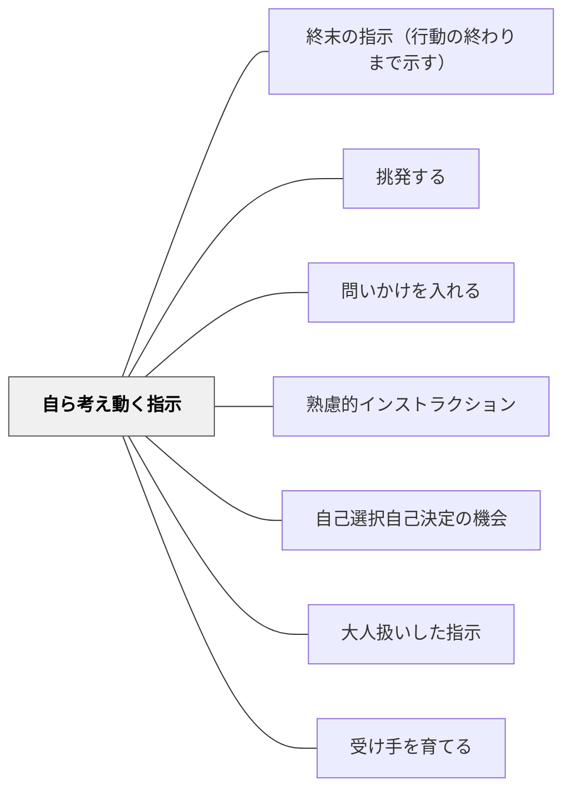

# 自ら考え動く指示

> ゴールを示して手段は委ねる。受け手が自律的に問題を解決できる指示の形。

## 背景（Context）
インストラクションの目標は、受け手が自律的に動ける力を育てることにある。詳細な手順を逐一与える指示は短期的には行動を引き出せるが、長期的には受け手の思考力・判断力の発達を妨げる。土居正博は、受け手が考えて動ける余地を残す指示の重要性を論じている。

## 問題（Problem）
手順を細かく指定しすぎると、受け手はその通りにしか動けなくなる。「次は何をすればいいですか？」と常に指示を求めるようになり、自律的な行動が育たない。一方でゴールだけ示してもサポートがなければ受け手が動けない場合もある。

## 力のかたち（Forces）
- ゴールが明確なほど、手段の自由度を高めても機能する
- 受け手のレベルに応じてどこまで委ねるかを調整する必要がある
- 考える余地があることが主体性と動機を高める
- 過度な委任は混乱を生み、適切な足場がけが必要

## 解決（Solution）
**「〇〇の状態にしてください。やり方は自分で考えて」のようにゴールを示し、手段の選択を受け手に委ねる。**

「好きな方法で」「自分でやりやすい順に」「3通りのやり方のどれかで」など、選択肢を明示したうえで判断を委ねる。受け手のレベルによって「ゴールのみ提示」か「選択肢を示して選ばせる」かを使い分ける。[[パタン/自己選択自己決定の機会]]と組み合わせることで、主体性がさらに高まる。

## 結果（Consequences）
- 受け手の問題解決力・判断力が育つ
- 指示への依存度が下がり、自律的に動ける場面が増える
- 受け手によって取り組み方が多様になり、豊かな学びが生まれる

## クラスター図

## Actionable Insight

- 「教室を元の形に戻してください。やり方は自分たちで考えて」とゴールだけ示して手段を委ねる——ゴールが明確な場面から始めることで自律的な問題解決の練習になる
- 課題に3つの取り組み方の選択肢を用意し「自分に合うものを選んで始めよう」と伝える——選択肢を明示したうえで委ねることが主体性を育てながら混乱を防ぐ
- 「次に何をすればいい？」と聞いてきた学習者には「どう思う？どうしたらいいと思う？」と問い返す——即座に答えず考える機会を返すことが自律的思考を育てる習慣になる

## 出典

- 一つの教育のパタン・ランゲージ（岩井輝久）

## 関連パタン
- [[パタン/終末の指示（行動の終わりまで示す）]]
- [[パタン/挑発する]]
- [[パタン/問いかけを入れる]]
- [[パタン/熟慮的インストラクション]] — 親パタン
- [[パタン/自己選択自己決定の機会]] — 選択・決定の余地をつくる
- [[パタン/大人扱いした指示]] — 自律した存在として委ねる
- [[パタン/受け手を育てる]] — 受け手の自律的な力を育てる
