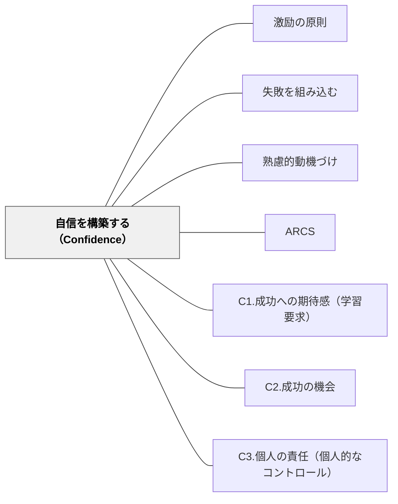

# 自信を構築する（Confidence）

> 「自分にはできる」という感覚が、挑戦を続ける原動力になる。適切な難易度・成功体験・自己コントロール感で自信を育てる。

## 背景（Context）
ARCSモデルの第3要素。学習内容が関連性を持っていても、「どうせ自分にはできない」という感覚があれば行動は起こらない。自己効力感（バンデューラ）と密接に関連し、学習への取り組み方そのものに影響を与える。

## 問題（Problem）
学習者は過去の失敗体験や周囲との比較によって「自分はできない」という信念を持ちやすい。この信念は行動を抑制し、困難に直面したときの諦めにつながる。

## 力のかたち（Forces）
- 自信は成功体験の積み重ねによって形成されるが、失敗が続くと急速に低下する
- 難易度が高すぎると無力感につながり、低すぎると達成感が得られない
- 外から与えられた自信（「あなたはできる」という言葉）より、自分で得た自信のほうが持続する
- 自己コントロール感（自分の行動が結果に影響するという感覚）が自信の基盤となる

## 解決（Solution）
**「できそう」という期待感を高め、実際に成功できる機会を用意し、自分でコントロールしているという感覚を保障することで、自信を構築する。**

成功への期待感を育てる（C1.成功への期待感）、スモールステップや足場がけで成功体験を設計する（C2.成功の機会）、選択や自己決定の機会を与える（C3.個人の責任）という3つのサブパターンを組み合わせる。

## 結果（Consequences）
- 学習者が困難に直面しても粘り強く取り組めるようになる
- 成功体験の蓄積が次の挑戦への動機となる好循環が生まれる
- 教師は「できた」を意図的に設計することの重要性を意識できる

## クラスター図

## Actionable Insight

- 難しい課題の最初に「必ずできる小さな成功体験」を意図的に設計する——最初の成功がその後の挑戦意欲と粘り強さの土台になる
- 学習者がつまずいているとき、難易度を一時的に下げて成功体験を確保してから再び上げる——「できた」の積み重ねが「自分はできる」という信念を育てる
- 「今日〇〇ができました」という具体的な達成を授業の最後に学習者と確認する——成功の言語化が自己効力感を強化し次の挑戦への動機となる

## 出典

- 一つの教育のパタン・ランゲージ（岩井輝久）

## 関連パタン
- [[パタン/激励の原則]]
- [[パタン/失敗を組み込む]]
- [[パタン/熟慮的動機づけ]] — 親パタン
- [[パタン/ARCS]] — 上位フレームワーク
- [[パタン/C1.成功への期待感（学習要求）]] — サブパターン
- [[パタン/C2.成功の機会]] — サブパターン
- [[パタン/C3.個人の責任（個人的なコントロール）]] — サブパターン
