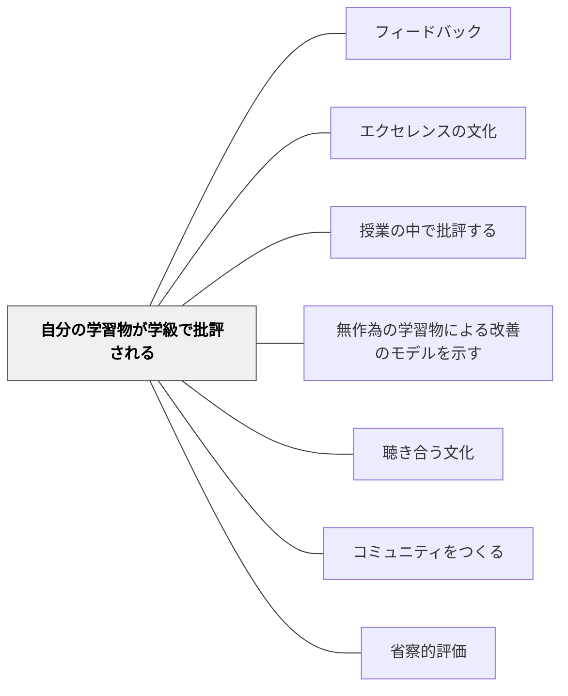

# 自分の学習物が学級で批評される

> 自分の作品がクラスの目にさらされるとき、それが傷つきではなく誇りになるなら、その教室は本物の学習共同体だ。

## 背景（Context）

自分の作品が学級全体で批評されるという経験は、学習者にとって最もインパクトの大きいフィードバック経験の一つだ。匿名での批評や無作為選択とは異なり、自分の作品として公開され、クラスメートと教師全員から批評を受けるこの経験は、エクセレンスの文化が根付いた教室でこそ深い成長につながる。

ロン・バーガーの「An Ethic of Excellence」では、子どもたちの作品が公開されることで、その作品への責任感と誇りが生まれることが示されている。批評が「丁寧で・具体的で・助けになる」ものであることが、この実践を機能させる前提だ。

## 問題（Problem）

自分の作品が公開批評される可能性がある環境では、学習者が「見せられるレベルでないと提出したくない」という萎縮が生まれることがある。あるいは逆に、批評文化が未成熟な教室では、公開批評が個人への傷つきになる危険がある。

この実践が機能するためには、批評の文化的土台（安全・信頼・丁寧さ）と、本人の同意・準備・意欲が必要だ。

## 力のかたち（Forces）

- 公開批評は強力な学習経験だが、準備なしに行うと心理的ダメージを与える
- 本人の了解と意志が前提条件であり、強制は絶対に避ける
- 批評後の作品の改善と再提出のサイクルが、批評を「恥」ではなく「成長の機会」にする

## 解決（Solution）

自分の学習物が学級で批評される経験を設計する際は、以下の条件を満たすことを確認する。(1) 本人の了解と同意を得ている。(2) 批評の枠組み（「丁寧で・具体的で・助けになる」）がクラスで共有されている。(3) 批評後に必ず改善の機会が保証されている。

実践の流れとして、志願者または事前の了解を得た学習者の作品を全体に公開し、まず成功している点を全員で挙げ、次に改善案を全員で議論する。作品の持ち主は批評を聞きながらメモをとり、その後の改善に活かす。文化として成熟すると、「自分の作品を批評してもらいたい」という学習者が増え、公開批評が成長の機会として捉えられるようになる。

## 結果（Consequences）

- 作品の質に対する本人の当事者意識と誇りが高まる
- クラス全体が「良い作品をともに作る」という協働的な目標をもつようになる
- エクセレンスの文化が根付いた教室では、この経験が最も深い学びの一つになる

## 関連パタン
- [[学級経営/学級経営で使えるパタン]]

- [[パタン/フィードバック]] — 親パタン
- [[パタン/エクセレンスの文化]] — この実践が機能するための文化的土台
- [[パタン/授業の中で批評する]] — 批評実践の基盤
- [[パタン/無作為の学習物による改善のモデルを示す]] — 匿名・無作為という前段階の実践

- [[パタン/聴き合う文化]] — 批評を受け入れる聴き合う文化の土台
- [[パタン/コミュニティをつくる]] — 批評が機能するコミュニティの構築
- [[パタン/省察的評価]] — 批評後の振り返りが深い自己評価を生む
## クラスター図

## Actionable Insight

- 最初は本人の了解を必ず得た上で批評を始める——同意が前提であることを文化として確立することが安全な批評文化の出発点
- 批評される前に「どんなフィードバックが欲しいか」を本人に1文言わせる——当事者が批評の方向を指定することで主体性と安全が両立する
- 批評後に作品の改善版を学級で共有する機会を設ける——「批評→改善→公開」のサイクルが批評を誇りに変える

## 出典

Berger, R. (2003). *An Ethic of Excellence*. Heinemann.
Clarke, S. (2014). *Outstanding Formative Assessment*. Hodder Education.
