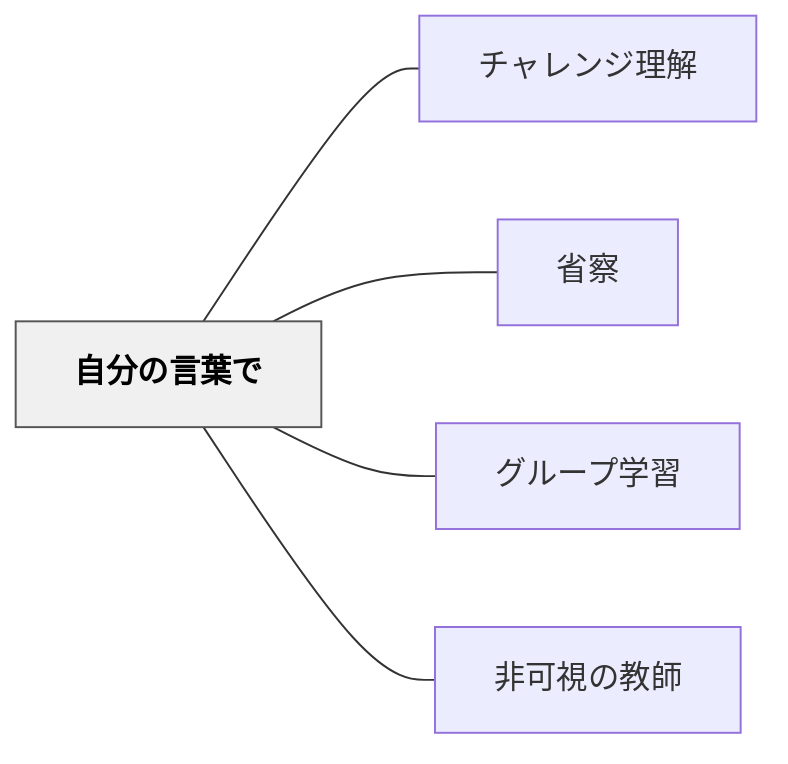

# 自分の言葉で

> 定義を繰り返せることと、理解していることは別物だ——本当にわかっているかは、自分の言葉で言い直せるかどうかに現れる。

## [Pattern Connection]

Bergin et al.（2012）の **Own Words** パタンは、[[パタン/チャレンジ理解]]の「理解を試す」という方向性を、**言語産出の活動**として具体化する点で新しい貢献をもつ。

- **補強点**：[[パタン/省察]]が「経験を内省する」ことを強調するのに対し、本パタンは**他者へ向けた言語化**（説明・議論）が理解の深化と自己確認の両方をもたらすことを示す
- **修正・拡張点**：内向き・外向きの学習者特性（内省型・表出型）への配慮として「まず隣の人に説明する」「ラウンドロビン形式」などの段階的な足場を提案する
- **他のパタンへの波及**：[[パタン/チャレンジ理解]]・[[パタン/省察]]・[[パタン/グループ学習]]

---

## 背景（Context）

複雑な内容や難しい素材を教えるとき、教師は学習者の理解度を確かめたい。しかし時間の制約から、包括的なテストを毎回行うことはできない。また、学習者の自信を損なわずに理解を確認する方法が必要である。

## 問題（Problem）

定義や説明を「そのまま繰り返す」ことは、本質的な理解を意味しない。学習者が教師の言葉を復唱できても、それが自分のものとして使える知識になっているかは別の問題である。

## 力のかたち（Forces）

- 定義の復唱は暗記であって理解の証拠にならない
- 全体的な理解があっても細部の微妙なニュアンスが抜けることがある
- 教師の説明が完全でない場合もある
- 学習者によって、人前で話すことへの抵抗感の大きさが異なる
- 自分の言葉で説明できた経験は、学習者の自己効力感を高める

## 解決（Solution）

**重要なアイデアを学習者が自分の言葉で表現するよう促す。自分の言葉を使うことで、教師は「表面的な繰り返し」と「本当の理解」を区別できる。**

実施の選択肢：
1. **隣の人に説明する**（ペアトーク）：全員が同時に話す低リスクな形式。内向きな学習者も安心して参加できる
2. **ラウンドロビン**：グループ内で順番に説明し、全員に発言機会を均等に確保する
3. **チームディベート**：学習者チームが重要概念の価値についてミニ討論を行う。賛否を言語化することで概念の多角的理解が深まる
4. **一言要約**：「この概念をひと言で言うと？」と問い、個人で書いてから全体で比較する

教師の観察ポイント：
- 学習者が専門用語を自分の文脈に置き換えているか
- 例を自分で作って説明しているか
- 「これはつまり〇〇ということですよね」という確認が出るか

---

具体例①：算数「面積の概念」
「面積とは何か、教科書を見ずに隣の人に説明してください」と指示する。ペアで説明した後にいくつかの表現をクラスで共有する。「1平方センチメートルのマス目がいくつ入るか」という自分の言葉で言えた子は面積の本質を把握している。「広さのこと」と言う子には「広さを数にするにはどうする？」と返す。

具体例②：国語「比喩」
授業で比喩を学んだ後、「比喩とは何かを、教科書に出てきた例を使わないで説明してみよう」と求める。自分で別の例を作ろうとする過程で、定義の正確な理解と誤解が浮かび上がる。

具体例③：理科「蒸発」
「蒸発について、家の人に説明するとしたらどう言う？」と問う。専門用語を排して日常語で言い換えることが、概念理解の深さを測る最も素直な方法になる。

---

## 結果（Consequences）

- 本当の理解と表面的な暗記が区別できる
- 自分の言葉で説明できた学習者は自己の知識への自信が高まる
- 教師は学習者の理解のズレを診断的に把握できる
- クラス全体での共有・討論が全員の理解を深める副次効果をもたらす

## 関連パタン

- [[パタン/チャレンジ理解]] — 自分の言葉での説明が理解を問いただす機会になる
- [[パタン/省察]] — 言語化は自分の知識を振り返るメタ認知活動
- [[パタン/グループ学習]] — ペア・グループでの説明活動が相互学習を生む
- [[パタン/非可視の教師]] — 学習者どうしの説明が相互リソースとして機能する

## クラスター図

## Actionable Insight

- 授業の最後5分に「今日学んだことを隣の人に1分で説明してみよう」を入れる——教師の説明より短いが、理解の確認として最も確かな証拠になる
- 「教科書に出てきた言葉は使わないで言ってみて」という制約を付けると、言葉の「借り物」と「自分の理解」が鮮明に分かれる——この問いかけを手元に持つだけで診断的指導の質が変わる
- ペアトークで片方が説明し、聞いた方が「わかったこと」「わからなかったこと」を返す形式にすると、説明者のメタ認知と聞き手の理解確認が同時に起きる

## 出典

Bergin, J., Eckstein, J., Manns, M. L., Marquardt, K., Chandler, J. P., Sharp, H., & Voelter, M.（2012）*Pedagogical Patterns: Advice For Educators.* Joseph Bergin Software Tools. CC BY-SA 3.0.

> "Invite your students to express the key ideas using their own words. If a student uses her own words you will be better able to judge the level of real understanding."
