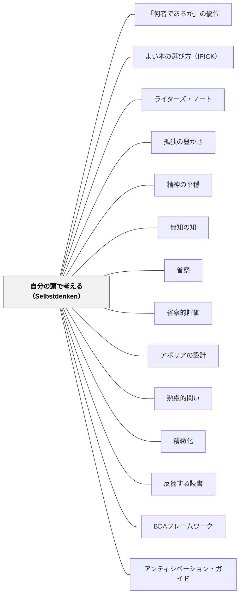

# 自分の頭で考える（Selbstdenken）

> 「読書するとは、自分でものを考えずに、代わりに他人に考えてもらうことだ。一日を多読に費やす勤勉な人間は、次第に自分でものを考える力を失っていく」——ショーペンハウアー

---

## Pattern Connection

---

**ショーペンハウアー（1851/2013）「幸福について」統合（2026-05-31）：**

ショーペンハウアーの「幸福について」は、「読書について」での思索論をさらに深め、「自分の頭で考えること」が幸福の本質条件「何者であるか」の核心であることを示す。「ひとりひとりが生きる世界は、何よりもまず、その人が世界をどう把握しているかに左右される」——主観的な把握の力こそが人生の質を決めるという論点は、Selbstdenken の存在論的な意義を補強する。

- **補強された点**：Selbstdenken は「正確に情報を取り出す技術」でなく、「世界をどう把握するか」という主観的能力の育成として理解されることで、より深い教育的意義を持つ。思索を深めることが「何者であるか」（第一の財宝）を育てる
- **孤独との接続**：「幸福について」では「才知あふれる人物はまったく独りぼっちでも、みずからの思索や想像ですばらしく楽しめる」と述べる。Selbstdenken は孤独の豊かさ（[[パタン/孤独の豊かさ]]）の実践的な形態でもある
- **波及するパタン**：[[パタン/「何者であるか」の優位]] — 思索が「何者であるか」を育てる；[[パタン/精神の平穏]] — 内的思索が外部刺激に揺さぶられない精神の基盤を作る

---

**ショーペンハウアー（1851/2013）統合（2026-05-31）：**

ショーペンハウアー「自分の頭で考える（Selbstdenken）」は、読む・調べる・聞くが「考える」の代替になってしまう現象を19世紀に鋭く指摘した。本パタンは既存の教育パタン群に「思索の先行性」という視点を加える。

- **既存パタンとの関連**：[[パタン/無知の知]] の「知らないことを知る」はソクラテスの実践だが、ショーペンハウアーはそこに「まず自分で問いを持ってから外部の知識に触れる」という時間的先行性を加える。[[パタン/省察]] の「自分の経験に問い返す」と同じ向きを持ちながら、「読む前・聞く前」に省察を置くという設計上の示唆を与える
- **補強された点**：[[パタン/熟慮的問い]] の「問いを設計する」に、「問いを持つのは教師だけでなく学習者でもある」という次元が加わる。学習者が「まず自分の問い・仮説を持つ」状態を設計することが、熟慮的問いのもう一つの実装になる
- **修正・拡張された点**：「調べ学習」や「読む活動」を学習の中心に置く傾向への対抗パタンとして機能する。「調べる前に考える」「読む前に予測する」「聞く前に仮説を持つ」という構造は、精緻化・アポリアの設計・BDAフレームワークとも接続する
- **他のパタンへの波及**：[[パタン/アポリアの設計]] — 自分の頭で考えようとするとき、はじめて「わからない（アポリア）」が生まれる；[[パタン/省察的評価]] — 省察が「他人の評価基準で振り返る」でなく「自分の頭で考え直す」ことを意味する；[[パタン/精緻化]] — 外部情報を受け取る前に自分の枠組みを持つことで精緻化の深さが変わる

---

## 背景（Context）

授業で「調べる」「読む」「聞く」活動が増えている。ICTの普及により検索は一瞬で完了し、子どもは自分の答えを持つ前に情報を受け取ることができる。教師研修の場でも「事例を見る」「成功例を聞く」という受け取り方が主流で、「自分の文脈で考え直す」時間が削られがちだ。

ショーペンハウアー（1851）は「Selbstdenken（自分の頭で考えること）」と「他人の頭で考えること（読書）」を鋭く対比した。この対比は「読書は悪い」という主張ではなく、「思索が先で読書は後」という時間的・優先的な順序の問題として読むべきだ。

## 問題（Problem）

「読む」「調べる」「聞く」が、「考える」の代替になっている。

子どもが問いを持つ前にタブレットを開き、検索結果をノートに写して「調べた」とする。教師も研修で学んだ方法を自分の教室の文脈で考え直すことなく適用しようとする。その結果、知識は「借り物」のまま——使うべき場面で出てこない。

> 「自分の頭で考える人間（思索家）は、書物から身を守るために、自分の思想の力を駆使して抵抗する。それに対して博覧強記の愛書家は、読書量によって自分の精神を押しつぶしてしまう」——ショーペンハウアー

## 力のかたち（Forces）

- 読むこと・調べることは容易で、結果がすぐに出る。考えることは意志でできない——「来るのを待つ」ものだ（ショーペンハウアー）
- 多くの情報が考える前に流れ込んでくる——デジタル環境はこの傾向を加速する
- 他人の考えで頭が詰まると、自分の思想が育つ余白がなくなる
- 自分で獲得した真理は体系に組み込まれるが、借り物の知識は「義手・義足」にすぎない——必要な場面で体の一部として使えない
- 「考えた」という経験なしに「調べた」だけでは、次の学習の足場が育たない

## 解決（Solution）

**「まず自分で考える時間」を授業・研修の構造として意図的に設ける。読む前・調べる前・聞く前に「今の自分はどう考えるか」を問い、読んだ後も「自分はどう考えるか」で締める。**

---

### 「考えてから読む・調べる・聞く」の授業設計

**Before（読む・調べる・聞く前）**

「今日のテーマについて、まず1分間で自分の考えを書いてみよう」——教材・資料・話に入る前に、今の自分の仮説・考え・問いを書かせる。

この1分間が「自分の枠組み」を作る。枠組みを持って読むことで、情報が「借り物」でなく「照らし合わせる対象」になる。

**After（読んだ・調べた・聞いた後）**

「調べた結果、自分の考えはどう変わりましたか？」「最初の考えと違ったのはどこですか？」——情報を受け取ったことで終わらず、「自分の考え」に戻る。

**ペア・シェア前の個人思考**

「ペアで話す前に、まず自分の考えを30秒書く」——他人の考えを聞く前に自分の考えを外に出すことで、「影響される」のでなく「対話する」状態になる。

---

### 教師研修での実装

「今から事例を見ます。その前に、この指導法を自分の教室で使うとしたら、どんな課題があると思いますか？」——成功事例を受け取る前に自分の文脈を考える。

「研修で学んだことを、月曜日の授業でどう使えそうか1分で書く」——学んだ直後に「自分の文脈への翻訳」を行う。この翻訳が Selbstdenken の研修版だ。

---

### 具体例①：算数の授業

「今日は面積を勉強します——その前に、面積って何だと思う？どんな時に使う？自分の言葉で書いてみて」（1分間の個人思考）

→ その後に教科書・操作活動・問題へ。

「教科書に書いてあった面積の意味と、最初に書いた自分の考えを比べてみよう。どこが同じで、どこが違った？」（After の問い返し）

---

### 具体例②：特別支援学級での応用

「今日の話を始める前に——先生の話を聞いて、あなたはどんな気持ちになると思う？」——受け取る前に予測させる。知的に難しくても「予測する」というプロセス自体がSelbstdenkenの入口になる。

「自分で最初に考えたことを大切にしよう」というメッセージは、「分からなかったから調べる」という外部依存ではなく「自分の考えを持つ」という姿勢を育てる。

---

## 結果（Consequences）

- 子どもが読書・調査・聴講の前に仮説・問い・予測を持てるようになる——情報の受け取り方が変わる
- 「調べた」「読んだ」が「自分の考えと照らし合わせた」に変わり、精緻化が起きやすくなる
- 教師が研修内容を「自分の理論として内化」しやすくなる——タクトの育ちに貢献する
- ただし、考える時間の確保は授業時数との緊張を生む——「1分の個人思考」を削りたい誘惑に抵抗する必要がある
- 最初は「書けない」「分からない」という反応が出る——「今の段階での考えでよい」「正解でなくてよい」という心理的安全の設計が前提になる

## 関連パタン
- [[パタン/「何者であるか」の優位]]
- [[パタン/よい本の選び方（IPICK）]]
- [[パタン/ライターズ・ノート]]
- [[パタン/孤独の豊かさ]]
- [[パタン/精神の平穏]]

- [[パタン/無知の知]] — 「知らないことを知る」という出発点の共有
- [[パタン/省察]] — 自分の思考を問い返す実践——Selbstdenken の継続版
- [[パタン/省察的評価]] — 省察は「他人の基準で振り返る」ではなく「自分の頭で考え直す」こと
- [[パタン/アポリアの設計]] — 自分で考えるとき初めて「わからない」というアポリアが生まれる
- [[パタン/熟慮的問い]] — 学習者が「まず自分の問いを持つ」構造を問いの設計に組み込む
- [[パタン/精緻化]] — 外部情報を受け取る前に自分の枠組みを持つことで精緻化の深さが変わる
- [[パタン/反芻する読書]] — Selbstdenken と読書を統合した実践——「考えながら読む」
- [[パタン/BDAフレームワーク]] — Before フェーズ（読む前）に自分の考えを持つ構造
- [[パタン/アンティシペーション・ガイド]] — 読む前の先入観の言語化がSelbstdenkenを促す
- [[パタン/熟慮的動機付け]] — 「考えたい」という動機の設計
- [[パタン/認知的コンフリクト]] — 自分の考えと情報の間のズレがコンフリクトを生む
- [[パタン/ギャップ]] — 「知っているつもり」と実際の知識のギャップへの気づき
- [[パタン/タクト（教育的機転）]] — 教師のSelbstdenkenが実践的知恵を育てる
- [[文献/読書について（ショーペンハウアー）]] — 一次資料

---

## クラスター図

## Actionable Insight

- **授業の最初に「1分間の個人思考」を設ける**——「今日のテーマについて、まず自分の考えを書いてみよう」。教材を開く前に1分間書く時間を入れるだけでよい。書けなくても「何が分からないか」を書かせる
- **「調べる前に予測する」を習慣にする**——「この答えは何だと思う？調べる前に書いてみて」。タブレットを開く前に手を止めて考える時間が、知識を血肉化させる
- **研修で「自分の教室への翻訳」を1分書く**——研修の最後に「月曜日の授業でこれをどう使うか」を1分書く。他の先生に見せなくていい——自分の頭で考える時間として使う
- **After の問い返し「自分の考えはどう変わった？」を定番にする**——読んだ後・調べた後に「最初の考えと何が変わりましたか？」で締める。この一問が Selbstdenken の最終フェーズになる

---

## 出典

Schopenhauer, A.（1851/2013）.『読書について』（鈴木芳子訳）. 光文社古典新訳文庫.

> 「読書するとは、自分でものを考えずに、代わりに他人に考えてもらうことだ。一日を多読に費やす勤勉な人間は、次第に自分でものを考える力を失っていく」——ショーペンハウアー（1851/2013）

> 「自分の頭で考える人間（思索家）は、書物から身を守るために、自分の思想の力を駆使して抵抗する」——ショーペンハウアー（1851/2013）
