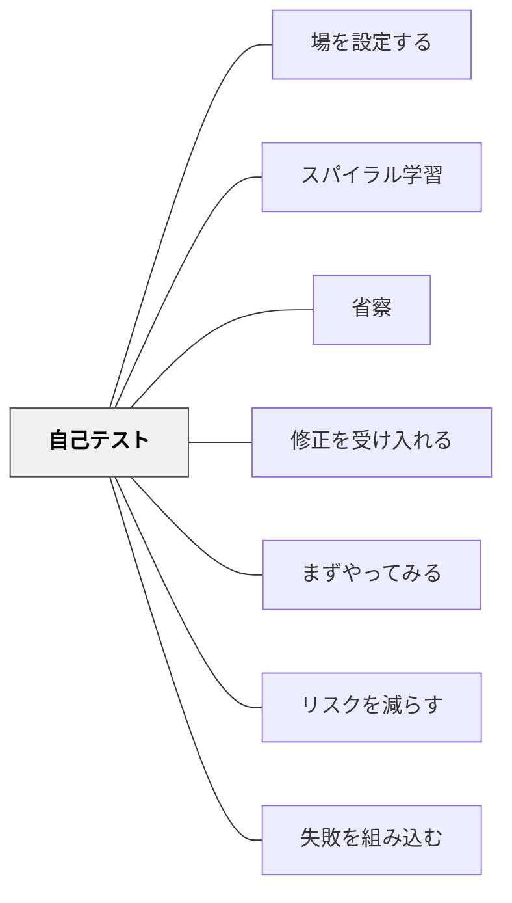

# 自己テスト

> 学習者自身が採点する小テストは、教師への報告ではなく、自分の理解の地図をつくる行為だ。

## [Pattern Connection]

- **既存パタンとの関連**：[[パタン/スパイラル学習]] と不可分——スパイラルで「一度学んだことを後から深化させる」構造の中で、自己テストは「次の螺旋に入る前に自分の理解を確認する」節目として機能する。
- **補強された点**：形成的評価（学習途中の理解確認）を「教師が採点する」から「学習者自身が行う」に移すことで、評価が制御から自己調整の道具になる。
- **修正・拡張された点**：成績に影響しないことが本パタンの核心条件。採点される小テストとは本質的に異なる——テストという形式を使いながら、目的は「理解の確認」であり「評定」ではない。
- **他のパタンへの波及**：[[パタン/省察]] ——自己テストの後に「どこが分からなかったか」を振り返る省察が深い学びになる。[[パタン/修正を受け入れる]] ——自己テストで発見した誤りは、次の螺旋で修正される機会になる。

## 背景（Context）

スパイラルカリキュラムや繰り返し学習の構造では、同じトピックに複数回取り組む機会がある。しかし、「一度聴いた」ことと「自分でできる」ことの間には大きなギャップがある。このギャップを学習者自身が発見できれば、次の学習の焦点が明確になる。

## 問題（Problem）

教師が採点するテストは、学習者に「評価される」プレッシャーを与える。このプレッシャーのもとでは、誤答を隠したい・間違いを避けたいという心理が働き、自由に探索することが難しくなる。また、返却に時間がかかるため、フィードバックの遅れが学習の歪みを拡大させる。

## 力のかたち（Forces）

- 学習者は採点されるテストに不安を感じ、失敗を恐れる
- 一方、自分の理解を確認したいという欲求は学習者自身にある
- 教師の採点待ちは時間的なラグを生む
- 誤答を自分で「探索できる」環境では、間違いが学習の資源になる
- 学習者が自分で採点することで、答えへの関与度が高まる

## 解決（Solution）

**教師が問題を準備し、学習者が自分で回答し、自分で採点する小テストを実施せよ。成績には影響しない。目的は「自分の理解の状態を知ること」だけである。**

---

### 実施の手順

**問題の準備（教師）**
- 「今回のスパイラルで扱う内容の理解があれば解ける」問題を準備する
- 問題は短く、答えが明確であるほど良い
- 選択式・記述式・計算問題など形式は自由

**回答（学習者・自分で）**
- 学習者は一人でノートやプリントに回答する
- 「テスト」という言葉を使っても「成績は関係ない」と必ず伝える
- 時間制限は緩めに設定する

**採点（学習者・自分で）**
- 教師が答えを示し、学習者が自分で採点する
- 自己採点の過程で「ああ、そういうことか」という理解が起きる
- 間違えた問いについて「なぜ間違えたか」を少し考える時間を設ける

**探索（学習者・任意）**
- 理解できていなかった箇所を、教師またはピアと探索する
- この探索が次のスパイラルへの架け橋になる

---

### 小学校での応用

- 単元の中盤で「自分でチェックシート」を配り、自分で採点させる
- 「できた・迷った・できなかった」の3択でチェックするだけでも自己テストになる
- 「次の授業では、迷った問いだけをもう一度扱います」とあらかじめ伝えると、学習者の集中が高まる

## 結果（Consequences）

- 学習者が自分の理解の状態を客観的に把握できる
- 成績に影響しないため、正直に取り組める
- 自己採点の過程で「正しい答えと自分の答えの差」が明示化される
- 次の学習（スパイラルの次の螺旋）の焦点が学習者自身にとって明確になる
- 教師は「クラス全体でどこが理解されていないか」を把握できる

## 関連パタン
- [[パタン/場を設定する]]

- [[パタン/スパイラル学習]] — 自己テストはスパイラルの各節目で機能する
- [[パタン/省察]] — 自己テストの結果を振り返ることで深い学びになる
- [[パタン/修正を受け入れる]] — 自己テストで見つけた誤りを修正する機会を設ける
- [[パタン/まずやってみる]] — 授業中のインライン確認との相互補完
- [[パタン/リスクを減らす]] — 成績に影響しない設計がリスクを下げる
- [[パタン/失敗を組み込む]] — 自己テストの誤答は失敗でなく学習の資源

## クラスター図

## Actionable Insight

- 単元の中間点で「今日は採点しません」と言って5問テストをやってみる。採点を学習者に委ね、結果を教師に報告させない——何が起きるか観察する
- 「できた問いに○、できなかった問いに△をつけて、△の問いを1つ選んで隣の人に説明してみよう」というセルフチェック活動を試す
- 単元末テストの1週間前に「自分でチェックシート」を作って配布する——何ができているか学習者自身が整理できるようになる

## 出典

Bergin, J., Eckstein, J., Volter, M., Sipos, M., Wallingford, E., Marquardt, K., Chandler, J., Sharp, H., & Manns, M. L. (2012). *Pedagogical Patterns: Advice For Educators*. Joseph Bergin Software Tools. (CC BY-SA 3.0)  
https://www.pedagogicalpatterns.org/

> "Therefore let the students answer a self-test on the theory after they have heard it once, before revisiting the theory another time." — Bergin et al. (2012)

> "The test is teacher prepared but student administered and marked. It should not contribute to the course grade. Students can explore incorrect answers with the teacher or their peers." — Bergin et al. (2012)
