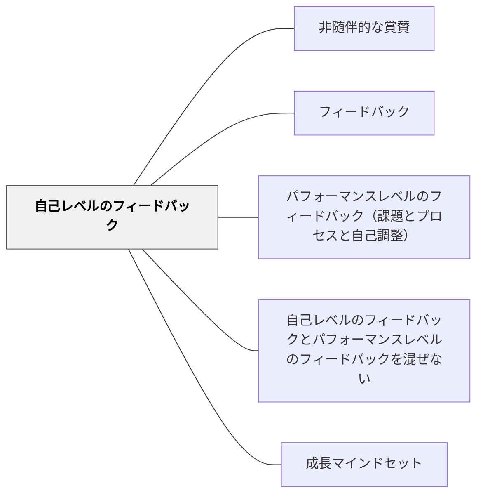

# 自己レベルのフィードバック

> 「すごいね！」は気持ちを高めるが、学習を改善しない。— ハッティ

## 背景（Context）

ハッティはフィードバックを4つのレベルに分類した。「自己レベル」は学習者の人格・自己そのものへの評価（「頭がいいね」「すごい子だ」「才能があるね」）であり、最も効果が低いとされている。

## 問題（Problem）

人格への賞賛は短期的には気持ちを高めるが、「次にどうするか」という学習改善の情報を含まない。また固定マインドセットを強化する可能性がある（ドゥエック研究）。

## 力のかたち（Forces）

- 人格への賞賛は親しみを生み、関係構築に一定の役割がある
- ただし、学習フィードバックとしての効果は低い
- パフォーマンスへのフィードバックと混ぜると、学習情報が薄まる

## 解決（Solution）

**「あなたはすごい」という自己レベルの評価は関係構築の文脈で用い、学習改善のためのフィードバックとは明確に区別する。学習フィードバックはパフォーマンスレベルで行う。**

自己レベルの例（学習フィードバックとしては不適）：
- 「天才だね」「才能があるね」「頭がいいね」

→ 代わりに「よく考えたね（プロセス）」「この戦略がうまく機能したね（自己調整）」を使う

## 結果（Consequences）

- フィードバックが具体的な改善情報として機能するようになる
- 成長マインドセットが育ちやすくなる

## 関連パタン
- [[パタン/非随伴的な賞賛]]

- [[パタン/フィードバック]] — 親パタン
- [[パタン/パフォーマンスレベルのフィードバック（課題とプロセスと自己調整）]] — 効果的な代替
- [[パタン/自己レベルのフィードバックとパフォーマンスレベルのフィードバックを混ぜない]] — 分離の原則
- [[パタン/成長マインドセット]] — プロセス賞賛との連携

## クラスター図

## Actionable Insight

- 「天才だね」「才能があるね」を使いそうになったとき、「どんな方法で考えたのか」という問いに置き換える——プロセスへの注目が成長マインドセットを育てる
- 作品を返すとき「あなたはすごい」の代わりに「ここの工夫が効いていた、理由は…」と伝える——自己レベルからパフォーマンスレベルへの言い換えをまず1回試みる
- 「結果が良かったね」より「この部分でどう考えたの？」と聞く習慣を持つ——プロセスへの問いが固定マインドセットでなく成長マインドセットを促す

## 出典

- Hattie, J. (2009). *Visible Learning: A Synthesis of Over 800 Meta-Analyses Relating to Achievement*. Routledge.（邦訳：原田信之訳（2018）『教育の効果―メタ分析による学力に影響を与える要因の効果の可視化』図書文化社）
