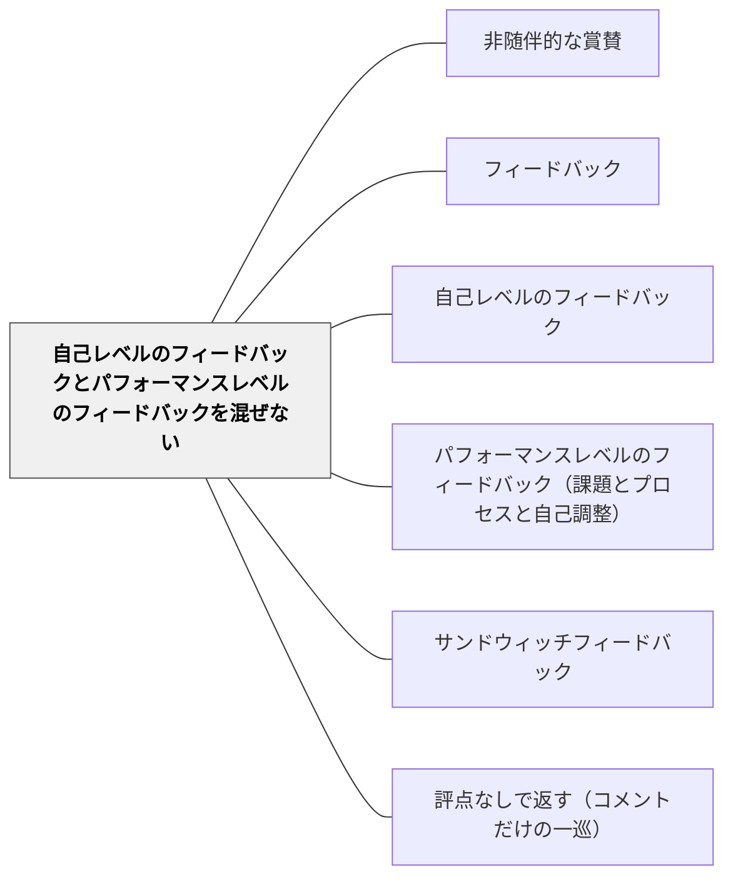

# 自己レベルのフィードバックとパフォーマンスレベルのフィードバックを混ぜない

> 「すごいね、でもここが…」という組み合わせは、どちらの効果も薄める。

## 背景（Context）

自己レベルのフィードバック（「よく頑張ったね」「才能があるね」）とパフォーマンスレベルのフィードバック（「この部分の論理が弱い」）を同じメッセージの中で混ぜると、学習者の注意が人格評価に向いてしまい、学習情報が届きにくくなる。

## 問題（Problem）

「サンドウィッチフィードバック」（良い点→改善点→良い点）の形でも、人格への賞賛が学習情報を包んでいる場合、改善情報が印象に残りにくくなる。

## 力のかたち（Forces）

- 人格評価は感情的に強く、学習情報を上書きしやすい
- 学習者は「自分は良い子だ」という承認を求める傾向がある
- 二つを分離することで、それぞれが機能しやすくなる

## 解決（Solution）

**人格への肯定（関係構築）と学習へのフィードバック（改善情報）を、意図的に文脈・タイミングを分けて伝える。学習フィードバックの場では、パフォーマンスレベルに集中する。**

実践例：
- 学習フィードバックの場では「この作品で、ここが良かった理由は…」と作品に焦点化する
- 一般的な関係構築の文脈で「今日よく頑張ったね」などは使う
- 「あなたは頭がいいね、だからこの部分を直して」と混ぜない

## 結果（Consequences）

- 学習フィードバックが純粋な学習情報として機能する
- 学習者が作品・パフォーマンスと自己を切り離して評価を受け取れるようになる

## 関連パタン
- [[パタン/非随伴的な賞賛]]

- [[パタン/フィードバック]] — 親パタン
- [[パタン/自己レベルのフィードバック]] — 避けるべきレベル
- [[パタン/パフォーマンスレベルのフィードバック（課題とプロセスと自己調整）]] — 優先すべきレベル
- [[パタン/サンドウィッチフィードバック]] — 混合の典型例

- [[概念/自我関与と課題関与（フィードバックが向ける先）]] — 注意の三水準（メタ課題／課題動機づけ／課題学習）という理論的裏づけ
- [[パタン/評点なしで返す（コメントだけの一巡）]] — 同じ軸の上にある。評点は最も凝縮された自己レベルのフィードバックだと読める

## クラスター図

## Actionable Insight

- フィードバックを書くとき「これは人格への評価か、作品・プロセスへの評価か」を一度確認する——意識するだけで自己レベルとパフォーマンスレベルが分離されていく
- 「よく頑張ったね」は授業の終わりに全体へ伝え、「この部分が良かった理由は」という学習フィードバックは作品に焦点化して伝える——場面と文脈を分けることで両方が機能する
- 「頭がいいね、だからここを直して」という組み合わせを意識的に避ける——人格賞賛と改善指摘の組み合わせは学習情報を薄める

## 出典

- Hattie, J. (2009). *Visible Learning: A Synthesis of Over 800 Meta-Analyses Relating to Achievement*. Routledge.（邦訳：原田信之訳（2018）『教育の効果―メタ分析による学力に影響を与える要因の効果の可視化』図書文化社）
