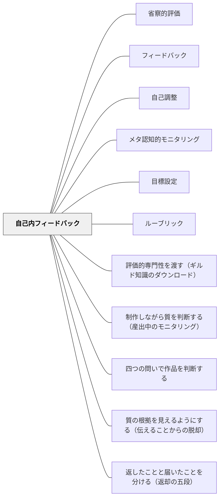

# 自己内フィードバック

**一文でいうと**：外からの評価だけでなく、自分の中で目標・現在地・次の一手を照合する。

## 使いどころ・使いすぎ注意

| 観点         | 内容                                                 |
| ------------ | ---------------------------------------------------- |
| 使いどころ   | 自分で目標・現在地・次の一手を照合したいとき。       |
| 使いすぎ注意 | 内省を求めすぎると、外部からの具体的支援が不足する。 |

> 外部から与えられるフィードバックを待つだけでなく、自分自身で自分の学習を評価し改善する内なるフィードバックループを育てよ。

## 背景（Context）

ハッティ（Hattie）とティンパリー（Timperley）のフィードバック研究によれば、フィードバックには外部（教師・仲間）から提供されるものだけでなく、学習者自身が内側で行う自己モニタリング・自己評価・自己修正のループがある。これを「自己内フィードバック（Internal Feedback）」と呼ぶ。自己調整学習の核心の一つだ。

サドラー（1989）は、評価的な情報の源が学習者の外にあるものを「フィードバック」、学習者自身がその情報を生むものを「自己モニタリング」と呼んで区別し、**多くの指導システムの目標は、フィードバックから自己モニタリングへの移行を促すことにある**と述べた。自己内フィードバックは、この移行の到達点にあたる。つまりこれは「外からのフィードバックの補助的な習慣」ではなく、指導が向かうべき方向そのものである。

## 問題（Problem）

教師からのフィードバックがなければ動けない。あるいは、フィードバックをもらっても「次どうすればいいか」を自分で判断できない。外部依存の学習者は、自律した学びが困難になる。

## 力のかたち（Forces）

- 外部フィードバックは常に得られるわけではない——自立した学習者には内部のフィードバックループが必要
- 自己内フィードバックはメタ認知能力と連動する
- ルーブリックや成功規準を持つことで自己内フィードバックが機能しやすくなる

## 解決（Solution）

**学習者が自分のゴール・現状・改善点を自分で把握できるよう、自己評価の仕組みと習慣を育てる。**

- 学習前に「今日のゴール」を自分で設定する（[[パタン/目標設定]]）
- 学習中に「今どこにいるか」を自分で確認する（[[パタン/メタ認知的モニタリング]]）
- 学習後に「何ができた・何がまだか」を自分で振り返る（[[パタン/自己調整]]）
- ルーブリックや成功規準を見ながら自分の作品を自己評価する機会をつくる

## 結果（Consequences）

- 外部フィードバックがなくても自分で改善できる力が育つ
- 自己効力感が高まる
- 自己調整学習が機能し始め、学力が向上する傾向にある

## 関連パタン
- [[パタン/省察的評価]]

- [[パタン/フィードバック]] — 自己内フィードバックはフィードバックの内的側面
- [[パタン/自己調整]] — 自己内フィードバックは自己調整サイクルの核
- [[パタン/メタ認知的モニタリング]] — 自分の学習状態を観察する
- [[パタン/目標設定]] — 自己内フィードバックのための基準を作る
- [[パタン/ルーブリック]] — 自己評価の基準として機能する
- [[パタン/評価的専門性を渡す（ギルド知識のダウンロード）]] — 自己内フィードバックが働くための前提。何をもって良しとするかの概念が渡っていなければ、自分では照合できない（Sadler, 1989）
- [[パタン/制作しながら質を判断する（産出中のモニタリング）]] — 自己内フィードバックが、作品を作っているただ中で働く場合（Sadler, 1989）

- [[概念/自我関与と課題関与（フィードバックが向ける先）]] — 自己採点も自我関与的になりうる（自己教育の場面）

- [[概念/形成的評価の5つの戦略（3×3の枠組み）]] — 戦略⑤の中核。学習者自身が自分に返す
- [[概念/自己調整学習の内側（成長の道とウェルビーイングの道）]] — その内部で何が起きているかのモデル（Winne & Hadwin の4段階×4資源）
- [[パタン/四つの問いで作品を判断する]] — 内側の批評家に持たせる問いの具体形
- [[パタン/質の根拠を見えるようにする（伝えることからの脱却）]] — 外からのフィードバックが不要になる状態へ向かう道筋
- [[パタン/返したことと届いたことを分ける（返却の五段）]] — 外からの返却が受け手の中で何になったか。自己内フィードバックへの入口を五段で見る

## クラスター図

## Actionable Insight

- 学習の始まりに「今日のゴール」を学習者自身に1文書かせる——自分で目標を設定することが自己内フィードバックの基準を作る
- 学習後に「できた・まだの欄」を自分で書く振り返り欄を作る——自己モニタリングの習慣化が外部依存を減らす
- ルーブリックを見ながら自分の作品を自己評価する機会を単元に1回入れる——明確な基準があることで自己内フィードバックが機能し始める

## 出典

Hattie, J., & Timperley, H. (2007). The power of feedback. _Review of Educational Research_, 77(1), 81–112.  
スタブページ——詳細な具体例は今後追記。
