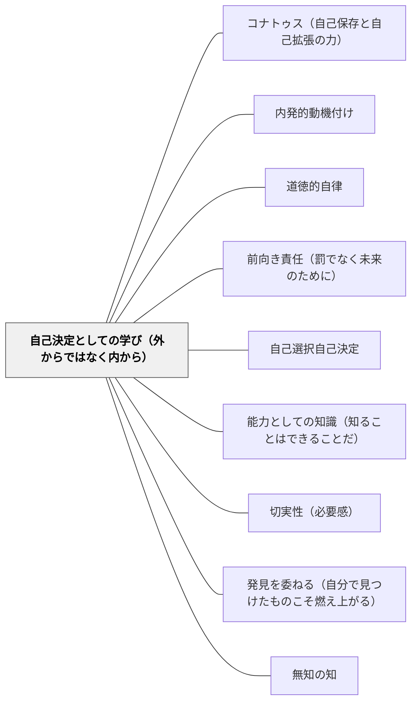

# 自己決定としての学び（外からではなく内から）

> 自由とは「何でもできること」でも「決められていないこと」でもない。自由とは自分の本性から行動すること——外部からの強制でなく、自分の中から動機が生まれること。スピノザの自由の定義（1DEF7）が示す、学習の自律性の哲学的核心。

---

## [Pattern Connection]

**Spinoza on Free Will（Kisner, 2026）統合：**

スピノザは『エチカ』1DEF7で自由を「それ自身の必然性のみによって存在し、それ自身のみによって行動するよう決定されているもの」と定義した。Kisner（2026）の両立論的解釈によれば、この定義は教育における「自律的な学び」の哲学的基盤を与える：

**スピノザの自由の構造**

| 自由でない行動 | 自由な行動 |
|---|---|
| 外部から決定される（強制・報酬・恐怖） | 自己の本性から決定される |
| 受動的感情に動かされる（パッション） | 能動的感情・理性に動かされる |
| 不十分な原因から生まれる（他への依存） | 適切な原因である（自己から十分に生まれる） |
| 不適切な観念（断片的・外部依存の理解） | 適切な観念（自己の本性から生まれる理解） |

- **既存パタンとの関連**：[[パタン/道徳的自律]] のカント的自律（理性による自己立法）と比較すると、スピノザ的自己決定は「理性だけでなく自分の本性全体（コナトゥス・能動的感情・理性の統合）」から行動することを含む。カントが義務を強調するのに対し、スピノザは喜び（コナトゥスの増大）を伴う自己決定を強調する。
- **補強された点**：SDTの「自律性（Autonomy）」欲求を哲学的に根拠づける。「自分で選んでいる感覚」（SDT）の背後には「自分の本性から行動している状態」（スピノザ）がある——外部から操作されているとき、たとえ表面上「自分で選んだ」としても自由ではない。
- **適切な観念という概念**：「丸暗記した知識」と「自分で考えて理解した知識」の差は、スピノザ的には「不適切な観念（断片的・外部依存）」と「適切な観念（自己の本性から生まれる自己完結的な理解）」の差として説明できる。後者だけが本当の理解であり、知識として活用できる。
- **他のパタンへの波及**：[[パタン/コナトゥス（自己保存と自己拡張の力）]] — 自己決定は自己の本性＝コナトゥスから行動すること；[[パタン/前向き責任（罰でなく未来のために）]] — 強制（外部決定）は自己決定を破壊するから、規律設計を変える必要がある。

---

## 背景（Context）

「自分で学んでいる感覚」と「やらされている感覚」の違いは、学習者なら誰でも体感している。

しかしその違いの正体は何か。表面上「自分で選んだ」としても、選択肢が外部から用意されているとき、評価という圧力が選択を操作しているとき、学習者は本当に自由に学んでいるのか。

スピノザ（1677）の自由の定義（1DEF7）は、この問いに根本的な答えを与える。自由とは「自己の必然性のみによって行動すること」——自分の本性から、自分の中の力から、外部でなく内部から行動が生まれる状態。これが学習における「本当の自律」の哲学的定義になる。

## 問題（Problem）

多くの学習設計は「自由にしているように見える」が実質的に外部決定されている：

- 「どちらの方法でやってもいい」——しかし評価基準は外部から与えられる
- 「自分で計画を立てて」——しかし計画の枠組みは教師が設定する
- 「好きなテーマを選んで」——しかしどのテーマを選ぶか仲間の目線が左右する

また逆に、「自分で考えた」と言っても広告・SNS・権威への反応から生まれた考えは、スピノザ的には外部から決定された受動的な考えである。

本当の自己決定（自分の本性から行動する状態）は、どのように設計できるか。

## 力のかたち（Forces）

- 自己決定は「何でも好きにしていい」という放任ではなく、「自分の本性・力・問いから行動する」という内的な構造の問題
- 適切な観念（自己完結した理解）は、知識を与えられるのではなく自分で構成するときに生まれる
- 外部からの強制（報酬・罰・同調圧力）は受動的感情を生み、自己決定を阻害する
- しかし完全な自己決定は理想——人間は常にある程度外部の影響を受けながら生きている
- スピノザの両立論：因果決定論と自由は両立する——「決定されること」が問題でなく「外部から決定されること」が問題
- 理性・適切な観念・能動的感情の三者が揃うとき、最も自由に近い学びが起きる

## 解決（Solution）

**「外から与えられた課題をこなす」設計から、「自分の本性・問い・力から動く」体験を授業に組み込む。適切な観念（自己完結した理解）を生み出す機会を設け、受動的服従でなく能動的理解を目指す。**

---

### 適切な観念を育てる設計

| 不適切な観念の設計 | 適切な観念の設計 |
|---|---|
| 「これが答えです」と伝える | 「なぜそうなるか、自分で考えてみる」 |
| 公式を覚えさせて適用させる | 公式がなぜ成り立つかを自力で導く |
| 教師が説明→生徒が確認 | 生徒が試行錯誤→教師が整理 |
| 正解を暗記する | 間違えた理由を自分で説明する |

---

### 問いの所有権を学習者に渡す

スピノザの自己決定は「問いが自分のものである」ときに実現する：

- **「先生の問い」から「自分の問い」へ**：単元の入口で「あなたはこの単元で何を知りたいか」を聞く。学習者の問いを拾い、授業に組み込む余地を作る。
- **「自分の問いで終わる」授業**：授業の終わりに「今日の授業で生まれた疑問を1つ書く」——知識を受け取るだけでなく、自分の問いを生み出す体験が自己決定の感覚を育てる。

---

### 外部強制を最小化する

自己決定を阻害する外部強制を設計から除去する：

- **評価の透明化**：「何のために評価するか」を学習者と共有する——評価への恐怖が自己決定を外部に移す。
- **失敗を安全にする**：間違いが罰でなく探索の一部——失敗への恐怖が「外部に正解を求める」行動を生む。
- **比較しない**：他者との比較は外部からの評価軸を持ち込み、自己の本性から行動する感覚を壊す。

---

### 具体例

**例1：「なぜ」を問い返す**
算数の授業で「3×4は12だよ」と答えた子に「それはなぜそうなるの？自分の言葉で説明してみて」と問い返す——答えを受け取るだけでなく、自分の本性から理解を生み出す体験。

**例2：探究の入口を自分で決める**
単元の始めに「この単元で自分が一番面白そうだと思うことを1つ選んで、それを中心に学ぼう」——問いの所有権が自己決定の感覚を生む。

**例3：岩井の数学デイリーでの適用**
「今日はどの問題に取り組むか、自分で選ぶ」という実践が自己決定の体験になる。外から「これをやりなさい」と言われる練習より、「自分が今解きたい問題」を選ぶ時間が能動的感情を生む。

## 結果（Consequences）

- 「やらされている」でなく「やっている」という感覚から生まれた学習は、記憶・活用・探究の深さが異なる
- 適切な観念（自己完結した理解）は、文脈が変わっても活用できる本当の理解になる
- 自己決定の体験が蓄積されると、学習者が「自分は学べる・自分の問いを持てる」という自己像を育てる
- ただし、すべての学習を自己決定にすることはできない——外部から与えられた枠組み・課題の中での自己決定という設計がより現実的

## 関連パタン

- [[パタン/コナトゥス（自己保存と自己拡張の力）]] — 自己決定はコナトゥスが能動的に働く状態
- [[パタン/内発的動機付け]] — 自律性欲求とスピノザ的自己決定の接続
- [[パタン/道徳的自律]] — カント的自律とスピノザ的自己決定の比較
- [[パタン/前向き責任（罰でなく未来のために）]] — 強制が自己決定を壊す——規律設計の接続
- [[パタン/自己選択自己決定]] — 具体的な実践レベルでの自己決定の実装
- [[パタン/能力としての知識（知ることはできることだ）]] — 適切な観念はKern的な「能力としての知識」と共鳴する
- [[パタン/切実性（必要感）]] — 切実性は自己の問いが生まれる状態——自己決定の起点
- [[パタン/発見を委ねる（自分で見つけたものこそ燃え上がる）]] — 発見の所有感が自己決定の感覚を生む
- [[パタン/無知の知]] — 「自分が知らないことを知る」体験が、自分の問いを生み出す出発点
- [[文献/Spinoza on Free Will（Kisner）]] — 本パタンの出典

---

## クラスター図

## Actionable Insight

- 授業の最後に「今日、自分で考えた（外から答えをもらわなかった）瞬間はいつだったか」を1文で振り返らせる——自己決定の体験の言語化が意識化につながる
- 「どうしてそうなるの？」という問い返しを増やす——答えを受け取るだけでなく、自分の本性から説明を生み出す体験を繰り返す
- 週1回「自分が決めていい時間」を5〜10分確保する——問いも方法も学習者が決める時間。小さくてもいい、習慣化することが大切

---

## 出典

Kisner, M. J. (2026). *Spinoza on Free Will*. Cambridge Elements: The Philosophy of Benedict de Spinoza. Cambridge University Press.  
DOI: https://doi.org/10.1017/9781009698917

> "A thing is said to be free if it exists solely by the necessity of its own nature and is determined to action by itself alone." — Spinoza, *Ethics* 1DEF7
