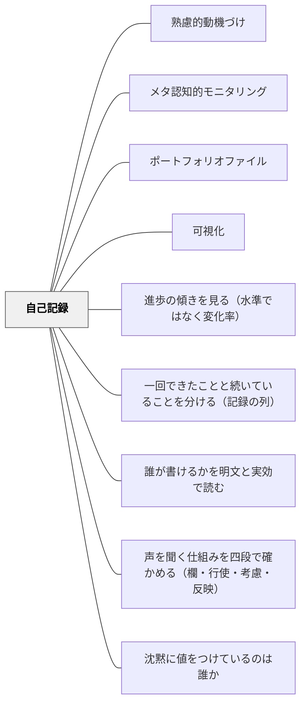

# 自己記録

> 自分の進歩を記録し、目に見えるようにすることで、動機が維持される。

## 背景（Context）
自己調整学習における自己記録は、自分の行動・成果・学習履歴を記録し追跡すること。記録の可視化が進歩の実感につながり、継続的な動機の維持を支える。日記・グラフ・ポートフォリオ・アプリなど様々な形で実践される。

## 問題（Problem）
長期的な学習では進歩が見えにくく、努力の成果が実感しにくい。「やっているのに変わらない」という感覚が動機の低下につながる。自分がどのくらい成長したかを客観的に把握する機会がないと、達成感が得にくい。

## 力のかたち（Forces）
- 記録することで行動・習慣が意識化される
- 記録の可視化（グラフ化）が成長の実感を高める
- 記録が煩雑すぎると継続が困難になる
- 記録の形式が学習者の特性・目的に合っていることが重要

## 解決（Solution）
**学習の成果・行動・進捗を定期的に記録し、自分の成長を可視化することで、長期的な動機の維持を支援する。**

読んだ本のリスト・練習時間のグラフ・学習日誌・ポートフォリオファイルなど、学習者が続けやすい形式を選ぶ。週に一度の振り返りなど、定期的に記録を見返す時間を設ける。自分の変化・成長に気づく問いかけを添える。

## 結果（Consequences）
- 自分の成長・進歩が可視化され、動機が維持される
- 学習の継続性と自己規律が高まる
- 記録そのものが学習の痕跡となり、自己評価を支える

## このパタンが働く教材

| 教材 | どのように自己記録が働くか |
|------|----------------------------|
| [[教材/20冊チャレンジ]] | 読んだ本を20冊分記録し、読書の積み重ねを見えるようにする |
| [[教材/1週間の読書目標]] | 週ごとの読書目標と振り返りを記録し、読書習慣の調整に使う |
| [[教材/読むことの振り返り]] | 一年間の読書経験やベスト5を振り返り、読者としての変化を記録する |

## クラスター図

## Actionable Insight

- 授業の最後に「今日学んだことを1文で記録する」習慣を作る——毎回の小さな記録が積み重なって自分の学習の軌跡が見えてくる
- 読んだ本の冊数・取り組んだ問題数などを自分でグラフに記録させる——視覚化された進捗が「自分は確かに進んでいる」という動機の維持につながる
- 週に一度「先週の記録を見て、自分の成長を一言書こう」と振り返りの時間を取る——記録を見返す習慣が自己評価と次の目標設定を自然に生み出す

## 出典

- 一つの教育のパタン・ランゲージ（岩井輝久）

## 関連パタン
- [[特別支援/特別支援で使えるパタン]]
- [[パタン/熟慮的動機づけ]] — 親パタン
- [[パタン/メタ認知的モニタリング]] — 自己観察と記録の連動
- [[パタン/ポートフォリオファイル]] — 学習の記録を蓄積する実践
- [[パタン/可視化]] — 記録を視覚的に示すパタン
- [[パタン/進歩の傾きを見る（水準ではなく変化率）]] — 外形は似るが主体と目的が違う。本パタンは学習者が動機維持のために記録するもの、あちらは教師が意思決定のために変化率を追うもの
- [[パタン/一回できたことと続いていることを分ける（記録の列）]] — 自分で残した記録を並べたとき、何が言えて何が言えないか
- [[パタン/誰が書けるかを明文と実効で読む]] — 子ども自身が書いた一枚が、記録として通用していること自体が、位置が固定されていないことの証人になる
- [[パタン/声を聞く仕組みを四段で確かめる（欄・行使・考慮・反映）]] — 自分で書いた記録に、返答が返ってくる欄はあるか。あることと読まれることは別
- [[パタン/沈黙に値をつけているのは誰か]] — 自分の記録の空白に、自分でどの値をつけているか

