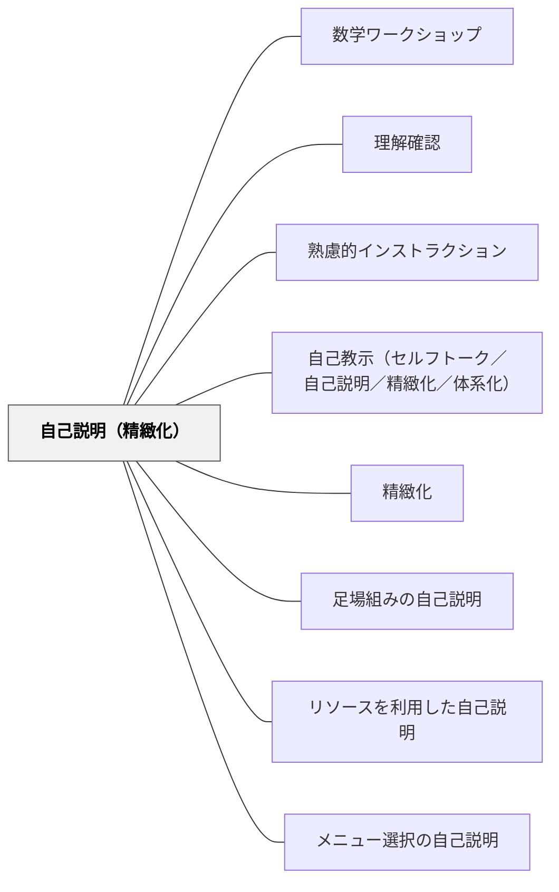

# 自己説明（精緻化）

> 自分の言葉で説明できることが、本当に理解していることの証拠である。

## 背景（Context）
山本博樹（2019）『教師のための説明実践の心理学』ナカニシヤ出版は自己説明を学習の認知方略として位置づける。自己説明とは、学習内容を自分の言葉で説明するプロセスであり、精緻化・体系化を促して長期記憶への定着を助ける。「説明できれば理解している」という前提のもと設計される。

## 問題（Problem）
学習者が「わかった」と感じていても、実際には表面的な理解にとどまっていることがある。人に説明しようとすると初めて「どこがわかっていないか」に気づく。受け身での受容だけでは深い理解が生まれにくい。

## 力のかたち（Forces）
- 自己説明は受け手を能動的な処理者に変換する
- 自由に説明させる形（自由な自己説明）から、焦点を絞った形・足場組みの形など5形態がある
- 説明の機会を多く設けすぎると活動時間が圧迫される

## 解決（Solution）
**学習内容を自分の言葉で説明させる機会を意図的に設計する。「〇〇をとなりの人に説明してみましょう」「今学んだことを3文で書いてみましょう」のように、説明の場を作る。**

自己説明には5形態がある：(1)自由に思いついたことを話す、(2)焦点を絞って説明する、(3)欠落部分を補いながら説明する（足場組み）、(4)資料・法則を使って説明する（リソース利用）、(5)選択肢から選んで説明する（メニュー選択）。学習の段階や目的に応じて形態を選ぶ。

## 結果（Consequences）
- 受け手が自分のわかっていない部分を自覚できる
- 精緻化・体系化が促進され、長期記憶への定着が高まる
- 「説明できる」という到達基準が学習の指標になる

## クラスター図

## Actionable Insight

- 説明後に「隣の人に今学んだことを自分の言葉で説明してみよう」と毎授業1回入れる——説明しようとすることで学習者が自分の理解の穴に自然と気づく
- 「今日の学びを3文で書いてみましょう」を授業の最後のルーティンにする——定期的な自己説明の習慣が長期記憶への定着と「説明できる」という自信を育てる
- 学習の段階に応じて「自由に話す→焦点を絞る→資料を使って説明する」と形態を変える——5形態の中から目的に合った自己説明を選ぶことが学習の精度を高める

## 出典

- 一つの教育のパタン・ランゲージ（岩井輝久）

## 関連パタン
- [[パタン/数学ワークショップ]]
- [[教科/算数]]
- [[教科/算数・数学で使うパタン]]
- [[パタン/理解確認]]
- [[パタン/熟慮的インストラクション]] — 親パタン
- [[パタン/自己教示（セルフトーク／自己説明／精緻化／体系化）]] — 自己説明の認知戦略的基盤
- [[パタン/精緻化]] — 理解を深める認知プロセス
- [[パタン/足場組みの自己説明]] — 自己説明5形態の一つ
- [[パタン/リソースを利用した自己説明]] — 自己説明5形態の一つ
- [[パタン/メニュー選択の自己説明]] — 自己説明5形態の一つ

## このパタンが働く実践
- [[実践/2列メモ（シンクシート）]]
- [[実践/学習科学の6方略]]
- [[実践/書き出しのクラフト]]

| 実践パタン | どのように自己説明を促すか |
|------------|----------------------------|
| [[実践/10や100を単位にして計算しよう]] | 計算の答えだけでなく、「何を単位として見たか」を自分の言葉で説明する |
| [[実践/カエルの算数：勝ちやすさを表で考えよう]] | 「何通りあるから勝ちやすい」と、表から読み取った根拠を自分の言葉で説明する |

## このパタンが働く教材

| 教材 | どのように自己説明を促すか |
|------|----------------------------|
| [[教材/読書反応の書き出しの手引き]] | 読んで感じたことや予想に「なぜなら」を添え、自分の読みを理由とともに説明する |
