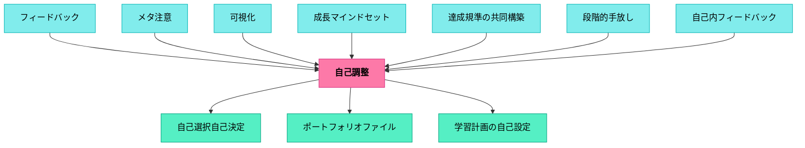

# 自己調整

> 自己調整のスキルが身につくように、自己調整のプロセスを支援せよ。自己調整のスキルを身につけることで、被教育者は優れた学習者となる。

---

## Pattern Connection

**Allen（1999）統合（2026-05-20）**：

*Words, Words, Words* は語彙の自己調整として「語攻略の12の方略」を提示する。熟達した読者が未知語に出会ったとき、立ち止まらずに複数の方略を柔軟に切り替える——これは読書における自己調整そのものだ。

- **既存パタンとの関連**：自己調整の核心「自己モニタリング→方略の選択→実行→再評価」が、語彙レベルで未知語への対処として具体化されている。「知らない語で止まる」という固定した反応から、「何の方略を使うか状況を判断する」への移行が語彙の自己調整だ
- **補強された点**：自己調整は「課題全体」だけでなく「一語単位のミクロな判断」でも働く——読書中に毎ページ数十回起きる「知らない語への対処」を明示的に教えることが、語彙自己調整の訓練になる
- **修正・拡張された点**：「12番（分からなくても先へ進む）」が重要。自己調整の失敗パターンは「完全に理解するまで先へ進めない」という過剰モニタリングだ。「文脈が積み上がってから戻る」という判断は高度な自己調整スキルであり、明示的に教える価値がある
- **他のパタンへの波及**：[[パタン/語彙指導]] — 語攻略の12方略の詳細。[[パタン/メタ認知的モニタリング]] — 語への意識的な注意と理解の確認

### 語攻略の12の方略（語彙の自己調整ツールボックス）

| # | 方略 | 自己調整の段階 |
|---|---|---|
| 1 | 文中での語の位置から意味を考える | モニタリング |
| 2 | 辞書で調べ文と照らし合わせる | 外部リソース活用 |
| 3 | 教師に聞く | 社会的リソース活用 |
| 4 | 声に出して読む（音から類推） | 別チャンネルでの確認 |
| 5-6 | 同じ文・文頭に戻る | 再読による文脈強化 |
| 7-8 | キーワードを探す・意味を予測する | 推論 |
| 9 | 友達と一緒に考える | 協同的モニタリング |
| 10 | 前後を広く読んでから戻る | 文脈の蓄積 |
| 11 | 挿絵・図を活用する | マルチモダールな補完 |
| **12** | **分からなくても先へ進む** | **柔軟な自己調整の判断** |

**Senge et al.（2000/2012）統合（2026-05-14）：**

*Schools That Learn* の個人の熟達（Personal Mastery）ディシプリンは、本パタンの「自己調整サイクル」に組織的・動機論的な深みを加える。

- **補強された点**：本パタンの4段階サイクル（課題分析→目標設定→実行→振り返り）に、Sengeの「創造的緊張（Creative Tension）」概念を接続する。目標設定とは、単に「何をするか」を決めることでなく、「自分が本当に望む姿（ビジョン）と現実のギャップ」を正直に見つめ、そのギャップをエネルギーに変えることだ。
- **接続した概念**：創造的緊張 vs. 不安の緊張——不安の緊張はビジョンを下げることで解消しようとする（「やっぱり無理だ」「こんなもんでいい」）。創造的緊張は現実を動かすことを選ぶ。教師が創造的緊張を持ち続けることが、個人の熟達の核心であり、子どもの自己調整学習のモデルになる。
- **他のパタンへの波及**：[[パタン/学習する学校]] では、個人の熟達は組織全体の学習能力の基盤として位置づけられる。教師一人ひとりの創造的緊張が積み重なることで、学習する組織が成立する。

### 岩井輝久（2023）——主体的学習の構造（イメージ→目標設定→自己調整）

> 「主体的に子どもたちが取り組む授業には、主体的に子どもたちが学習に取り組む構造（パタン）がある。例えば、どのような授業であれ、子どもたちが目標設定する機会がなければ、自己調整は起きないし、主体性は出てこない。また、適切な目標設定を可能にする構造（パタン）がある。学習者は、このような姿になりたい、このような姿が良いもの、価値あるものだというイメージがなければ、よい目標設定することはできないだろう。具体的には、ナンシー・アトウェルのジャンル学習のような実践。」（岩井輝久、2023）

- **既存パタンとの関連**：本パタンの4段階サイクル（課題分析→目標設定→実行→振り返り）において、目標設定（②）はサイクルの起点となる。このツイートは「イメージ→目標設定→自己調整→主体性」という因果連鎖を明示し、目標設定がなければ自己調整は起動しないという構造を浮き彫りにする
- **補強された点**：「よいイメージ（モデル）がなければよい目標設定はできない」という洞察が加わった。[[パタン/作ることで学ぶ]]のジャンル学習（アトウェル）が「良い書き手のイメージを作る」ことと本パタンの「目標設定」がセットで機能するという設計の根拠が見えてくる
- **他のパタンへの波及**：[[パタン/作ることで学ぶ]]（類推的学習でイメージを形成→目標設定が可能になる）・[[パタン/内発的動機付け]]（「なりたい姿」というイメージは内発的動機の源泉）

---

## 背景（Context）

> 「魚を一匹もらうと、一日は食べていける。魚釣りの方法を学ぶと、一生食べていける。」（孔子 / プロジェクトアドベンチャーの本より）

この言葉は仕事の最初の段階でプロジェクトアドベンチャーの本で出会った。プロジェクトアドベンチャーは「学び方を身につける」という方向性の教育プログラムだ。個別の知識を身につけることも大事だが、知識を生み出す方法・学び方を身につければ、学校から離れた後も生涯にわたって自分で学習を進めることができる。

自己調整のスキルが身についていないために、課題を後回しにしたり、詰め込み勉強をしたりするなど、多くの悪い習慣が身についている。良い結果を出せず、学習に対する自己効力感は低い——そういう状況がある。

## 問題（Problem）

学習の仕方が分からないまま努力しても、非効率な悪い習慣を繰り返すだけになる。どうすれば被教育者が自分自身の学習プロセスを管理・改善できる力を育てられるか。

## 力のかたち（Forces）

- 優れた学習者は自己調整のスキルが身についているため、学力は高く自己効力感も高い傾向にある
- 自己調整は教わるだけでなく、自己調整のプロセスを経験することで身につく
- 生まれつきの差・文化資本の差があっても、学び方を身につければ誰でも力をつけていける
- 自己調整は「主体的に取り組む態度」（文科省）の核となるもの

## 解決（Solution）

**自己調整のプロセスを支援せよ。**

自己調整学習とは、個人が自分自身で学習プロセスをモニタリング・評価し、必要に応じて自分自身を改善するための学習を確立することだ。

優れた学習者は：
- 学習の方法や進み方に対して**自己モニタリング**を多く使う
- フィードバックを踏まえて、学習の方法や進み方をより良いものへ組織する
- 適切な目標設定をする
- 動機づけや学習プロセスのコントロールを自分で行う

**自己モニタリング**とは、学習のプロセスや結果を内からも外からも観察することだ。

---

### 4段階の循環する自己調整サイクル

```
① 課題の分析とモニタリング
      ↓
② 目標と計画の設定とモニタリング
      ↓
③ 計画の実行とモニタリング
      ↓
④ 振り返り
      ↓（次のサイクルへ）
```

各段階は緩やかに連続し、循環する。

---

#### ① 課題の分析とモニタリング

まず、何を求められているのか——課題（テーマ）や与えられていることを理解すること。学習者はアフォーダンスと制約の中で課題に出会う。

**外的なもの**（環境・状況）：
- 時間はどれだけあるか
- 仲間に援助を頼むことができるか

**内的なもの**（学習者自身）：
- 課題（テーマ）に関する知識
- うまくできるかの見通し
- 課題を解決する方法

課題を本当に理解できているのかモニタリングを行う。

**課題の例**：
- 時間の予定を立て、時間を管理するスキルを育てること
- 俳句を作って発表すること
- 算数の問題を解決する方法を説明すること
- 10分間でできるだけたくさんの解法を説明すること（解法を説明するには、これまで習った既知の方法が未知の問題でも使えるかもしれない）

---

#### ② 目標と計画の設定とモニタリング

課題を理解した学習者は明確な目標を設定する。何が達成の基準となるのか——目標を明確にすることで自己評価を行い、自己フィードバックを受け取ることができるようになる。

目標を立てたら、どうやって到達するのか計画を立てる。学習者は目標を達成するための選択肢について比較検討する。

この段階でも自己モニタリングがある：
- 課題に対して設定した目標と計画は適切か
- そもそも課題を理解できているのか
- 何か与えられていることを見逃していないか

---

#### ③ 計画の実行とモニタリング

学習者は計画したことを実行していく。学習が進むにつれて②で設定した基準から質のモニタリングがなされる。

自己モニタリングの中で方法や途中の結果を自己評価して学習を調整していく。このモニタリングに含まれる**形成的な自己評価**が自己調整学習の重要な要素だ。

- 自分自身の強みや弱みを理解し学習プロセスを評価することで、自己フィードバックを受け取る
- 自己フィードバックを使用して成功した要因や課題を特定し次の計画を立てる
- 学習プロセスに合わせて方法を調整することで学習の成果を最大限に引き出す
- 実行の段階で計画自体が修正されることもある

---

#### ④ 振り返り

振り返りは自己調整の最終段階だ。自分自身が学んだこと・成功したこと・課題や困難に直面したことを振り返ることで、学習プロセスを総括し今後の学習を改善することができる。

---

### 教育者が提供できる支援

自己調整のプロセスを支援するために、様々な支援パターンを考えることができる：
- 課題との出会いを工夫する
- モデルとなるエクセレンスを集めて見せる
- 方法を一緒に考えたり提案したりする

---

### 動画後半：パターンランゲージを身につけることも自己調整

パターンランゲージを作りパターン記述をしながら、それを視点に教育の仕事の計画を立てている。しかし実行の最中にも、子どものリアルタイムな情報がいっぱい入ってくる——やってみたけどうまくいかなかった、やってみたら予想通りうまくいったという情報だ。

その時にパターンリストの視点で即興で計画が変更されていく。**パターンランゲージを身につけるということ自体が自己調整のスキルの一つだ**——それを実践しながら振り返って気づいた。

---

### 動画後半：誰もが自己調整を身につけられる

みんな生まれつきの差もあるし、文化資本などの差もある。しかし**どんな人も、学べば必ず自分なりに力をつけていくことができる**と考えている。

自分より頭がいい人と比べても何の意味もない。どんな人でも、学び方・やり方・考え方を身につけることで、努力することで少しずつ力をつけていける。

子どもたちも同じだ。自信を失っている子・自分に自信を持てない子も、努力すれば必ず少しずつ力をつけていける。力をつけることで：
- 生きていく上での不要な苦しみを避けられる確率が上がる
- 自己実現できる可能性が高まる
- 自分がやれる仕事の可能性が広がる

---

### 「主体的に取り組む態度」との接続

文科省の3つの視点（深い学び・共同的な学び・主体的に取り組む態度）のうち、**「主体的に取り組む態度」の核となるものがこの自己調整**だ。

メタ認知——「自分がどのように認知しているか考える」「自分の計画がうまくいっているか考える」——これが自己調整だ。「粘り強さ」という非認知的なものが主体的に取り組む態度のキーコンセプトとされているが、その核となるものが自己調整学習の成果だと考えている。

「意欲」を評価していた時代から、「主体的に取り組む態度＝自己調整」という形で評価がより明確になったことは、自己調整学習の学問の成果が反映されていると見ることができる。

## 結果（Consequences）

- 自己調整のスキルを身につけることで、被教育者は優れた学習者となる
- 学力は高くなる傾向にあり、自己効力感も高まる
- 学校から離れた後も生涯にわたって自分で学習を進めることができる（生涯学習）
- 不要な苦しみを避け、自己実現できる可能性が広がる

## 関連パタン
- [[パタン/パタン・ネットワーク図]]
- [[パタン/パフォーマンス課題]]
- [[パタン/能動的関与]]
- [[パタン/複線型授業]]
- [[パタン/ギャップを埋める行動]]
- [[パタン/自己選択自己決定の機会]]
- [[パタン/受け手を育てる]]
- [[パタン/焦点を絞った目標設定]]
- [[パタン/振り返りでのねらいの共同構築]]
- [[パタン/アイデンティティの複数性]]
- [[パタン/アドベンチャー]]
- [[パタン/コレクションと趣味]]
- [[パタン/パフォーマンスレベルのフィードバック（課題とプロセスと自己調整）]]
- [[パタン/フィードバック文化]]
- [[パタン/フィードフォワード（次に何をするべきか）]]
- [[パタン/メタ意識]]
- [[パタン/よい本の選び方（IPICK）]]
- [[パタン/ラーニングガイド]]
- [[パタン/援助要求スキル]]
- [[パタン/内部と外部それぞれの視点を取り入れる]]
- [[パタン/学習する学校]]
- [[パタン/学習計画の自己設定]]
- [[パタン/環境調整]]
- [[パタン/教育＝成長]]
- [[パタン/語彙の評価]]
- [[パタン/行動契約]]
- [[パタン/失敗を組み込む]]
- [[パタン/授業の縦糸と横糸]]
- [[パタン/熟慮的インストラクション]]
- [[パタン/熟慮的動機付け]]
- [[パタン/上級者向け]]
- [[パタン/想起させる誘発]]
- [[パタン/即時的なフィードバック]]
- [[パタン/内発的動機付け]]

- [[パタン/フィードバック]] — 自己調整の各段階でフィードバックが機能する
- [[パタン/可視化]] — 自己モニタリングを支える可視化
- [[パタン/作ることで学ぶ]] — 作ること自体が自己調整の学習ループ
- [[パタン/ナッジ]] — 自己調整を促す環境設計
- [[パタン/成長マインドセット]] — 自己調整と成長マインドセットは相互に支え合う
- [[パタン/自己内フィードバック]] — 自己調整サイクルの内的駆動
- [[パタン/段階的手放し]] — I Do→We Do→You Do で徐々に手を離し自己調整を育てる
- [[パタン/精緻化]] — 新旧知識をつなぐことが学習の自己管理につながる
- [[パタン/メタ注意]] — 自分の注意状態を観察・調整する力は自己調整の核心
- [[パタン/ポートフォリオファイル]] — 成長の記録が振り返りと次の計画を支える
- [[パタン/自己選択自己決定]] — 選択の経験が自己調整力の基盤をつくる
- [[パタン/間隔学習]] — 学習スケジュールを自分で管理する自己調整の典型実践
- [[パタン/達成規準の共同構築]] — ゴールが見えていることで自己モニタリングが機能する

## このパタンが働く実践
- [[実践/ノート指導（読み書きハンドブック・ノート検定）]]

| 実践・パタン | どのように働くか |
|--------------|------------------|
| [[実践/学習科学の6方略]] | 間隔学習・検索練習・精緻化などを、学習者が自分で選び直す方略として使う |
| [[実践/デイリー5の起動]] | 活動選択・スタミナ記録・チェックインで、独立した読み書きを自己管理する |
| [[実践/リーダーズ・ノートの起動]] | 読書中の思考を記録し、読み方や本選びを振り返る |
| [[実践/カンファリング（読書会議）]] | 会議で決めた次の一手を、次回の読書で試し直す |
| [[教材/1週間の読書目標]] | 週ごとの読書計画を立て、実行と振り返りをつなげる |
| [[パタン/4象限ノートテンプレート（意味のあるノート）]] | 収束後に自分の言葉で学びを選び、記録し、次の学習へつなげる |
| [[パタン/ラーニングガイド]] | 単元の見通し・仮説・計画を外部化し、自己調整の足場にする |

## クラスター図
<!-- cluster: manual -->



## Actionable Insight

- 授業の最後5分に「今日の課題をどうやって解決したか」を一文で書かせる——解法ではなく「方法」を聞くことで自己モニタリングが始まる
- 子どもが「分からない」と止まっているとき「こうすればいい」ではなく「どの方法が使えそう？」と問い返す——方法の選択肢を自分で考えることが自己調整の核心
- 4段階サイクル（課題分析→目標設定→実行→振り返り）を掲示して、今どこにいるかを子ども自身が指させる習慣をつくる

## 出典
- [[文献/みるみる（個別最適な学び）]]

孔子（魚釣りの言葉）／プロジェクトアドベンチャー  
岩井輝久「岩井輝久『一つの教育のパタン・ランゲージ』」（2026-04-29 vault収録）  
岩井輝久「パタン　自己調整（動画記録）」https://youtu.be/q6KzFyN_byQ
