# 自己選択自己決定

> 「自分で決めた」という感覚が、やってみようという気持ちの根っこになる。選択の余地があること自体が、動機を生み出す。

---

## Pattern Connection

**出典**: Boushey, G., & Moser, J.（2014）*The Daily 5: Fostering Literacy Independence in the Elementary Grades*（2nd ed.）. Stenhouse Publishers.

- **既存パタンとの関連**: このパタンが「選択の余地そのものの価値」を論じるのに対して、Daily 5 の IPICK（よい本の選び方）は「**選べるようにするための手続きを教える**」という実践的補完を提供する。「好きな本を選んでよい」と言うだけでは選べない子どもに、**選び方を明示的に教えること**がこのパタンの実現条件になる
- **補強された点**: 「選択肢が多すぎると判断が困難になる」という力のかたちに対して、Daily 5 の「**5択の一貫性**」（Read to Self / Read to Someone / Listen to Reading / Work on Writing / Word Work）が「意味のある選択肢の中での自由」の具体例を提供する——5択は多すぎず少なすぎず、生徒が毎日迷わず選べる設計
- **修正・拡張された点**: 選択は「提供すれば機能する」ものではなく、「**選ぶ力（IPICK のような自己評価の枠組み）**を育てることで初めて機能する」という視点が加わった。選択の機会と選択の力の両方が必要
- **他のパタンへの波及**: [[パタン/よい本の選び方（IPICK）]] — 選書の自己選択を支える具体的ツール。[[パタン/デイリー5]] — 「構造の中の選択」の実装例

**カント（1784）『啓蒙とは何か』補足：**

- **啓蒙との接続**：カントの意味での啓蒙（未成年状態からの脱却）は、「選択肢から選ぶ」を超えて、「選択基準そのものを自分の理性で問い直す」段階まで含む。自己選択自己決定は啓蒙の**最初の一歩**であり、「自分で選ぶ習慣」が育つことで、次第に「なぜそれを選ぶのか」という問いへと深まる
- **波及するパタン**：[[パタン/啓蒙（自分の理性を使う勇気）]] — 選択の次の段階。選択基準そのものを問い直す力の育成

---

**スピノザ『エチカ』1DEF7／Spinoza on Free Will（Kisner, 2026）統合：**

スピノザは『エチカ』1DEF7で自由を「それ自身の必然性のみによって存在し、それ自身のみによって行動するよう決定されているもの」と定義した。Kisner（2026）の両立論的解釈によれば、この定義は「自己選択自己決定」の哲学的基盤を与える。

**スピノザの自由の構造**

| 自由でない行動 | 自由な行動 |
|---|---|
| 外部から決定される（強制・報酬・恐怖） | 自己の本性から決定される |
| 受動的感情に動かされる（パッション） | 能動的感情・理性に動かされる |
| 不十分な原因から生まれる（他への依存） | 適切な原因である（自己から十分に生まれる） |
| 不適切な観念（断片的・外部依存の理解） | 適切な観念（自己の本性から生まれる理解） |

- **コナトゥスと自己決定**：自己決定とは、コナトゥス（自己の本性＝自己保存と自己拡張の力）が能動的に働く状態である。「選んでいる」とは、外的強制でなく、自分の力からの動きである
- **両立論の含意**：因果決定論と自由は両立する——「決定されること」が問題なのではなく、「外部から決定されること」が問題。自己選択自己決定は「自己原因性」を学習に取り戻すことに本質がある
- **適切な観念という概念**：「丸暗記した知識」と「自分で考えて理解した知識」の差は、スピノザ的には「不適切な観念（断片的・外部依存）」と「適切な観念（自己の本性から生まれる自己完結的な理解）」の差として説明できる。後者だけが本当の理解であり、知識として活用できる
- **カント的自律との比較**：[[パタン/道徳的自律]] のカント的自律（理性による自己立法）と比べて、スピノザ的自己決定は「理性だけでなく自分の本性全体（コナトゥス・能動的感情・理性の統合）」から行動することを含む。カントが義務を強調するのに対し、スピノザは喜び（コナトゥスの増大）を伴う自己決定を強調する
- **SDTの哲学的根拠づけ**：自己決定理論の「自律性（Autonomy）」欲求を哲学的に根拠づける。外部から操作されているとき、たとえ表面上「自分で選んだ」としても自由ではない——選択の機会を設けるだけでなく、外部強制（報酬・罰・同調圧力）の最小化が同時に必要になる
- **波及するパタン**：[[パタン/コナトゥス（自己保存と自己拡張の力）]] — 自己決定はコナトゥスが能動的に働く状態；[[パタン/前向き責任（罰でなく未来のために）]] — 強制（外部決定）は自己決定を破壊するから、規律設計を変える必要がある；[[文献/Spinoza on Free Will（Kisner）]] — 本統合の出典

> "A thing is said to be free if it exists solely by the necessity of its own nature and is determined to action by itself alone." — Spinoza, *Ethics* 1DEF7

---

## 背景（Context）

※旧パタン「自己決定としての学び（スピノザ）」を本ページに統合（2026-06-13）

自己決定理論（デシ＆ライアン）によれば、自律性は内発的動機付けの三つの基本的欲求のひとつである。学習者が自分で選び、決める経験は、動機の質を外発から内発へとシフトさせる核心的な要素である。

スピノザ（1677）の自由の定義（『エチカ』1DEF7）は、この自律性に哲学的な深さを与える——自由とは「自己の必然性のみによって行動すること」、すなわち自分の本性から、自分の中の力から、外部でなく内部から行動が生まれる状態である。「自分で選んでいる感覚」（SDT）の背後には「自分の本性から行動している状態」（スピノザ）がある。

表面上「自分で選んだ」としても、選択肢が外部から用意されているとき、評価という圧力が選択を操作しているとき、学習者は本当に自由に学んでいるとは言えない。本当の自己決定（自分の本性から行動する状態）を、どのように設計できるか——これが自己選択自己決定の問いの深層にある。

## 問題（Problem）
すべてが決められ、指示通りにこなすだけの学習では、学習者に「なぜやるのか」が育たない。指示に従っているとき、人は自分の行動の原因を「外」に帰属させ、主体性を感じにくくなる。

## 力のかたち（Forces）
- 選択肢が多すぎると判断が困難になり、かえって不安につながる
- 選択の範囲は学習者の発達段階・経験・文脈によって適切に調整が必要
- 完全な自由よりも、意味のある選択肢の中での自由が動機付けに有効
- 選択の結果を自分で引き受ける（責任）と組み合わせることで効果が高まる

## 解決（Solution）
**学習者が自分で選択・決定できる余地を意図的に設けることで、「自分がやっている」という感覚と動機を生み出す。**

テーマ・方法・ペース・発表形式などの一部を学習者が選べるようにする、「どうやって学ぶか」を自分で計画する時間を設ける、プロジェクト学習で自分のテーマを設定できるようにするなどが有効な方法である。選択の機会は小さなものから始め、徐々に広げていくことができる。

### 教室での使い方

**例①（国語・読書）**：  
デイリー5の独立読書タイムで「今日は何を読むか自分で選んでいい」と伝える。ジャンル・シリーズ・著者を自分で選ぶことで「自分が選んだから読む」という関与が生まれる。

**例②（算数・習熟）**：  
計算練習の問題数を「5問・10問・15問から選んでいい」と提示する。選択したことへの責任感が集中を生む。量が少なくても全力で取り組む子が増える。

**例③（単元の振り返り）**：  
振り返りの形式（文章・箇条書き・絵・口頭）を自分で選ばせる。「どうやって表すか」を選ぶだけでも主体的関与が高まる。

## 結果（Consequences）
- 学習者が学習を「やらされるもの」でなく「自分のもの」として捉えるようになる
- 選択に伴う責任意識が育ち、主体的な学習姿勢が形成される
- プロジェクト学習・探究学習との親和性が高く、組み合わせることで効果が増す

## クラスター図

```mermaid
flowchart LR
    ne887aae5b7b1e981b8e68a9ee887aae5b7b1e6b1bae5ae9a["自己選択自己決定"]
    ne887aae5b7b1e6b1bae5ae9ae381a8e38197e381a6e381aee5ada6e381b3efbc88e5a496e3818be38289e381a7e381afe381aae3818fe58685e3818be38289efbc89["自己決定としての学び（外からではなく内から）"]
    ne69bb8e3818de3818be38188e381bee381ade381a3e38193efbc88e6aeb5e99a8ee79a84e8b6b3e5a0b4e381aee981b8e68a9ee588b6efbc89["書きかえまねっこ（段階的足場の選択制）"]
    ne799bae8a68be38292e5a794e381ade3828befbc88e887aae58886e381a7e8a68be381a4e38191e3819fe38282e381aee38193e3819de78783e38188e4b88ae3818ce3828befbc89["発見を委ねる（自分で見つけたものこそ燃え上がる）"]
    ne588a9e5b7b1e6849be381aee7bda0efbc88e6af94e8bc83e3818ce58685e799bae79a84e58b95e6a99fe38292e5a38ae38199efbc89["利己愛の罠（比較が内発的動機を壊す）"]
    ne79baee79a84e381aee59bbdefbc88e4ba92e38184e38292e79baee79a84e381a8e38197e381a6e689b1e38186e5ada6e381b3e381aee585b1e5908ce4bd93efbc89["目的の国（互いを目的として扱う学びの共同体）"]
    ne59593e89299efbc88e887aae58886e381aee79086e680a7e38292e4bdbfe38186e58b87e6b097efbc89["啓蒙（自分の理性を使う勇気）"]
    ne883bde58b95e79a84e996a2e4b88e["能動的関与"]
    ne887aae5b7b1e981b8e68a9ee887aae5b7b1e6b1bae5ae9ae381aee6a99fe4bc9a["自己選択自己決定の機会"]
    ne5a4a7e4babae689b1e38184e38197e3819fe68c87e7a4ba["大人扱いした指示"]
    ne382a2e383aae38386e383a9e382b7e383bcefbc88e8aaade38280e6848fe5bf97efbc89["アリテラシー（読む意志）"]
    ne38387e382a4e383aae383bc35["デイリー5"]
    ne381aae3828ae3818de3828be8a9a9["なりきる詩"]
    ne38396e38383e382afe383bbe38381e383a3e38383e38388["ブック・チャット"]
    ne38397e383aae383a9e382a4e38386e382a3e383b3e382b0["プリライティング"]

    ne887aae5b7b1e981b8e68a9ee887aae5b7b1e6b1bae5ae9a --- ne887aae5b7b1e6b1bae5ae9ae381a8e38197e381a6e381aee5ada6e381b3efbc88e5a496e3818be38289e381a7e381afe381aae3818fe58685e3818be38289efbc89
    ne887aae5b7b1e981b8e68a9ee887aae5b7b1e6b1bae5ae9a --- ne69bb8e3818de3818be38188e381bee381ade381a3e38193efbc88e6aeb5e99a8ee79a84e8b6b3e5a0b4e381aee981b8e68a9ee588b6efbc89
    ne887aae5b7b1e981b8e68a9ee887aae5b7b1e6b1bae5ae9a --- ne799bae8a68be38292e5a794e381ade3828befbc88e887aae58886e381a7e8a68be381a4e38191e3819fe38282e381aee38193e3819de78783e38188e4b88ae3818ce3828befbc89
    ne887aae5b7b1e981b8e68a9ee887aae5b7b1e6b1bae5ae9a --- ne588a9e5b7b1e6849be381aee7bda0efbc88e6af94e8bc83e3818ce58685e799bae79a84e58b95e6a99fe38292e5a38ae38199efbc89
    ne887aae5b7b1e981b8e68a9ee887aae5b7b1e6b1bae5ae9a --- ne79baee79a84e381aee59bbdefbc88e4ba92e38184e38292e79baee79a84e381a8e38197e381a6e689b1e38186e5ada6e381b3e381aee585b1e5908ce4bd93efbc89
    ne887aae5b7b1e981b8e68a9ee887aae5b7b1e6b1bae5ae9a --- ne59593e89299efbc88e887aae58886e381aee79086e680a7e38292e4bdbfe38186e58b87e6b097efbc89
    ne887aae5b7b1e981b8e68a9ee887aae5b7b1e6b1bae5ae9a --- ne883bde58b95e79a84e996a2e4b88e
    ne887aae5b7b1e981b8e68a9ee887aae5b7b1e6b1bae5ae9a --- ne887aae5b7b1e981b8e68a9ee887aae5b7b1e6b1bae5ae9ae381aee6a99fe4bc9a
    ne887aae5b7b1e981b8e68a9ee887aae5b7b1e6b1bae5ae9a --- ne5a4a7e4babae689b1e38184e38197e3819fe68c87e7a4ba
    ne887aae5b7b1e981b8e68a9ee887aae5b7b1e6b1bae5ae9a --- ne382a2e383aae38386e383a9e382b7e383bcefbc88e8aaade38280e6848fe5bf97efbc89
    ne887aae5b7b1e981b8e68a9ee887aae5b7b1e6b1bae5ae9a --- ne38387e382a4e383aae383bc35
    ne887aae5b7b1e981b8e68a9ee887aae5b7b1e6b1bae5ae9a --- ne381aae3828ae3818de3828be8a9a9
    ne887aae5b7b1e981b8e68a9ee887aae5b7b1e6b1bae5ae9a --- ne38396e38383e382afe383bbe38381e383a3e38383e38388
    ne887aae5b7b1e981b8e68a9ee887aae5b7b1e6b1bae5ae9a --- ne38397e383aae383a9e382a4e38386e382a3e383b3e382b0

    classDef hub fill:#f0f0f0,stroke:#555,color:#000,font-weight:bold
    class ne887aae5b7b1e981b8e68a9ee887aae5b7b1e6b1bae5ae9a hub
```

## Actionable Insight

- 毎回の活動に「テーマ・方法・発表形式のどれか1つ」を選べる余地を意図的に組み込む——小さな選択でも「自分で決めた」という感覚が動機の質を内発へとシフトさせる
- 「どうやって学ぶか」を自分で計画する時間を週1回でも設ける——計画の自己決定が主体的な学習姿勢の形成に直結する
- 最初は2〜3択から始め、学習者の成長に合わせて選択の範囲を少しずつ広げる——段階的な自由の拡大が選択にともなう責任意識を育てる

## 出典

- Boushey, G., & Moser, J.（2014）The Daily 5. Stenhouse.

## 関連パタン
- [[パタン/自己決定としての学び（外からではなく内から）]]
- [[パタン/書きかえまねっこ（段階的足場の選択制）]]
- [[パタン/発見を委ねる（自分で見つけたものこそ燃え上がる）]]
- [[パタン/利己愛の罠（比較が内発的動機を壊す）]]
- [[パタン/目的の国（互いを目的として扱う学びの共同体）]]
- [[パタン/啓蒙（自分の理性を使う勇気）]]
- [[学級経営/学級経営で使えるパタン]]
- [[特別支援/特別支援で使えるパタン]]
- [[パタン/能動的関与]]
- [[特別支援/インクルーシブ教育]]
- [[パタン/自己選択自己決定の機会]]
- [[パタン/大人扱いした指示]]
- [[パタン/アリテラシー（読む意志）]]
- [[パタン/デイリー5]]
- [[パタン/なりきる詩]]
- [[パタン/ブック・チャット]]
- [[パタン/プリライティング]]
- [[パタン/よい本の選び方（IPICK）]]
- [[パタン/ライティング・ワークショップ]]
- [[パタン/リーディング・ワークショップ]]
- [[パタン/リテラシー・ワークステーション]]
- [[パタン/リテラチャー・サークル]]
- [[パタン/課題設定]]
- [[パタン/学習のための評価（A4L）]]
- [[パタン/学習の美学]]
- [[パタン/個別化]]
- [[パタン/合図システム]]
- [[パタン/作業活動の時間]]
- [[パタン/子どもの尊厳]]
- [[パタン/主体的行為者としての感覚]]
- [[パタン/出版（Publishing）]]
- [[パタン/多様な演習レベル]]
- [[パタン/脱トラッキング（De-tracking）]]
- [[パタン/統合単元]]
- [[パタン/読書ラウンジ]]
- [[パタン/内発的動機づけ]]
- [[パタン/豊かな課題]]
- [[パタン/本を祝う]]
- [[パタン/民主的教育]]

- [[パタン/熟慮的動機づけ]] — 親パタン
- [[パタン/内発的価値]] — 選択は内発的価値と直結する
- [[パタン/C3.個人の責任（個人的なコントロール）]] — 個人のコントロール感は選択から生まれる（ARCSとの接点）
- [[パタン/本物を扱う（当事者意識・自分ごと）]] — 選択経験が当事者意識を育てる
- [[パタン/目標設定]] — 目標も自分で設定することで真の自己決定になる
- [[パタン/読書アイデンティティ]] — 選択経験が「自分は読む人間だ」という自己像を育てる
- [[パタン/リーディング・ゾーン]] — 自分で選んだ本でのみゾーン体験が生まれる
- [[パタン/Someday List（読みたい本リスト）]] — 読みたいリストが自己選択を豊かにする
- [[パタン/行動契約]] — 自己決定を「契約」として可視化する形式
- [[パタン/自己調整]] — 選択の経験が自己調整力の基盤をつくる
- [[パタン/段階的手放し]] — 選択肢を徐々に広げることで自己決定の土台を育てる
- [[パタン/複線型授業]] — 異なる課題・進め方を並行させることで選択が生まれる構造

## このパタンが働く実践
- [[実践/カンファリング（読書会議）]]
- [[実践/ライターズ・ノートの起動]]
- [[実践/ライティング・ワークショップ年度初め]]
- [[実践/リテラシー・ワークステーションの起動]]
- [[実践/リテラチャー・サークルの起動]]
- [[実践/思考の記録サイクル]]
- [[実践/詩歌の授業（詩を書く・詩を読む）]]
- [[実践/発達特性別の環境調整]]
- [[実践/デイリー5の起動]]
- [[実践/読書への情熱を育てる実践集]]

| 実践パタン | どのように自己選択自己決定が働くか |
|------------|------------------------------------|
| [[パタン/リーディング・ワークショップ]] | 学習者が自分に合う本を選び、読書目標や計画を自分で持つ |
| [[パタン/ブッククラブ]] | 次に読む本や話し合いたいテーマを学習者自身が選ぶ余地をつくる |
| [[実践/ローベルみたいな物語を書こう]] | 書き手が相談したいところを自分で明確にし、交流でほしい助言を持つ |
| [[実践/俳句と短歌を楽しもう]] | 気に入った俳句・短歌や、自分の興味に近い題材を選んで本歌取する |
| [[実践/詩を紹介する・詩を創作する]] | 詩を紹介するか創作するか、タブレットで書くか紙で書くかを選ぶ |
