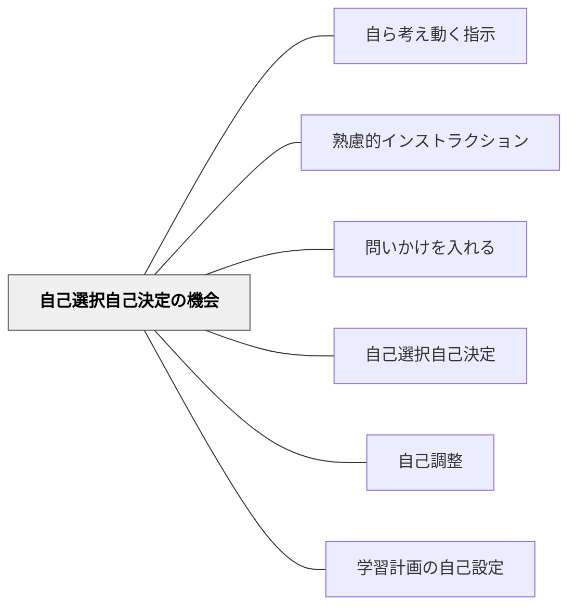

# 自己選択自己決定の機会

> 指示の中に「自分で決める余地」を意図的に作ることで、受け手の主体性と動機を引き出す。

## 背景（Context）
土居正博の指示論では、指示の中に自己選択・自己決定の機会を埋め込むことが学習者の主体性を高める重要な要素として示されている。どんなに小さな選択であっても「自分で決めた」という感覚は、行動への動機と責任感を生む。教師が全てを決める指示より、選択の余地がある指示の方が学習者を能動的に動かすことができる。

## 問題（Problem）
すべてが指示された通りにやるだけの活動では、学習者は外発的な動機にとどまりやすい。「どうやるかは自分で決めていい」という余地がないと、学習者は自分の思考・判断・工夫を持ち込む機会がなくなる。主体性は与えられるのを待つのではなく、設計の中に埋め込む必要がある。

## 力のかたち（Forces）
- 選択肢があることで動機が高まるが、多すぎると決断疲れを起こす
- 選択の範囲を限定することで、初心者でも迷わず決めやすくなる
- 小さな選択の積み重ねが大きな自律性を育てる
- 選択の結果に責任を持つという経験が学習者の成長につながる

## 解決（Solution）
**「AかBを選んでください」「やり方は自分で決めてください」という形で、指示・活動の中に自己選択・自己決定の余地を意図的に組み込む。**
選択の対象はテーマ・方法・順番・形式・パートナーなど何でもよい。学習の初期段階では2〜3択から始め、慣れに応じて自由度を上げていく。選んだ理由を振り返る機会を設けることで、自己選択の質が高まる。指示の中に「あなたが決める部分」を明示することが重要である。

## 結果（Consequences）
- 学習者が活動を「自分のもの」として取り組むようになる
- 選択に伴う責任意識と振り返りの習慣が育まれる
- 指示への依存が減り、自律的な学習者が育ちやすくなる

## クラスター図

## Actionable Insight

- 1コマの指示の中に「AかBかあなたが決めてください」という箇所を少なくとも1つ入れる——どんなに小さな選択でも「自分で決めた」という感覚が学習への主体的関与を生む
- 選択をさせた後に「なぜそれを選んだか」を1文書かせる——選択の理由を言語化する経験が自己決定の質と責任意識を高める
- 「やり方は自由です」と伝えるとき、迷わないよう2〜3の選択肢の例を示してから解放する——適切な範囲の示し方が初心者でも安心して選べる自律的な活動につながる

## 出典

- 一つの教育のパタン・ランゲージ（岩井輝久）

## 関連パタン
- [[学級経営/学級経営で使えるパタン]]
- [[パタン/自ら考え動く指示]]
- [[パタン/熟慮的インストラクション]] — 親パタン
- [[パタン/問いかけを入れる]] — 思考を促す指示設計
- [[パタン/自己選択自己決定]] — 動機付け視点からの同概念
- [[パタン/自己調整]] — 自律的な学習への発展
- [[パタン/学習計画の自己設定]] — 計画段階での自己決定
