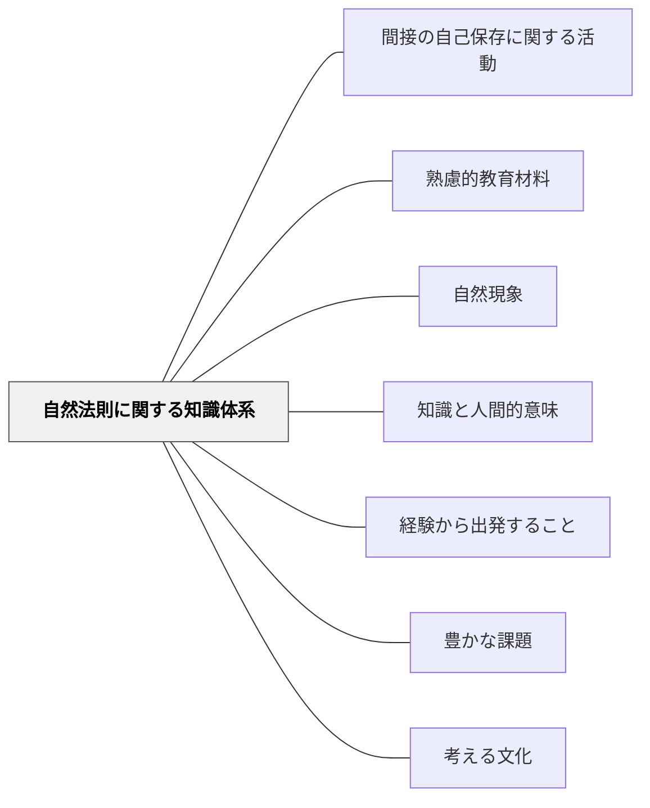

# 自然法則に関する知識体系

> 物理・化学・生物学などが発見してきた自然の法則が教育材料の核をなす。

## 背景（Context）

牧口常三郎の知識体系分類の一つ。物理学・化学・生物学・地学など、自然界の普遍的な法則・原理に関する知識の体系。これらは自然との直接的な関わり（観察・実験）を通じて体験的に学ぶことが重要。

## 問題（Problem）

自然科学の法則を「覚えるもの」として扱うと、知識と現象の結びつきが失われ、科学的思考が育たない。

## 力のかたち（Forces）

- 自然法則は普遍的で検証可能
- 観察・実験を通じた体験的学習が理解を深める
- 数学との深い接続がある

## 解決（Solution）

**自然法則を、観察・実験・問いを通じて発見的に学べる教材設計をする。法則の「人間的意味」（誰が・なぜ発見したか）も伝える。**

## 結果（Consequences）

- 科学的思考・探究心が育つ
- 自然への理解と畏敬が深まる

## 関連パタン
- [[パタン/間接の自己保存に関する活動]]

- [[パタン/熟慮的教材教具]] — 親パタン
- [[パタン/自然現象]] — 法則の入り口
- [[パタン/知識と人間的意味]] — 法則の背景にある人間の営み

- [[パタン/経験から出発すること]] — 自然現象の体験を出発点に法則を発見する
- [[パタン/豊かな課題]] — 自然法則を核にした豊かな課題設計
- [[パタン/考える文化]] — 自然法則への批判的考察が「考える文化」の基盤となる
## クラスター図

## Actionable Insight

- 自然法則を教えるとき「誰がどのように発見したか」の物語を1つ添える——法則が人間の営みの産物であるという文脈が学習者の関与と記憶を深める
- 単元に1回「現象を見せて法則を自分で見つける」発見型活動を設ける——「覚える」から「発見する」への変換が科学的思考の習慣を育てる
- 「なぜこの法則が成り立つと思う？」という問いを法則の提示後に入れる——理由への問いが表面的な暗記を概念的な理解へと深める

## 出典

- 牧口常三郎（1972）『牧口常三郎全集第4巻 創価教育学体系 上』聖教新聞社
