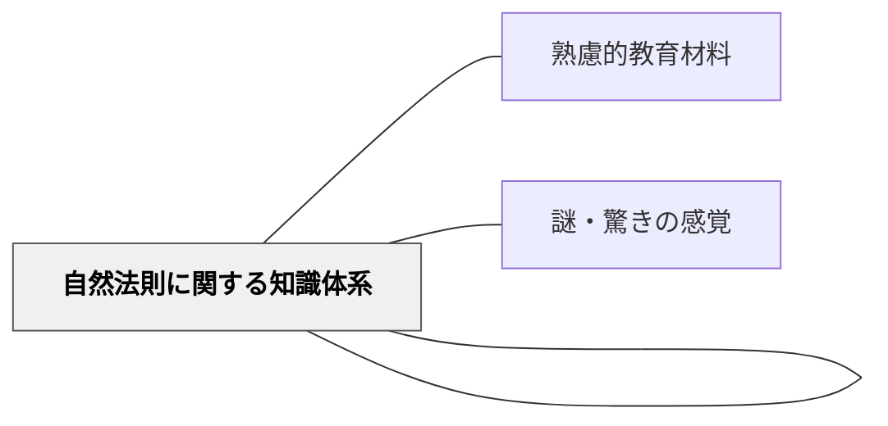

# 自然現象

> 「なぜそうなるのか」という問いを引き起こす自然の出来事が学びを動かす。

## 背景（Context）

雷・虹・影・潮の満ち引き・植物の成長・動物の行動など、身の回りの自然現象は強力な教育材料となる。予期せぬ自然現象との出会いは「謎・驚きの感覚」を生み、探究の動機を自然に引き出す。

## 問題（Problem）

教科書の中の「現象」は既に答えが書かれており、本来の驚きや疑問が奪われている。

## 力のかたち（Forces）

- 実際の自然現象は予測不能で驚きを生む
- 季節・地域によって体験できる現象が変わる
- 現象の観察から概念・法則への接続が必要

## 解決（Solution）

**実際の自然現象を学習者が直接観察・体験できる機会を意図的に設計し、「なぜ？」という問いを引き出す入り口として活かす。**

## 結果（Consequences）

- 学習者から自然発生的な問いが生まれる
- 抽象的な法則が具体的な現象と結びつく

## 関連パタン

- [[パタン/熟慮的教材教具]] — 親パタン
- [[パタン/自然的環境]] — 上位パタン
- [[パタン/謎・驚きの感覚]] — 自然現象が生む驚き
- [[パタン/自然法則に関する知識体系]] — 現象から法則へ

## クラスター図

## Actionable Insight

- 理科の授業の導入に「実際の現象の観察」を置き、その後に概念・法則の説明に進む——現象への直接的な出会いが「なぜ？」という問いを自然に引き出す
- 「何が見えますか？何が不思議ですか？」と問いから始め、答えをすぐに教えない——観察から生まれた学習者自身の問いが探究への動機となる
- 季節・地域の自然現象（雨・虹・霜・影・植物の成長など）を単元の導入材料として積極的に使う——身近な自然との出会いが抽象的な法則を具体と結びつける

## 出典

- [[文献/熟慮的教育材料のパターンリスト（動画記録）]]
