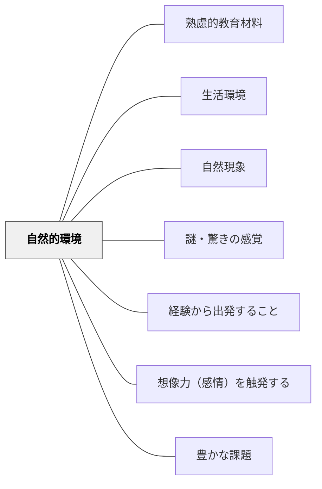

# 自然的環境

> 自然との関わりが価値を創造し、学びを生む。

## 背景（Context）

山・川・植物・動物・気象・地形など、学習者を取り巻く自然的環境は豊かな教育材料の宝庫である。牧口常三郎の価値論では、自然的環境との関わりから利・善・美の価値が生まれる。理科・算数・図工・社会など多くの教科で自然的環境を教材化できる。

## 問題（Problem）

教室内の教科書・プリントだけで自然を「知識」として扱うと、直接体験から来る気付きや驚きが失われる。

## 力のかたち（Forces）

- 直接体験が感情・想像力を触発し深い理解を生む
- 自然事象には「謎・驚きの感覚」が豊富に含まれる
- 学校所在地や季節によって使える自然的環境が異なる

## 解決（Solution）

**学習者の周囲にある自然的環境（植物・動物・気象・地形など）を観察・体験する活動を通じて教育材料として活かす。**

## 結果（Consequences）

- 直接体験を通じた深い理解が生まれる
- 自然への畏敬・探究心が育つ

## 関連パタン
- [[学級経営/学級経営で使えるパタン]]

- [[パタン/熟慮的教材教具]] — 親パタン
- [[パタン/生活環境]] — 上位パタン
- [[パタン/自然現象]] — 自然的環境の具体的な事象
- [[パタン/謎・驚きの感覚]] — 自然事象との出会い

- [[パタン/経験から出発すること]] — 自然環境との体験が学びの起点になる
- [[パタン/想像力（感情）を触発する]] — 自然の驚きが感情・想像力を動かす
- [[パタン/豊かな課題]] — 自然環境を核にした豊かな課題設計

## クラスター図

## Actionable Insight

- 単元に1回、教室外に出て学習テーマに関連する自然を直接観察する機会を設ける——直接体験がもたらす驚きと気づきは教科書だけでは得られない探究の入り口になる
- 自然物（葉・石・種・虫など）を教室に持ち込んで「これは何だろう？なぜこうなっているか？」と問いを立てる——手触りのある現実の素材が好奇心と探究意欲を引き出す
- 学校周辺の自然（校庭の植物・近くの川・天気の変化）を継続的な観察対象にする——継続観察が変化の発見と因果への問いを生む

## 出典

- 牧口常三郎（1972）『牧口常三郎全集第4巻 創価教育学体系 上』聖教新聞社
