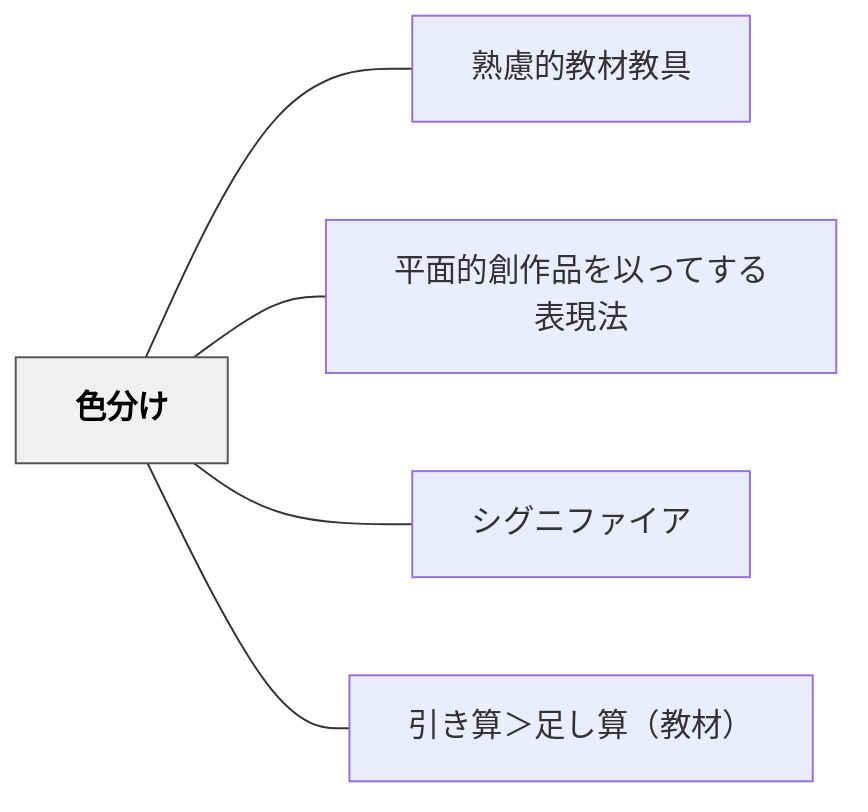

# 色分け

> 色を使って情報を分類・強調・整理することで、学習者の理解とナビゲーションを支援する。

## 背景（Context）

アナログ実装技法の一つ。ハイライト・色付きカード・色別インデックスなど、色が情報の意味・カテゴリ・重要度を視覚的に伝える。視覚的コーディングとして教材の構造を直観的に把握させる。過剰な色使いは逆効果になることも知られている。

## 問題（Problem）

文字や情報が均質に並んでいると、重要な情報や関連する情報のかたまりが見えにくい。

## 力のかたち（Forces）

- 色が構造・カテゴリ・重要度を即座に伝える
- 一貫した色使いが認知の安定をもたらす
- 多色使いは混乱を生む（3〜4色が上限の目安）

## 解決（Solution）

**教材の情報に意味のある色分けを施す。カテゴリ・重要度・段階などを色で区別し、一貫したルールで使用する。色だけに頼らず形や位置とも組み合わせる。**

## 結果（Consequences）

- 情報の構造・カテゴリが視覚的に把握できる
- ナビゲーションと参照が容易になる

## 関連パタン
- [[教科/算数・数学で使うパタン]]

- [[パタン/熟慮的教材教具]] — 親パタン
- [[パタン/平面的創作品を以ってする表現法]] — 視覚的表現
- [[パタン/シグニファイア]] — 視覚的な意味の伝達
- [[パタン/引き算＞足し算（教材）]] — 視覚的シンプルさ

## このパタンが働く実践

| 実践パタン | どのように色分けが働くか |
|------------|--------------------------|
| [[実践/カエルの算数：勝ちやすさを表で考えよう]] | 同じ和になる組み合わせを色や丸で示し、出やすさの違いを見えやすくする |

## クラスター図

## Actionable Insight

- 教材で使う色を「重要語＝赤、例示＝青、注意点＝緑」のように3色以内に固定し、全授業で一貫させる——色のルールが統一されるだけで学習者の情報ナビゲーション速度が上がる
- ワークシートの「問題文・作業エリア・答え欄」を背景色や枠線の色で区別する——視覚的構造が明確になり、どこで何をすべきかが一目でわかる
- ノートまとめの際に「自分の色分けルール」を1行書かせてから始める——色に意味を持たせる習慣が情報整理力と自己調整力を育てる

## 出典

- 鈴木克明（2002）『教材設計マニュアル――独学を支援するために』北大路書房
