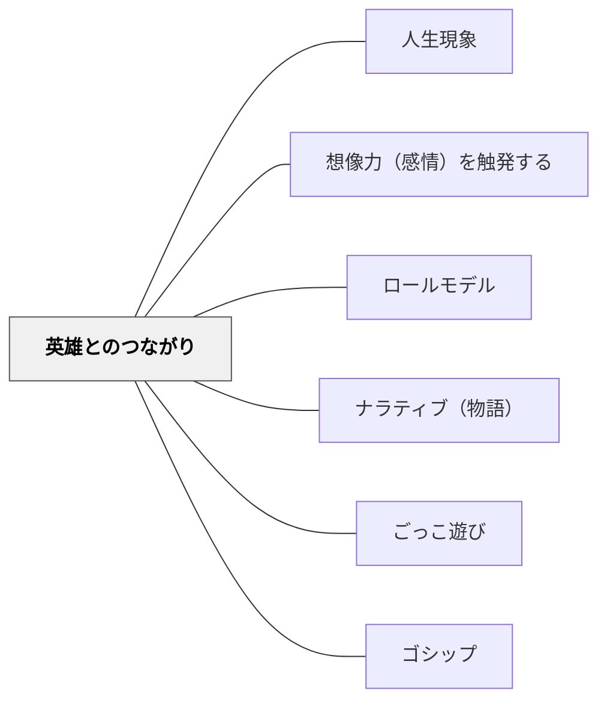

# 英雄とのつながり

> 尊敬できる存在との心理的なつながりが、成長の方向を指し示す

## 背景（Context）

人間は憧れの存在・ロールモデルとのつながりを感じることで、自分の可能性を広げようとする。英雄は歴史上の偉人だけでなく、アニメの登場人物や身近な大人にも存在する。

## 問題（Problem）

学習者が「なぜ学ぶのか」「自分はどんな人間になりたいのか」という方向性を持ちにくいとき、学習への動機が弱くなる。どうすれば学習者の自己形成の欲求と学びをつなぐことができるか。

## 力のかたち（Forces）

- ロールモデルへの同一化は強力な動機づけになる
- 英雄は完全でなくてよい。失敗・葛藤・成長のストーリーが共感を生む
- ナポレオン・アインシュタインといった歴史的人物も、アニメの登場人物も英雄になりうる
- 特定の英雄像の押しつけは、学習者の自律性を損なう

## 解決（Solution）

授業の中で学習者が感情的なつながりを感じられる「英雄」を取り上げる。伝記学習では人物の葛藤と成長を丁寧に描く。学習者自身に「あなたの英雄は誰か」を問い、その英雄から学ぶことを探究活動につなげる。アニメや漫画の登場人物を「英雄」として真剣に分析する活動も有効。

## 結果（Consequences）

- 学習者の自己形成意欲と結びついた深い動機づけが生まれる
- 伝記・歴史・道徳などの学習内容への感情的関与が高まる
- 特定の英雄への過度な同一化が批判的思考を妨げることがある

## 関連パタン
- [[パタン/人生現象]]

- [[パタン/想像力（感情）を触発する]]
- [[パタン/ロールモデル]]
- [[パタン/ナラティブ（物語）]]
- [[パタン/ごっこ遊び]]
- [[パタン/ゴシップ]]

## クラスター図

## Actionable Insight

- 単元の最初に「あなたにとっての英雄は誰か、その人から何を学びたいか」を1文書かせる——学習者の内的動機と学習内容をつなぐ橋を架ける
- 伝記・歴史人物の学習では「その人の失敗・葛藤」にスポットを当てる——完璧な英雄像でなく人間的な成長物語が学習者の共感を引き出す
- アニメ・漫画のキャラクターを「なぜその人を英雄と思うか」の分析対象として正式に扱う——学習者が自分の言葉で英雄を語る経験が自己形成の思考を促す

## 出典

キアラン・イーガン（2010）『想像力を触発する教育――認知的道具を活かした授業づくり』北大路書房
