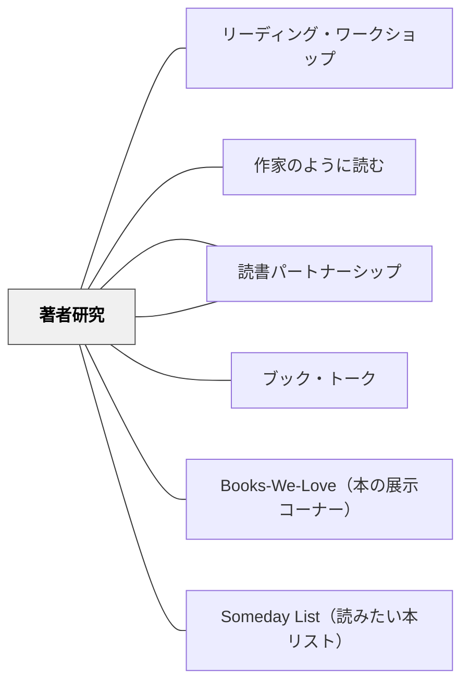

# 著者研究

> 好きな著者の本を集め、類似・相違・着想の源を探ることで、読む力と「作家のように読む」力を同時に育てる。

---

## 背景（Context）

1〜5月の「Readers Pursue Their Interests」単元で、子どもたちは**Reading Centers**（読書センター）と呼ばれる小グループ研究に取り組む。著者研究（Favorite Authors Study）はその中心的なセンターの一つ。子どもが「このオードリー・ウッドの本も、あの本も、なんか似てる！」という気づきを出発点にして、著者への深い探究に入っていく。

## 問題（Problem）

読書の量は増えても、本との関わりが表面的なままになることがある。「読んだ」「面白かった」「好きじゃなかった」で終わり、なぜ面白かったのか、作者がどんな工夫をしているのかという視点が育たない。

## 力のかたち（Forces）

- 好きな著者の本を何冊も読むことで、自然と「類似・相違」に気づく読み方が育つ
- しかし、「著者の技法を分析する」という指示は抽象的すぎて子どもに届かない
- 浸透フェーズ（読み聞かせで同じ著者に出会う期間）なしに研究を始めると空回りする
- グループで話し合うと一人では気づかなかった発見が生まれるが、話し合いの構造がないと発散する

## 解決（Solution）

Collins（2004）は著者研究を**段階的なサイクル**として設計する。

---

### 準備フェーズ：Immersion（1週間程度）

研究開始前に、これから研究する著者の本を読み聞かせで複数回取り上げる。「この著者の本を読んでいる」という共通体験を全員が持った状態でスタートするため。

著者例：Mem Fox, Cynthia Rylant, Ezra Jack Keats, Judith Viorst, Arnold Lobel, Joy Cowley, Lois Ehlert, Seymour Simon（ノンフィクション）

---

### Cycle 1：類似と相違を見つける（1〜2週間）

パートナーで著者バスケット（同じ著者の本10冊前後）を選び、読み始める。

**読み手として育てたい習慣（Collins, 2004）：**
- 著者の本を集めて読む
- 著者の本の類似・相違に気づく
- 著者の本に繰り返し登場するテーマを見つける

**センターでの活動例：**
- 「この著者の本には何が必ず出てくる？」をパートナーと話し合う
- Cynthia Rylantの本を並べて「ミスたまき先生みたいな登場人物がいつもいる」と気づく子

---

### Cycle 2：着想の源と文体を研究する（2〜3週間）

- 著者がどこからアイデアを得ているかを探る（作者紹介・インタビュー等を使う）
- 文体・構成の特徴をノートに記録する（繰り返し表現・特定の言葉の使い方など）

**育てたい習慣：**
- 著者の人生とその本の関係を考える
- 著者の「お気に入りのテーマ」に気づく
- 著者の文体や構成の特徴を読む（作家のように読む）

---

### Cycle 3（選択）：著者を比較・分類する

複数の著者を横断的に比較する（例：Mem Fox と Cynthia Rylant はどちらも家族・つながりをテーマにするが、絵のスタイルが全く違う）。

---

### 日本の学校文脈での実装例

- 国語の読書単元に「好きな作家の本を3冊読んで、気づいたことを話し合う」という活動として設計できる
- 著者バスケットを学校図書館と連携して作る
- 読み聞かせの年間計画に「同じ著者を連続して取り上げる週」を意図的に入れる

---

## 結果（Consequences）

- 子どもが「自分の読み手としての興味」を意識するようになる（読書アイデンティティの深化）
- 「作家のように読む」力が読書の中で自然に育つ
- 著者研究がライティング・ワークショップの「お手本著者」探しにつながる
- ノンフィクション著者研究（Seymour Simon等）は情報テキストの読み方も育てる

## 関連パタン

- [[パタン/リーディング・ワークショップ]] — 著者研究が組み込まれる親構造（Chapter 7 の Reading Centers）
- [[パタン/作家のように読む]] — 著者の技法を意識して読む力
- [[パタン/読書アイデンティティ]] — 好きな著者を持つことがアイデンティティを深める
- [[パタン/ブック・トーク]] — 著者研究の成果をブックトークで共有する
- [[パタン/読書パートナーシップ]] — 著者研究はパートナーと行う
- [[パタン/Books-We-Love（本の展示コーナー）]] — 著者研究で発見した本を展示する
- [[パタン/Someday List（読みたい本リスト）]] — 同じ著者の未読本がリストに積まれる

---

## クラスター図

## Actionable Insight

- 読み聞かせの計画で「同じ著者を3週連続で取り上げる」時期を年に1〜2回作る。その著者の本が自然と「好きな著者」になっていく
- 著者バスケットは紙袋に著者の顔写真と名前を貼って「著者コーナー」を作ると子どもが手に取りやすい
- 「この著者が好きな人は誰？」を朝のサークルで聞き、著者ごとに手を挙げる。「自分は○○先生ファンだ」という感覚が研究のモチベーションになる

---

## 出典

Collins, K.（2004）*Growing Readers: Units of Study in the Primary Classroom*. Stenhouse Publishers.

> "Readers gather and read texts by authors they love."
> "Readers notice similarities and differences among the texts by authors they love."
> "Readers wonder where authors get their ideas."
> "Readers look for themes that run through favorite authors' books."
