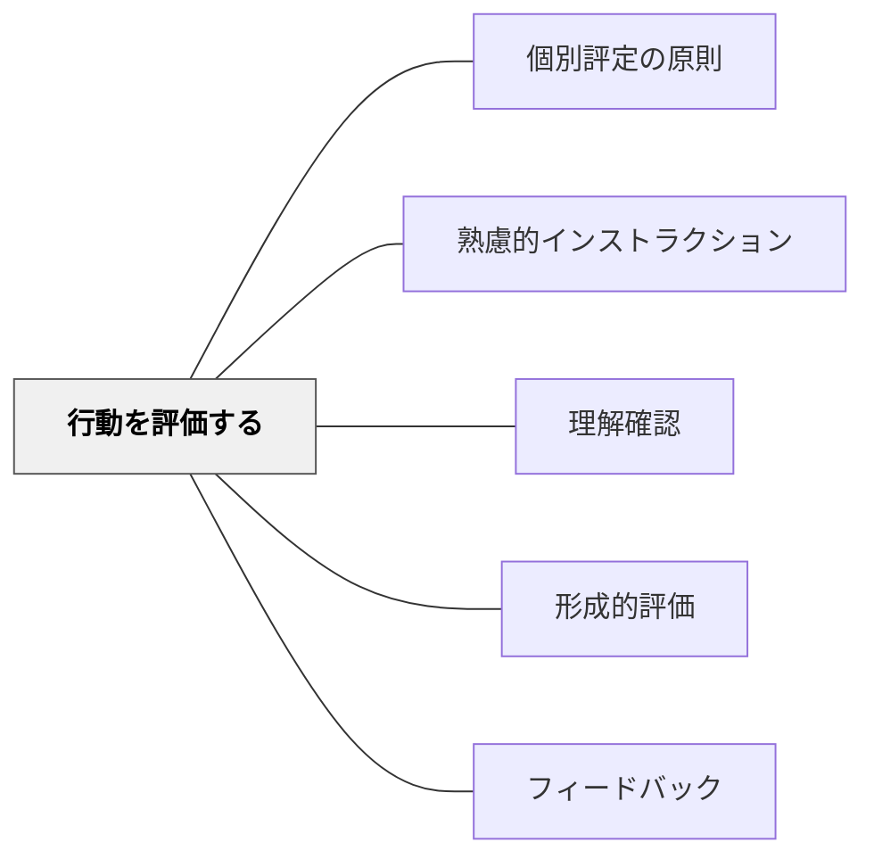

# 行動を評価する

> インストラクションは受け手が行動するまでを含む。行動を評価することで、次の設計に活かせる。

## 背景（Context）
インストラクションの設計は、指示・説明を出す段階だけで完結しない。受け手が実際にどう動いたか・どう理解したかを確認し評価することで、初めてインストラクションの効果が判断できる。土居正博の指示論は、指示の成否を行動の結果から評価する視点を重視する。

## 問題（Problem）
指示を出した後に受け手の行動を観察・評価しないと、指示が有効だったかどうかが分からない。指示の問題点や改善点が見えないまま同じインストラクションを繰り返してしまう。「伝えた」ことと「届いた」こと・「動いた」ことは別であり、行動の確認なしには評価が成立しない。

## 力のかたち（Forces）
- 「伝えること」ではなく「動かすこと」がインストラクションのゴール
- 行動を観察することで指示の明確さ・適切さが検証できる
- 評価なしには設計の改善が起きない
- 行動を評価する姿勢が、受け手への責任ある関与を促す

## 解決（Solution）
**指示・説明の後に、受け手の行動を観察・記録し、インストラクションの有効性を評価する。**

「指示どおりに動けたか」「どこで詰まったか」「どれくらいの割合が正しく理解したか」を確認する。観察の結果を次の指示設計に反映させる。形成的評価のサイクルとして、指示→行動→評価→改善を意識的に回す。

## 結果（Consequences）
- インストラクションの質が継続的に向上する
- 問題のある指示パターンが早期に発見される
- 受け手の実態に基づいた設計ができるようになる

## クラスター図

## Actionable Insight

- 指示を出した後に意図的に30秒観察し「どれくらいの子が正しく動けているか」を確認する——「伝えた」と「届いた」を区別する視点がインストラクションを改善し続ける
- 授業後に「今日の指示で詰まっている子が多かった場面はどこか」を1分振り返る——評価の記録が次の設計への具体的な改善点になる
- 「指示どおりに動けなかった子」を注意するのではなく「どこでつまずいたか」を丁寧に確認する——行動の結果を観察することが、指示の問題なのか理解の問題なのかを判断する基礎になる

## 出典

- 一つの教育のパタン・ランゲージ（岩井輝久）

## 関連パタン
- [[パタン/個別評定の原則]]
- [[パタン/熟慮的インストラクション]] — 親パタン
- [[パタン/理解確認]] — 行動前の理解確認と連動
- [[パタン/形成的評価]] — 評価を改善に活かす
- [[パタン/フィードバック]] — 評価結果を受け手に返す
