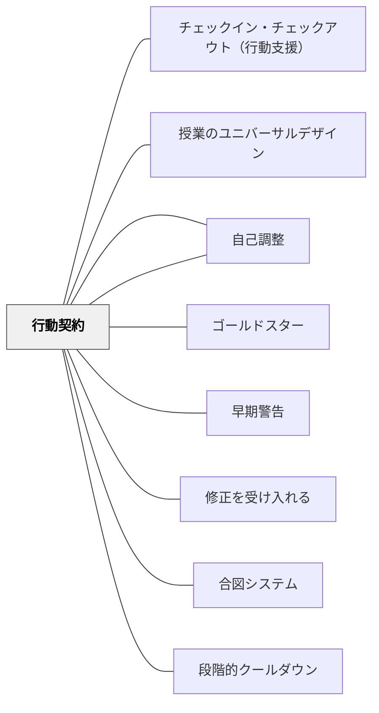

# 行動契約

> 子どもが「自分で決めた」目標に向かうとき、契約は義務でなく自己決定の証になる。

## [Pattern Connection]

- **既存パタンとの関連**：[[パタン/自己選択自己決定]] の「自分で決める」という核と直結する。[[パタン/自己調整]] のサイクル（目標設定→モニタリング→調整）を「契約」という目に見える形にしたもの。[[パタン/ゴールドスター]] と組み合わせると、契約達成時の公的な称賛が強化として機能する。
- **補強された点**：「強化子（報酬）を子ども自身が選ぶ」という原則が核心。大人が設定した報酬ではなく、その子どもが本当に価値を感じるものを使うことで、動機が内発的になる。
- **修正・拡張された点**：行動契約は「問題行動への罰的対応」ではなく、「望ましい行動への前向きなサポート」として設計する。ネガティブな文脈で使うと関係が壊れるため、必ずポジティブな目標設定から始める。
- **他のパタンへの波及**：[[パタン/早期警告]] ——行動契約は「問題が起きる前に」設計するものであり、早期警告の後に次のステップとして使える。[[パタン/修正を受け入れる]] ——契約の内容は学習しながら調整可能であり、学習者が「やり直せる」という感覚を持てる。

## 背景（Context）

特定の行動目標（座っている時間を増やす・友達に話しかける・課題を最後までやり終える）に向けて、子どもが継続的に取り組むためには、「今日どのくらいできたか」を確認できる仕組みと、「できたら何かよいことがある」という見通しが必要なことがある。

特別支援が必要な子どもや、動機づけに困難を抱える子どもは、遠い目標よりも近い目標・抽象的な賞賛より具体的な報酬の方が効果的に機能しやすい。

## 問題（Problem）

「もっとがんばりなさい」という言葉は行動を変えない。何を・どのくらい・いつまでに、という目標の具体化がなければ、子どもは何に向かえばよいかわからない。また、「できても何も変わらない」では継続のエネルギーが続かない。

## 力のかたち（Forces）

- 目標が具体的でないと、子どもは何をどのくらい頑張ればよいかがわからない
- 大人が設定した報酬は子どもに刺さらないことがある
- 子どもが自分で選んだ目標と報酬には、自己決定の感覚が伴う
- 子どもにとって「先生と約束した」という事実が社会的な動機になる
- 達成できない高すぎる目標は逆効果になる

## 解決（Solution）

**子どもと一緒に、①目標の設定→②強化子の選択→③条件の合意→④契約書への署名、という4ステップで行動契約を作り、実施・モニタリング・調整を行え。**

---

### 行動契約の4ステップ

**① 目標行動を具体的に定義する**
- 「授業中に座っている」ではなく「〇時間目の算数の授業を最後まで自分の席でやり遂げる」
- 行動を観察・記録できる形にする
- 目標は現在のレベルより少し上——達成可能な高さに設定する
- 「しないこと」でなく「すること」で記述する

**② 強化子（報酬）を子どもと一緒に選ぶ**
- 「何を達成したら何が嬉しい？」と子どもに聞く
- 大人の発想ではなく、子どもが本当に価値を感じるものを選ぶ
- シンプルでよい：10分の自由時間、コンピュータの時間、友達と話せる時間、「できた」の電話を親にかける機会
- 物質的な報酬は最初のきっかけとして使い、徐々に内的な満足へ移行する

**③ 条件を交渉する**
- 「この報酬をもらうには、何をどのくらいすればよいか」を子どもと話し合う
- 子どもが「これならできる」と感じる条件から始める
- 最初は低めの基準から始め、成功を重ねながら段階的に上げていく

**④ 契約書に書いて署名する**
- 合意した内容を紙に書き、両者（子どもと教師）が署名する
- 「紙に書いた・署名した」という事実が「自分で約束した」という感覚を強化する
- 形式は問わない——ノートの一ページでも、印刷したフォームでも

---

### 実施とモニタリング

**日々の記録**
- 毎日または毎時間、「できたか」を記録する（チャート・シール・数字など）
- 記録は子ども自身が行う方が自己調整につながる

**興味を失い始めたとき**
- 「報酬が今でも魅力的か」を確認する——飽きていれば別の報酬に替える
- 「基準が高すぎないか」を確認する——達成できないことが続けば意欲が下がる
- 「強化のタイミングが遅すぎないか」を確認する——特に幼い子は即時強化が重要

---

### 子どもとの話し方の例

- 「〇〇するようにしよう。できたら一緒に〇〇しよう。どう思う？」
- 「何ができたら嬉しい？先生と一緒に考えよう」
- 「これを一週間やってみて、うまくいったら見直そう」

## 結果（Consequences）

- 子どもが「自分で決めた目標」を持つことで、主体性が生まれる
- 具体的な目標と報酬があることで、行動変容の見通しが立つ
- 教師との「約束」関係が、信頼とつながりを強化する
- 小さな成功の積み重ねが自己効力感を育てる
- 問題行動が「どうにかなってから」でなく「起きる前の設計」で対処される

## 関連パタン
- [[実践/インクルーシブ授業の設計]]
- [[パタン/チェックイン・チェックアウト（行動支援）]]
- [[パタン/授業のユニバーサルデザイン]]

- [[パタン/自己選択自己決定]] — 子どもが選ぶことが契約の核心
- [[パタン/自己調整]] — 目標設定・モニタリング・調整のサイクル
- [[パタン/ゴールドスター]] — 達成時の公的な称賛との組み合わせ
- [[パタン/早期警告]] — 問題が起きる前に行動契約を設計する
- [[パタン/修正を受け入れる]] — 契約は修正・再交渉できる
- [[パタン/合図システム]] — 契約の実施中に合図で状態を伝え合う
- [[パタン/段階的クールダウン]] — 行動が崩れたときの対応手順との組み合わせ

## クラスター図

## Actionable Insight

- 今週、一人の子どもと「今日の算数の時間、最後まで座っていたら〇〇しよう」という口約束から始めてみる——紙に書かなくていい。まず「子どもと目標と報酬を一緒に決める」感覚をつかむ
- 報酬を決めるとき「先生ならこれが嬉しいだろうと思うものを選ぶ」のをやめる——「あなたは何をもらったら嬉しい？」とそのまま聞いてみる
- 1週間後に「報酬、まだ好き？」と確認する習慣をつける——子どもの好みは変わる。更新し続けることが契約の鮮度を保つ

## 出典

Hammeken, P. A. (2007). *The Teacher's Guide to Inclusive Education: 750 Strategies for Success!* Corwin Press. (2nd ed.)

> "Use behavior contracts. When creating behavior contracts, do the following: Define the behavior and be specific. Select the reinforcers with the student. Negotiate with the student what must be done to receive the reward. Fill in the contract and sign it." — Hammeken (2007), Strategy #725

> "If a student begins by working toward the goal and loses interest, check to be sure the student is receiving consistent reinforcement and that the rewards are still motivating for the student. If not, readjust the criteria." — Hammeken (2007), Strategy #725
