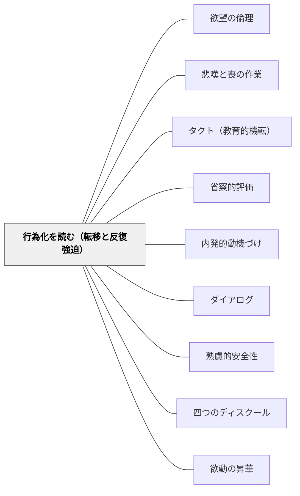

# 行為化を読む（転移と反復強迫）

> 子どもが同じ問題行動を繰り返すとき、それは記憶を語れないからかもしれない——言葉で教えても変わらない。行為を通じて語られていることを丁寧に読み、繰り返し向き合う時間を作ることが、変容への唯一の道だ。

---

## Pattern Connection

**フロイト「フロイト、無意識について語る」（中山元訳）統合（2026-06-03）：**

フロイトの1914年論文「想起、反復、徹底操作」が本パタンの理論的基盤である。

- **既存パタンとの関連**：[[パタン/タクト（教育的機転）]] が「教師が状況を読んで即興的に対応する」を扱うのに対し、本パタンは「その状況を生み出している無意識的構造を読む」という一段深い層を扱う。[[パタン/省察的評価]] の「繰り返し向き合う」が徹底操作と接続する
- **補強された点**：「なぜこの子は何度言っても変わらないのか」という問いへの答えとして、行為化・反復強迫・徹底操作という精神分析的概念が教育的文脈に有効な枠組みを提供する
- **他のパタンへの波及**：[[概念/無意識と教育]]・[[パタン/内発的動機づけ]]（快感原則と現実原則の発達的文脈）・[[パタン/ダイアログ]]（言語化を促す対話の意味）

**ラカン入門（向井雅明）統合（2026-06-03）：**

ラカンのautomaton/tuché概念とSSS（想定的知の主体）が、フロイトの反復強迫・転移理論を深める補助線として追加された。

- **補強された点**：フロイトの「反復強迫」を表面的反復（automaton）と現実界との遭遇（tuché）に分けることで、「なぜ解釈が届かない反復があるのか」が構造的に説明できる
- **修正・拡張された点**：転移の構造をSSSとして読む枠組みが加わり、「教師-子ども関係における転移の何が問題か」がより精密になった（→7.）
- **他のパタンへの波及**：[[概念/享楽と反復]]・[[パタン/四つのディスクール]]

---

## 背景（Context）

教師は日々、問題行動の繰り返しに直面する。叱る・諭す・罰する・褒める——様々な介入をしても、同じ行動が繰り返される。

一般的な解釈は「習慣」「わがまま」「反抗」「特性」——行動の表面を見ている。

フロイトは別の視点を示す：**人間は語れない記憶を、行為として再現する**。未解決の過去（傷・不安・未達成の関係パターン）は、言語化できるほど意識に上ることなく、繰り返しの行為として表出する。これを**行為化（Acting out）**、その駆動力を**反復強迫（Wiederholungszwang）**と呼ぶ。

## 問題（Problem）

「言葉で教えれば変わる」という前提は、子どもの問題行動の深い層に届かないことがある：

- 叱ればその場は収まるが、翌日また同じことが起きる
- 「なぜそうしたか」を問うと「分からない」「また怒られる」と答える
- 本人も「やめたい」と言いながら繰り返す
- 特定の場面・関係・トリガーで必ず反応が出る

言語的理解と行動変容の間にある「壁」——この壁を「サボり」「反抗」として読むと介入が噛み合わない。壁の正体を理解する枠組みが必要。

## 力のかたち（Forces）

- 過去の傷・失敗・関係パターンは、意識に上れるほど言語化されていない
- 言語化されていない記憶は行為として「語られる」——本人にその意識はない
- 教師という権威的存在は、過去の重要な関係者（親・以前の教師）への転移を引き起こしやすい
- 一度理解しても、抵抗は変化の前後に繰り返し現れる——理解と変化は別のプロセス
- 変化には「繰り返し向き合う時間」（徹底操作）が必要であり、一回の正解・一回のカウンセリングでは足りない

## 解決（Solution）

**行為化を「語りかけ」として読み、「繰り返し向き合う」関係と時間を設計する。**

---

### 1. 「誰に対してこうしてきたのか」と問う（転移を読む）

子どもが教師に対して示す強い反応——過度な服従・試す行動・突然の反抗・依存・拒絶——は、その子の個人史に根を持っている可能性がある。

問いの転換：
- ✗「なぜ私にこうするのか」（現在の関係への怒り・困惑）
- ○「この子は誰に対してこうしてきたのか」（過去のパターンとしての理解）

この問いは答えを出すためではなく、「この子は過去の誰かを私に見ているかもしれない」という理解の構えを生む。その構えが、反応せずに「受ける」タクトを可能にする（[[パタン/タクト（教育的機転）]]）。

---

### 2. 行為を「語れない言葉」として読む

繰り返される問題行動を「メッセージ」として読む枠組み：

| 行為 | 考えられる「語れない言葉」 |
|---|---|
| 教師の目を見て試す行動を繰り返す | 「私を見捨てないか確認したい」 |
| 課題の前に必ず癇癪を起こす | 「失敗が怖すぎて始められない」 |
| 叱られた後に突然甘える | 「怒りの後に愛があるか確認したい」 |
| 特定の場面で急に問題行動が出る | 過去の特定の状況のトリガー |

これらは「意図的な悪意」ではなく「意図なき再現」——本人も知らずに繰り返している。

---

### 3. 徹底操作——繰り返し向き合うことを設計する

「そのような徹底操作が頂点に達したときにはじめて、わたしたちは被分析者との協力作業によって、抑圧された欲動の動きを発見することができるのである」（フロイト、1914年論文）

**徹底操作の教育的応用**：
- 一回の「分かった」では変わらない——同じ局面に繰り返し向き合う時間を作る
- 「また同じことをした」という失望を「もう一度向き合う機会」として読む
- カンファリング・振り返り・個別面談を「一回解決」ではなく「繰り返しのプロセス」として設計する（[[パタン/省察的評価]]）

---

### 4. 言語化を促す——事物表象から言語表象へ

「意識された表象は、事物表象とそれについての言語表象を含む。意識されない表象は事物表象だけしか含んでいない」（フロイト、1915年論文）

行為化から言語化へ——これが変容のプロセス。

実践：
- 「どんな気持ちだった？」（感覚・身体から始める）
- 「そのとき体はどんな感じだった？」（事物表象に触れる）
- 「それを言葉にするとしたら？」（言語表象への橋渡し）
- 「前にも似たような気持ちになったことある？」（過去との接続）

言語化は解決策を探すのではなく、「感じている何か」に名前をつけること。名前がつくと、それは行為ではなく「言葉として語れるもの」になる。

---

### 5. 集団の中の転移を読む

教室では個人の転移だけでなく、集団レベルの力動が働く：

- 教師への過度な依存・批判・崇拝は、集団としての「自我理想の投影」
- 学級内でのいじめ・排除は、集団の不安が特定の子どもへの「スケープゴート化」として現れることがある
- 学級崩壊は「教師への信頼（リビドー的結びつき）の崩壊」として起きる——危険の大きさではなく、絆の崩壊が原因

---

### 6. automaton・tuché・サントーム——反復の三層を読む（ラカン）

ラカンはフロイトの反復強迫を二つの層に分解した（セミネールXI、1964年）：

| 層 | 内容 | 介入の可能性 |
|---|---|---|
| **automaton**（自動的反復） | シニフィアン連鎖の表面的反復。「またこうなった」というパターン | 解釈・言語化・指摘が届く |
| **tuché**（現実界との遭遇） | 始原の充足（das Ding）への接近を反復しようとする現実界の核心 | 解釈では届かない。繰り返し向き合う関係が必要 |

**陰性治療反応との接続**：
解釈を提示されても症状が続く（悪化することもある）——それはtuchéのレベルの問題。解釈（象徴的操作）はautomatonには届くが、tuchéには届かない。

**教育的含意**：
- 何度指導しても変わらない行動の核心には、tuchéがある可能性がある
- 「なぜそうするの」という問いの反復はautomatonを整理するが、tuchéには届かないことがある
- tuchéの層に必要なのは「繰り返し向き合う関係そのもの」——徹底操作はtuchéへの唯一の臨床的応答

さらにその反復が主体の「在り方」として固定化されるとき、**サントーム（sinthome）**の次元に入る。サントームは解釈が届かないだけでなく、その子を支えている構造でもある——「直す」前に「これはその子のサントームかもしれない」と問う（→[[概念/サントーム]]）。

---

### 7. SSSとしての教師——転移の構造的読み方（ラカン）

ラカンは転移を「想定的知の主体（sujet supposé savoir / SSS）」の構造として定式化した：

> 「患者が分析家を訪れるのは、分析家にSSSを想定しているからだ——私の享楽に関する知を保持している者を私は愛する」

子どもが教師に「この先生は私のことを分かっている・分かってくれる」という転移を向けるとき、教師はSSSの位置に置かれる。

**SSSとしての教師の二つのリスク**：
1. SSSを字義通りに引き受ける（「そうだ、私がすべて分かっている」）→ 権威的指導・依存の強化・子どもの欲望の消去
2. SSSを否定する（「私には何も分からない」）→ 転移の崩壊・関係の空白

**分析的な応答**：SSSの位置を引き受けながら、その知の全能性を少しずつ崩す——「私はあなたのことを知っているかもしれないが、あなた自身が知ることが大事だ」という立場性。これは[[パタン/四つのディスクール]] の「分析家のディスクール」として展開される。

---

### 8. タナトスとしての攻撃的行為化

フロイトの欲動二元論（1932年）は、行為化の「なぜ暴力的な行為化が起きるのか」に答える：

**タナトス（死の欲動）の外向化**が攻撃性の根源。攻撃行動は「悪い子だから」ではなく、タナトス的エネルギーが昇華されずに外界（他者・物・空間）に向かっている状態。

| タナトスの向かい方 | 行為化の形 |
|---|---|
| 外界に向かう | 他害・物の破壊・暴言・いじめ |
| 自己に向かう | 自傷・自責・「消えたい」・過度な服従 |
| 未昇華のまま保持 | 緊張・かんしゃく・突然の爆発 |
| 昇華される | 激しい競争・批判的思考・スポーツ・解体・分析 |

**教師へのタナトス的行為化**：試す・反抗する・壊す・消える——教師への攻撃欲動の表れ。これは転移とタナトスの重なりとして読める。

**介入の方向**：「怒る・罰する（教師のタナトスで返す）」ではなく、「このエネルギーが昇華できる場を設計する（エロスで受け取る）」。攻撃欲動を壊す方向ではなく、昇華する方向に誘う。

---

## 結果（Consequences）

- 問題行動を「懲らしめるべきもの」でなく「読むべきメッセージ」として扱うことで、介入が変わる
- 「なぜ変わらないのか」という失望が「まだ十分に向き合えていない」という問いに変わる
- 徹底操作の観点から「繰り返し向き合うこと」を設計の前提にすることで、短期的な結果への焦りが和らぐ
- ただし、精神分析の枠組みは教育現場で使う際に限界がある：教師は分析家ではない。「読む」ことと「治療する」ことは別——読むことで関係と環境が変わり、行為化が不要になる状況を作ることが目標

## 関連パタン
- [[パタン/欲望の倫理]]
- [[概念/無意識と教育]] — 本パタンの理論的基盤
- [[概念/エロスとタナトス]] — タナトスとしての攻撃的行為化の欲動論的基盤
- [[概念/享楽と反復]] — automaton/tuché・das Ding・tuchéへの臨床的応答
- [[概念/鏡像段階]] — 想像界的競合・いじめの構造的理解
- [[パタン/悲嘆と喪の作業]] — 未完了の喪の作業が行為化として現れる
- [[パタン/タクト（教育的機転）]] — 転移状況に対応するタクトの意味
- [[パタン/省察的評価]] — 徹底操作としての繰り返しの省察
- [[パタン/内発的動機づけ]] — 快感原則・現実原則との接続
- [[パタン/ダイアログ]] — 行為化から言語化へのプロセスとしての対話
- [[パタン/心理的安全性（コンフォートゾーン）]] — 行為化が起きやすい場への配慮
- [[パタン/四つのディスクール]] — SSSとしての教師スタンスと分析家的応答
- [[文献/フロイト、無意識について語る（中山元訳）]] — 転移・反復強迫・徹底操作の主出典
- [[文献/人はなぜ戦争をするのか（フロイト、中山元訳）]] — タナトス・攻撃欲動の欲動論的基盤
- [[概念/サントーム]] — tuchéが固定化した「在り方」・解釈が届かない反復の第三の層
- [[文献/ラカン入門（向井雅明）]] — automaton/tuché・SSSの主出典
- [[パタン/欲動の昇華]] — 昇華に失敗した欲動が行為化として現れる；昇華のチャンネル設計が行為化への教育的応答

---

## クラスター図

## Actionable Insight

- **「なぜ私にそうするのか」を「誰に対してこうしてきたのか」に置き換える**——次に子どもの強い反応に直面したとき、この問いを自分の中でだけ立ててみる。答えは出なくていい。問いを持つだけで「受ける」タクトが変わる
- **「また同じことをした」ときのリアクションを変える**——「何度言えば」の代わりに「まだここに何かある」と読む。同じことが繰り返されるとき、それは「まだ向き合う余地がある」という信号でもある
- **言語化の問いを一つ試す**——問題行動の後に「そのとき体はどんな感じだった？」という問いを一度だけ使ってみる。答えを引き出すためではなく、「感じていることに名前をつける」体験をともに作るために

---

## 出典

フロイト, S.（中山元訳）（2021）．*フロイト、無意識について語る*．光文社古典新訳文庫．
向井雅明（2015）．*ラカン入門*．ちくま学芸文庫．

- Freud, S. (1914). Erinnern, Wiederholen und Durcharbeiten.
- Freud, S. (1915). Das Unbewußte.
- Freud, S. (1921). Massenpsychologie und Ich-Analyse.
- Lacan, J. (1964). Les quatre concepts fondamentaux de la psychanalyse. (Séminaire XI)

> 「被分析者はそれを記憶として再生するのではなく、行為として再現するのである。ただし被分析者はそれを自分が再現しているということを知らずに、行為において再現する」——フロイト（1914年論文）

> 「そのような徹底操作が頂点に達したときにはじめて、わたしたちは被分析者との協力作業によって、抑圧された欲動の動きを発見することができるのである」——フロイト（1914年論文）
