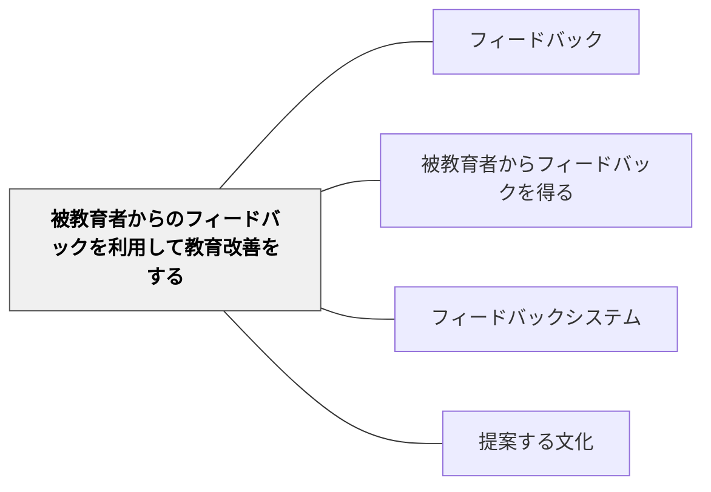

# 被教育者からのフィードバックを利用して教育改善をする

> 学習者から得た情報を使って授業を変えることが、真の双方向フィードバックである。

## 背景（Context）

学習者から情報を得ても、それを授業改善に活かさなければ情報が死んでしまう。また、「あなたの声が授業を変えた」という経験が学習者の当事者意識を高める。

## 問題（Problem）

多くの教師はアンケートや観察を行うが、その結果を次の授業に反映させる仕組みがない。学習者も「フィードバックを出しても変わらない」と感じると、フィードバックを出さなくなる。

## 力のかたち（Forces）

- 改善が学習者に見える形で示されると、フィードバックの循環が促進される
- すべての声に応えることはできないが、選択と理由の説明が信頼を生む
- 教師自身が「自分の授業が改善された」という体験が、この習慣を支える

## 解決（Solution）

**学習者から得たフィードバックを分析し、それに基づいて授業を調整し、その変更を学習者に伝える（「先週みんなからわかりにくいと言われたので、今日は別の方法で説明します」）。**

実践例：
- 「前回の振り返りで○○がわかりにくかったとあったので…」と授業を始める
- アンケート結果を集計して次の単元計画に反映する
- 学習者の得意・不得意パターンを授業設計に取り込む

## 結果（Consequences）

- フィードバックの循環（収集→改善→再フィードバック）が確立する
- 学習者が授業の共同設計者として参加意識を持つようになる

- [[パタン/省察的評価]] — フィードバックを省察的評価のサイクルに組み込む
- [[パタン/考える文化]] — 学習者が改善提案できる「考える文化」の土台
- [[パタン/主要概念で評価する]] — 主要概念への学習者フィードバックが評価設計を改善する
## クラスター図

## Actionable Insight

- 「前回○○がわかりにくかったとあったので、今日は別の方法で説明します」と授業を始める——変更を学習者に伝えることで「自分の声が届いた」という経験が参加意識を高める
- アンケート結果を集計して次の単元計画に具体的に反映させる——活用される実績がフィードバックの質と頻度を継続的に高める
- 「先週の振り返りカードを読んで、今日の授業を少し変えました」と1文添える——教師がフィードバックを読んでいるという事実だけで学習者の書く誠実さが変わる

## 出典

- 一つの教育のパタン・ランゲージ（岩井輝久）

## 関連パタン

- [[パタン/フィードバック]] — 親パタン
- [[パタン/被教育者からフィードバックを得る]] — 収集の前段階
- [[パタン/フィードバックシステム]] — 循環の仕組み化
- [[パタン/提案する文化]] — 学習者が改善提案をする文化
