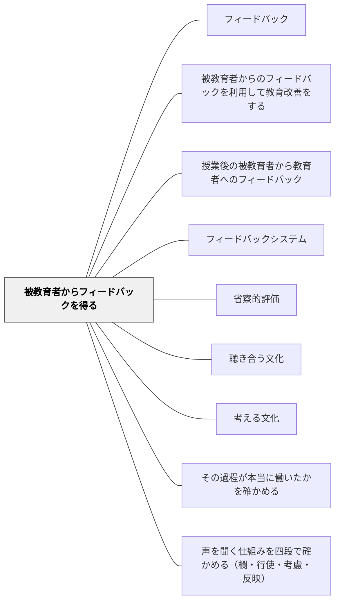

# 被教育者からフィードバックを得る

> 学習者の反応・声・作品はすべてフィードバックである。

## 背景（Context）

フィードバックは教師から学習者への一方向だけではない。学習者の表情・声・作品・理解度、授業中の様子——これらはすべて教師への貴重なフィードバックである。意図的にこれらを収集・活用することで、教育が改善される。

## 問題（Problem）

教師が一方的に「教えた」つもりになっていても、学習者が理解していない・動機がない・困惑しているということが、フィードバックを得ない限り見えない。

## 力のかたち（Forces）

- 学習者は自分の困惑や不満を直接伝えることをためらうことがある
- 形式的なフィードバック（アンケート）だけでなく、日常的な観察も重要
- フィードバックを得ても、使わなければ意味がない

## 解決（Solution）

**学習者の作品・発言・表情・態度・アンケートなど様々な形でフィードバックを収集し、それを教育改善に活用する習慣を作る。**

収集方法：
- 授業中のノート確認・机間巡視
- 「今日の授業でよくわからなかったこと」の記録
- 授業後の簡単な3問アンケート
- 出口チケット（終了前に1分で記録）

## 結果（Consequences）

- 教師が学習者の実態に基づいて授業を調整できるようになる
- 学習者が「自分の声が届く」と感じ、授業への参加意識が高まる

## クラスター図

## Actionable Insight

- 授業の終わりに「今日わからなかったこと」を1文書く出口チケットを使う——毎回の小さな記録が学習者の実態を継続的に把握する最も簡単な方法
- 机間巡視で学習者の表情・手の動き・ノートの様子を観察する——言葉にならない困惑が表情と行動に先に現れる。日常的な観察がアンケートより速い実態把握になる
- 授業後に「わかった・ふつう・わからなかった」の3択アンケートを1分で取る——シンプルな収集手段が継続を支え教師の改善サイクルの土台になる

## 出典

- 一つの教育のパタン・ランゲージ（岩井輝久）

## 関連パタン

- [[パタン/フィードバック]] — 親パタン
- [[パタン/被教育者からのフィードバックを利用して教育改善をする]] — 得たフィードバックの活用
- [[パタン/授業後の被教育者から教育者へのフィードバック]] — 授業後の系統的収集
- [[パタン/フィードバックシステム]] — 収集・活用の仕組み化
- [[パタン/省察的評価]] — 収集したフィードバックが省察的評価の材料になる
- [[パタン/聴き合う文化]] — 学習者が本音を語れる聴き合う文化の土台
- [[パタン/考える文化]] — 学習者が意見を持てる「考える文化」の前提

- [[パタン/その過程が本当に働いたかを確かめる]] — 子どもを「課題がいい課題かどうか」の検証の協力者に置く。同じ構造の反転
- [[パタン/声を聞く仕組みを四段で確かめる（欄・行使・考慮・反映）]] — 欄を作ることと、書かれること・読まれること・記録が動くことは、別の出来事である

