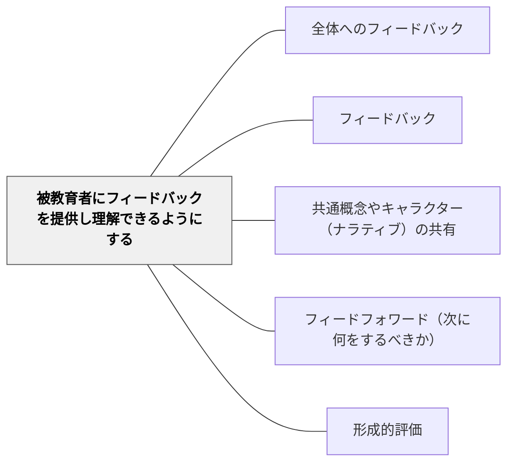

# 被教育者にフィードバックを提供し理解できるようにする

> フィードバックは届いてはじめて意味をもつ。理解されないフィードバックは存在しないも同然だ。

## 背景（Context）

教育の場では、教師や評価者が学習者に対してフィードバックを提供する機会が繰り返し訪れる。しかし、提供された情報が学習者にとって難解であったり、抽象的すぎたりすると、そのフィードバックは実際の学習改善に結びつかない。

フィードバックの質は「何が言われたか」だけでなく、「どのように届いたか」によって決まる。教師が正確な評価を行っていても、学習者がその意味を理解できなければ、学習は前進しない。

## 問題（Problem）

教師が提供するフィードバックが専門的・抽象的な言葉で書かれていたり、具体的な行動指針を欠いていたりするため、学習者がそれをどう活かせばよいかわからない状態が生じる。

フィードバックが届かない主な原因として、語彙の難しさ、改善の方向性が不明確なこと、学習者の現在の理解水準とフィードバックのレベルのずれがある。これにより、フィードバックは「評価のための儀式」になってしまい、学習者の成長に直結しない。

## 力のかたち（Forces）

- 教師は学習を深く理解しているため、専門的な言葉でフィードバックを書きがちだが、学習者はその言語を共有していない
- 時間の制約から、フィードバックを簡略化すると具体性が失われ、逆に詳細にすると学習者が圧倒される
- 学習者が「わかった」と思っていても、実際の行動に反映されていないことがある

## 解決（Solution）

フィードバックを提供する際には、学習者が実際に「次に何をすればよいか」を理解できる形式で伝えることを設計の原則とする。具体的には、抽象的な評価語（「深い考察が必要」）ではなく、具体的な行動（「事例を一つ追加し、その事例がなぜこの概念を支持するかを一文で説明する」）として表現する。

また、フィードバックには「成功している点（星）」と「改善できる点（願い）」の両方を含め、改善の方向性を明確にする。口頭でのフィードバックを補足として添えることも有効で、書かれた言葉と声のトーンを組み合わせることで理解が深まる。さらに、フィードバックを受け取った後に学習者が「つまりどういうこと？」と自分の言葉で言い換える機会を設けると、理解度を確認できる。

## 結果（Consequences）

- フィードバックが具体的な行動改善につながり、学習の質が向上する
- 学習者がフィードバックを「評価」ではなく「次へのガイド」として受け取るようになる
- 教師と学習者の間に共通言語が育まれ、フィードバックの循環が生まれやすくなる

## 関連パタン
- [[パタン/全体へのフィードバック]]

- [[パタン/フィードバック]] — 親パタン
- [[パタン/共通概念やキャラクター（ナラティブ）の共有]] — 共通言語の形成によってフィードバックの理解が助けられる
- [[パタン/フィードフォワード（次に何をするべきか）]] — 「次に何をすべきか」を具体化することがこのパタンの核心
- [[パタン/形成的評価]] — フィードバックを学習過程の中で活用するための基盤

## クラスター図

## Actionable Insight

- フィードバックを「深めなさい」ではなく「事例を一つ加えて」という具体的な行動として書く——抽象的な評価語より行動可能な言葉が学習改善に直結する
- フィードバックを渡した後「つまりどういうこと？」と学習者に一言言わせる——理解度の確認が一言でできる最速の方法
- 口頭でのフィードバックを書いたコメントの補足として使う——声のトーンと言葉を組み合わせることで理解が深まる

## 出典

Hattie, J. & Timperley, H. (2007). The Power of Feedback. *Review of Educational Research*, 77(1), 81–112.
Clarke, S. (2014). *Outstanding Formative Assessment*. Hodder Education.
