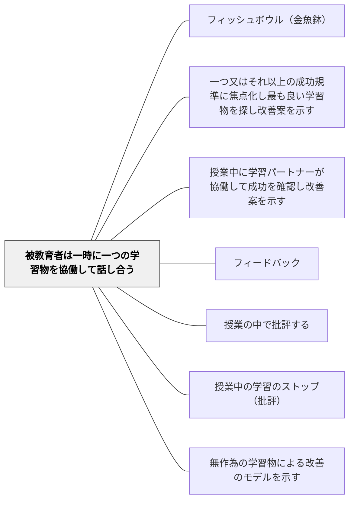

# 被教育者は一時に一つの学習物を協働して話し合う

> 一つのことに全員が集中するとき、議論の深さはどんな個別学習も超える。

## 背景（Context）

クラス全体が同時に複数の異なる作品を評価しようとすると、注意が分散し、フィードバックの質が下がる。一方、全員が一つの学習物（作品・解法・文章・アイデア）に集中して議論する形式では、多角的な視点が一点に集まり、深い批評と学びが生まれる。

シャーリー・クラークが提唱するこのアプローチは、授業のフィードバックセッションにおいて、「一度に一つ」の原則を守ることで、全員の知識と視点が集積し、個々の学習者には到達できない深さの理解が生まれるという考えに基づいている。

## 問題（Problem）

授業の中でフィードバックの時間を設けても、全員が同時に異なる作品を見ていると、共通の議論が成立しない。各自がバラバラな観点でコメントするため、学習者は「どこが問題なのか」「どう改善すればよいのか」についての集合的な理解を得られない。

また、複数の作品を並行して扱うと、一つひとつの評価が浅くなり、「成功の規準とはどういうものか」という共通認識が育ちにくい。

## 力のかたち（Forces）

- 一つの作品に集中することで議論が深まる一方、取り上げられなかった作品の学習者が疎外感を感じることがある
- 議論する学習物の選択（無作為・代表的・典型的）が、議論の方向性を大きく左右する
- 一つに絞ることで、全員が共通の批評経験をもち、その後の個別作業に応用できる

## 解決（Solution）

フィードバックセッションでは、一度に一つの学習物だけを全体に提示し、それに対してクラス全体で話し合う。学習物の選択は、無作為（特定の個人への偏りを避ける）または典型的な問題を含むものが効果的だ。

議論の進め方として、最初に「成功している点を見つける」ことから始め、全員が発言できる雰囲気をつくる。次に「改善できる点・疑問点」を挙げ、具体的な改善案を全体で議論する。教師はファシリテーターとして議論を整理し、最終的に「今日の批評から自分の作品に応用できることは何か」を各自が考える時間を設ける。

## 結果（Consequences）

- 全員が同じ基準で一つの学習物を評価する経験を通じて、評価規準の共通理解が深まる
- 個別にフィードバックを受けるよりも、集合的な知識と視点が蓄積される
- 「一つのものを丁寧に見る」という観察の習慣がクラス全体に育まれる

## 関連パタン
- [[パタン/フィッシュボウル（金魚鉢）]]
- [[パタン/一つ又はそれ以上の成功規準に焦点化し最も良い学習物を探し改善案を示す]]
- [[パタン/授業中に学習パートナーが協働して成功を確認し改善案を示す]]

- [[パタン/フィードバック]] — 親パタン
- [[パタン/授業の中で批評する]] — 一つの学習物への集中はこのパタンの核心的な実装
- [[パタン/授業中の学習のストップ（批評）]] — 作業を止めて一つの学習物に集中する
- [[パタン/無作為の学習物による改善のモデルを示す]] — 無作為選択で特定個人への焦点化を避ける

## クラスター図

## Actionable Insight

- フィードバックセッションでは複数の作品を並行して扱わず、一つの作品に全員の目を集める——集中することで議論が深まり全員が共通の評価規準を体験できる
- 作品を選ぶときは最初は無作為選択を使う——「誰かを特定する」雰囲気を避けることで安全な批評文化が育つ
- 全員批評の後に「自分の作品に応用できることは何か」を1分で書かせる——集合的な批評の学びを個人の改善に転換するひとすり

## 出典

Clarke, S. (2014). *Outstanding Formative Assessment*. Hodder Education.
Clarke, S. (2008). *Active Learning through Formative Assessment*. Hodder Education.
