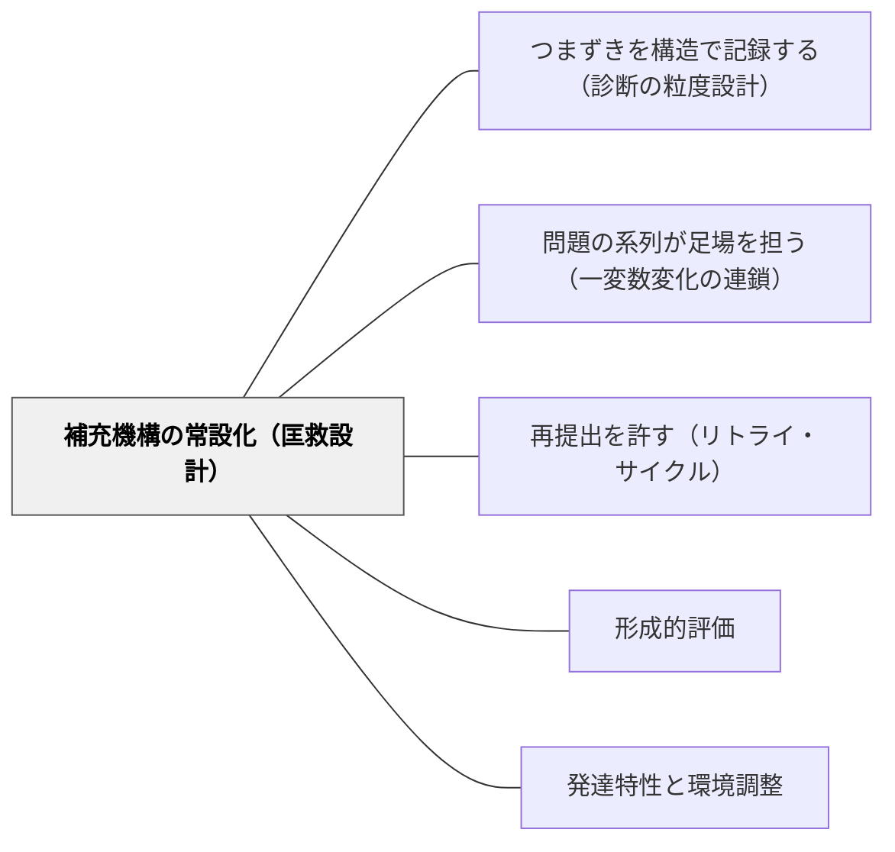

# 補充機構の常設化（匡救設計）

> 0点の子を永久に応用問題と縁のなきものとしてしまってはならない——戸田城外。補充は思いやりでなく、設計として存在させる。

## 背景（Context）

戸田城外（1930）『推理式指導算術』には、教授サイクルの中に「匡救」という概念が置かれている。「匡」は正す・矯正する、「救」はすくい上げる。つまずいた子を「永久に応用問題と縁のなきもの」にしないために、補充の時間と仕組みを授業設計の中に組み込むという、戸田の強い意志から生まれた言葉だ。

現代の教育現場を見ると、補充が機能しない理由は教師の「思いやりの欠如」ではない。補充の仕組みが設計されていないことにある。気づいた教師が個別に対応し、気づかなかった教師は気づかないまま次の単元へ進む。これは教師の力量の差ではなく、「補充が必要な子が生じたら動く仕組み」の有無の差だ。

推理式指導算術プロジェクト（岩井輝久, 2026）では、この問題を「設計の失敗（ロールズの差の原理的に補充を譲らない）」として第2弾§8.1に位置づけ、AIドリル設計においても補充機構を付加機能ではなく設計の中核に置くという原則を明示している（第1弾§5.2 設計原則7「匡救の設計」）。

## 問題（Problem）

補充の仕組みがない教室では、「誰が担任か」によってつまずいた子のその後が変わる。気づく教師は気づき、気づかない教師は気づかない。そして気づいたとしても、補充の内容が「もう一度全部やり直し」という一律の対応になりがちで、学習者にとっての負担は大きく、実際の弱点への的中率は低い。

後手に回った補充は効果も薄い。単元が終わり「定着確認テスト」で低得点が明らかになっても、次の単元は待ってくれない。「終わった単元のやり直し」が課題として出ても、多くの子はそれを消化できないまま積み残しが積み重なる。

## 力のかたち（Forces）

- **全体指導のペース vs 個別補充のコスト**：全体の進度を保ちながら個別の補充を行うには時間とリソースが必要。補充を「後から考える」にすると、どちらも中途半端になる
- **教師の専門的判断 vs システムの自動化**：「誰に何を補充するか」の判断は教師の専門性が問われる領域だが、支援が必要な学習者の特定・補充系列の準備は部分的にシステムが担えば教師の判断に集中できる
- **早期発見 vs 記録負担**：早い段階でつまずきを発見するほど補充の効果は高いが、観察・記録のコストも増える。記録設計と発見の仕組みがなければ早期発見も機能しない
- **一律補充の簡便さ vs 個別補充の精度**：「全部やり直し」は準備コストが低いが、学習者の弱点に当たらない補充は時間の浪費。種別に絞った補充は精度が高いが、設計コストがかかる
- **特別支援の優先度 vs クラス全体の設計**：補充機構は特別支援の子に特に重要だが、全員を対象とした仕組みとして設計することで「特別扱い」の烙印なく機能する

## 解決（Solution）

**つまずきの発見・補充系列の提案・教師の判断と実行という3ステップのサイクルをあらかじめ設計し、「補充が必要な子が発生したら動く仕組み」を授業設計の中に常設する。誰が担当しても最低限の補充が機能する設計にする。**

---

### ステップ1：発見——「正答率」ではなく「構造的弱点」で特定する

[[パタン/つまずきを構造で記録する（診断の粒度設計）]] が記録した「どの変化種別（オペレータ）で詰まったか」のデータを用いて、支援が必要な学習者を特定する。

発見のトリガーは2種類ある。

**自動発見**（AIドリル・採点システムを使う場合）：
- 特定の変化種別の正答率が閾値（例：同一種別3問中1問以下）を下回った学習者を自動フラグ
- 連続して同種別でミスが続く学習者（例：逆問題で3回連続×）をアラート対象にする

**教師の観察による発見**（紙の授業でも機能する）：
- 「鉛筆が止まる問題の種別」「消しゴムを使う頻度が高い問題の型」をメモする習慣をつくる
- 週1回「誰が詰まっているか」を5分で確認するサイクルを授業設計に入れる（見取りの儀式化）

---

### ステップ2：補充系列の提案——「全部やり直し」でなく「この種別の基本から」

弱いオペレータが特定されたら、その種別に特化した補充系列（易しい基本原形から始まる一変数変化の連鎖）を準備する。[[パタン/問題の系列が足場を担う（一変数変化の連鎖）]] の原則で作る。

補充系列の設計原則：
1. **基本原形から始める**——「同（確認問題）ですら正解できる最も易しいバージョン」から出発する
2. **一種別に絞る**——「逆が弱い子」には「逆問題のみの系列」を出す。他の種別は混在させない
3. **3〜5問で終われる長さ**——長すぎる補充は消化されないまま放置される。短期に達成感が得られる量にする
4. **補充前後で同型問題を確認できる**——補充の効果を確認するための「check問題」を末尾に1問つける

---

### ステップ3：教師の判断と実行——最終決定権は教師が持つ

提案された補充を「この学習者・今この時点で」配信するかどうかの最終判断は、教師が担う。システムや自動化が補充を強制的に配信するのではなく、教師が「今この子に合うか」を判断して実行する。

教師が判断する際の確認点：
- 学習者の心理状態——「もう一度やらされる」という感覚にならないか
- タイミング——授業の流れの中で補充を入れるのか、放課後・翌日か
- 形態——個別に渡すか、補充が必要な数人をグループにするか

AIドリルでは「補充を推奨する」通知を教師に出し、教師が承認したら学習者の画面に補充系列が配信される設計が望ましい。

---

### 具体例：割合単元の補充機構

単元末の診断テスト後に、種別別の正答率を集計する（[[パタン/つまずきを構造で記録する（診断の粒度設計）]] の方法で）。

A児のデータ：
- 同（確認）：4/4 正解
- 逆（未知数交換）：1/4 正解（25%）——補充フラグ
- ＋α（条件追加）：2/3 正解
- 質的変化：0/3 正解（0%）——補充フラグ

補充提案：
1. 「逆（未知数交換）」基本原形系列 4問
2. 「質的変化」基本原形系列 4問

教師の判断：A児は不安が強く「またやり直し」と感じやすいため、1のみ今週配信し、2は来週に分ける。配信前に「逆問題だけ3問追加で練習しよう」と一言添える。

---

### 特別支援の視点：補充機構は合理的配慮の制度的実装

発達障害のある子・学習に困難がある子にとって、補充機構の常設化は特に重要な意味を持つ。

「この子だけ特別に追加問題を渡す」という個別対応は、子どもに「できない子の特別扱い」という烙印を押しやすい。しかし「補充が必要な子が生じたら動く仕組み」を全員対象の制度として組み込めば、補充を受けることが「普通のこと」になる。

また、ワーキングメモリに困難がある子・処理速度がゆっくりな子は、一度の学習での定着に時間がかかる。補充サイクルが常設されていれば、「1回目は定着しなくてもよい、補充で積み上げる」という設計前提になり、定着の評価も1回きりの測定からサイクルの中での成長の確認へと変わる。

## 結果（Consequences）

**利点**

- **誰が担当しても機能する底支え**——担任の交代・産休・育休・学級替えがあっても、補充の仕組みは設計に内蔵されているので機能する。属人性がなくなる
- **補充の精度が上がる**——種別に絞った補充系列は「全部やり直し」より学習者の弱点に的中しやすく、短時間で効果が出る
- **教師の専門性が「判断」に集中できる**——発見・系列準備をシステムが担えば、教師は「今この子のためにこれが合うか」という専門的判断に注力できる
- **補充が文化になる**——「補充を受けることは普通のこと」という学習文化が育つ。失敗→補充→再挑戦のサイクルが自然になる

**注意点・リスク**

- **発見の仕組みがなければ補充も動かない**——補充機構は、[[パタン/つまずきを構造で記録する（診断の粒度設計）]] の記録設計がなければ最初のトリガーを得られない。記録設計と補充機構はセットで機能する
- **補充系列の準備コスト**——種別別の補充系列を事前に準備するには教材研究の時間が必要。授業設計の段階で「補充問題の系列」も作っておく習慣が定着するまで負担がかかる
- **「補充=罰」の文化にしない**——「できなかったら追加問題が増える」と学習者が感じると、補充が罰として機能してしまう。「補充は全員に開かれた次のステップ」という言語化が教師に求められる
- **教師の過剰介入を防ぐ**——全員に常に補充を入れると、どの子が本当に必要かが見えなくなる。「補充フラグが立った子に、教師が判断して渡す」という流れを守る

## 関連パタン

- [[パタン/つまずきを構造で記録する（診断の粒度設計）]] — 本パタンの「発見」ステップを支える。種別ごとの記録なしに補充機構は動かない。セットで機能する
- [[パタン/問題の系列が足場を担う（一変数変化の連鎖）]] — 補充系列の設計は本パタンの原則（一変数変化の連鎖）で作る。基本原形から始まる系列が補充の精度を決める
- [[パタン/再提出を許す（リトライ・サイクル）]] — リトライの機会（再提出）と、補充の仕組み（本パタン）は相補的。補充で力をつけてから再挑戦するサイクルが学習を循環させる
- [[パタン/形成的評価]] — 形成的評価の「評価→指導改善のサイクル」の具体的な補充実装が本パタン。形成的評価が目的を持ったとき、その実行手段として補充機構が機能する
- [[パタン/発達特性と環境調整]] — 特別支援の観点で補充機構は特に重要。全員対象の制度設計が「特別扱い」の烙印なく合理的配慮を実現する

## クラスター図

## Actionable Insight

- **今週の小テストに「補充フラグ」基準を1つ決める**：採点後に「逆問題を2問以上間違えた子」を1枚のメモに書き出す。次の授業でその子に「逆問題だけ3問」を渡す。これが補充機構の最小実装——仕組みがあれば動く
- **補充問題を単元設計時に一緒に作る**：授業プリントを作るとき、各変化種別の基本原形問題を3問ずつ「補充セット」として一緒に用意しておく。授業中は使わなくてよい——必要な子が出たときに即座に出せる状態が「常設化」の意味
- **「補充サイクルの週1回確認」を授業設計に組み込む**：毎週月曜の準備時間に「先週、補充が必要な子は誰か」を5分で確認するルーティンをつくる。確認→判断→配信のサイクルが週単位で回れば、補充は「後手」でなくなる

## 出典

戸田城外（1930）『推理式指導算術』全3冊
岩井輝久（2026）推理式指導算術プロジェクト設計文書（第1弾§5.2 設計原則7「匡救の設計」、第2弾§8.1）
