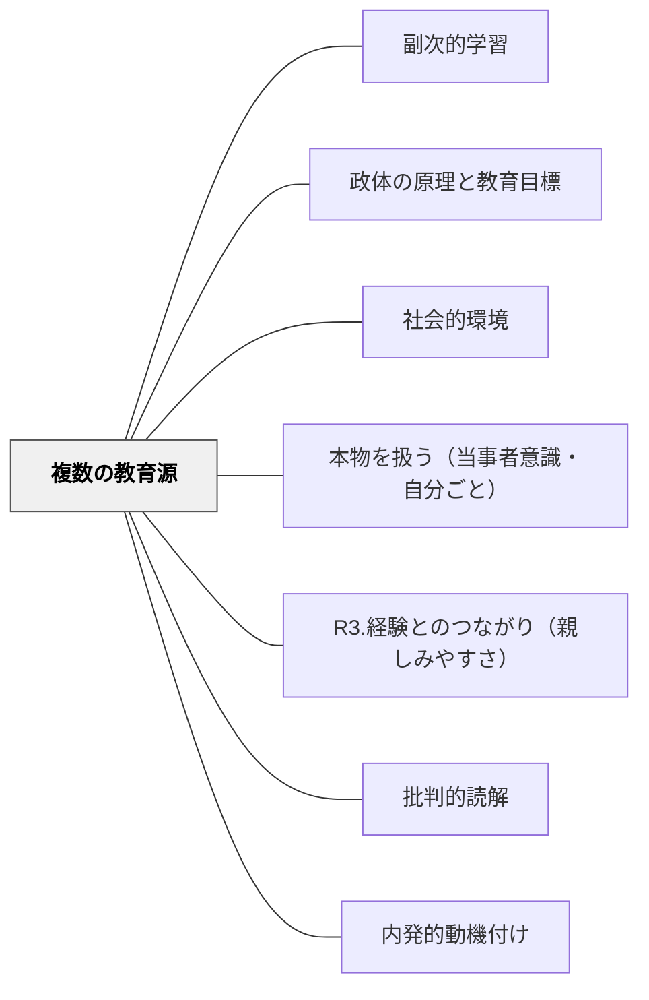

# 複数の教育源

> 今日、私たちは三つの異なる、あるいは相反する教育を受ける。父からの教育、教師からの教育、世界からの教育。最後のものが最初のものの考えをすべてひっくり返す。——モンテスキュー（Livre IV, Ch.IV）

## Pattern Connection

### モンテスキュー（1748）——Livre IV Ch.IV

> 「Aujourd'hui, nous recevons trois éducations différentes ou contraires: celle de nos pères, celle de nos maîtres, celle du monde. Ce qu'on nous dit dans la dernière renverse toutes les idées des premières. Cela vient, en quelque partie, du contraste qu'il y a parmi nous entre les engagements de la religion et ceux du monde; chose que les anciens ne connaissaient pas.」

18世紀の診断が21世紀に増幅されている：現代では「世界からの教育」がデジタルメディア（YouTube・SNS・AI）によって強化され、学校と家庭の教育を押しのける力を持つ。

- **既存パタンとの関連**：[[パタン/副次的学習]] が「外部の環境が意図せず態度を形成する」ことを論じるが、本パタンはその外部環境が「複数の矛盾した教育源」として組織されている構造に名前をつける。[[パタン/政体の原理と教育目標]] が「どの原理で動くか」を問うなら、本パタンは「誰が教えているか」を問う。
- **補強された点**：「家庭の教育を外の印象が打ち消す」というモンテスキューの観察（Ch.V: "si cela n'arrive pas, c'est que ce qui a été fait dans la maison paternelle est détruit par les impressions du dehors"）は、副次的学習の理論と完全に対応する。
- **エレクトロニクス時代への拡張**：第四の教育源としてデジタルメディアが加わり、矛盾がより深刻化した。特にアルゴリズムによるコンテンツ推薦は、個人化された「第四の教師」として機能する。

### 古代と現代の対比（Ch.IV）

> 「Leur éducation avait un autre avantage sur la nôtre; elle n'était jamais démentie.」
> （彼らの教育にはわれわれのものにはない利点があった——それは決して否定されることがなかった。）

古代ギリシャでは宗教・市民的道徳・家庭教育が一致していた。現代はこれらが分断・矛盾している。

---

## 背景（Context）

子どもは家庭・学校・社会（デジタルメディア含む）から同時に、しばしば異なる価値観と行動規範を受け取っている。これは21世紀に始まった問題ではなく、モンテスキューが18世紀にすでに「三つの相反する教育」として診断していた構造的問題である。

教師は「学校の教育」という一つの源泉しかコントロールできないが、子どもが受け取る教育の総量から見れば、それは三分の一（またはそれ以下）にすぎない。

## 問題（Problem）

子どもが「学校では学ぼうとするが家に帰ると全く違う態度になる」「親から聞いたことと教師から聞いたことが矛盾する」「ネットで見た情報が授業での学びを否定する」という状況が生まれる。教育者が単一の教育源の視点だけで子どもを見ると、なぜ価値観が安定しないか・態度が一貫しないかが理解できない。

## 力のかたち（Forces）

- 人間は「柔軟な存在」であり、置かれた環境の思想や印象に従って変化する（モンテスキュー：l'être flexible）
- 家庭・学校・デジタルの三源泉はしばしば異なる「政体の原理」（徳・名誉・恐怖・エンゲージメント）で動いている
- 「世界（デジタル）からの教育」は接触時間が最も長く、影響力が最も大きくなりつつある
- 矛盾する教育源は子どもを混乱させるが、意識的に扱えば批判的思考の素材になる
- アルゴリズムは「個人に最適化された第四の教師」として機能し、子どもの関心を定義する

## 解決（Solution）

**子どもが受け取っている複数の教育源を教師自身が意識し、その矛盾・一致・対話を教育設計に組み込む。「学校だけが教育する」という前提を手放し、他の教育源との協働・対話・批判的対峙を授業の中で行う。**

### 三（四）教育源の役割分担の設計

| 教育源 | 強み | 弱み | 学校との連携 |
|---|---|---|---|
| **家庭（父・親）** | 感情・価値観・生活習慣の伝授 | 多様性・社会性の欠如 | 家庭の価値観を授業で尊重・対話の素材に |
| **学校（教師）** | 体系的知識・社会的スキル | 生活から切り離された抽象 | 他の源泉との橋渡し役を担う |
| **社会（世界）** | 現実との接触・多様性 | 一貫した価値観の欠如・商業的動機 | 批判的読解の力を育てる |
| **デジタル（第四）** | 個人化・即時性・広さ | アルゴリズムによる閉鎖化・依存 | アルゴリズムを教材として批判的に扱う |

### 授業での具体的な扱い

1. **矛盾を対話の素材にする**：「家では○○と言われているのに、学校では違うと言われた」という体験を恥ずかしいことではなく、「教育源が違う」という現象として扱う
2. **デジタルの「教育」を可視化する**：「昨日YouTubeで何を学んだか」を聞く——子どもが受け取っている第四の教育を授業に取り込む
3. **一貫した価値の提示**：学校が提示する価値観を明確に言語化し、「なぜそれを大切にするか」を伝える——モンテスキューが言う「政体の原理の明示」

## 結果（Consequences）

- 「なぜ家と学校で態度が違うのか」が構造的に理解できるようになる
- デジタルメディアを「敵」でなく「別の教師」として扱え、批判的に対話できる
- 家庭・学校・地域・デジタルの連携の枠組みが生まれる
- 子どもが自分が受けている「複数の教育」を意識するメタ認知の力が育つ

## 関連パタン

- [[パタン/副次的学習]] — 教育源が意図せず形成する態度の理論
- [[パタン/政体の原理と教育目標]] — 各教育源はどの政体原理で動いているか
- [[パタン/社会的環境]] — 社会・デジタルが教育源として機能する環境
- [[パタン/本物を扱う（当事者意識・自分ごと）]] — 「世界からの教育」を授業に取り込む
- [[パタン/R3.経験とのつながり（親しみやすさ）]] — 家庭・社会での経験を授業と接続
- [[パタン/批判的読解]] — デジタルの「教育」を批判的に読む力
- [[パタン/内発的動機付け]] — 矛盾する外部源に依存しない内発的動機の設計
- [[文献/法の精神（モンテスキュー）]] — 本パタンの出典

## クラスター図

## Actionable Insight

- **子どもの「第四の教師」を聞く**：週に一度「最近YouTubeやSNSで面白いと思ったこと」を書かせる。デジタルが何を教えているかが見えてくる。
- **矛盾を歓迎する問い**：「家で聞いたこと・学校で習ったこと・ネットで見たこと——どれが違う？」という問いを授業に置く。矛盾が批判的思考の入口になる。
- **保護者との共有**：学校が今どんな「価値の原理」で動いているかを、学級通信で一文伝える。家庭という別の教育源との対話が始まる。

## 出典

- Montesquieu（1748）. *De l'esprit des lois*, Livre IV, Ch.IV.
- [[文献/法の精神（モンテスキュー）]]

> 「Ce qu'on nous dit dans la dernière renverse toutes les idées des premières.」（最後のものが最初のものの考えをすべてひっくり返す。）
