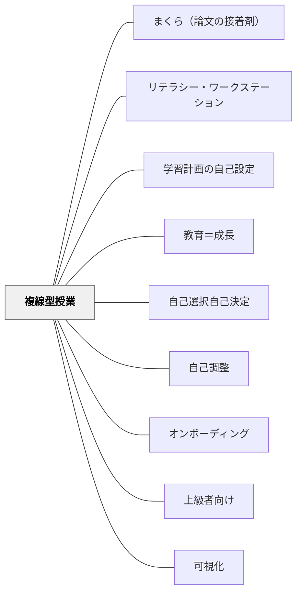

# 複線型授業

> 子供一人一人が学習課題・過程・形態を選びながら学ぶ、多様な学びが同時に起きる教室。

---

## Pattern Connection

**みるみる（文科省・先生の幸せ研究所, 2025）統合（2026-05-21）：**

複線型授業の「学習課題・過程・形態の3択」は芝園小学校の実践が定義したが、みるみるの9校実践には2つの深化形がある。

- **山吹セレクトタイム（YST）**（山吹小学校・名古屋）：複数教科の単元をまとめて提示し、子供が「いつ・何を・どのように学ぶか」を計画する形式。単一授業の複線型を「単元スパンの学習計画」に拡張する——[[パタン/学習計画の自己設定]] の小学校実装版。「違いから豊かに学び合う」という協働の哲学が中心。
- **フリースタイルプロジェクト**（天童中部小学校・山形）：「通常授業→子供主導授業→マイプラン→フリースタイル」と段階的に自由度を高めた年間計画。「一人が年間通じて自分の問いを粘り強く探究する」最終形——[[パタン/オンボーディング]] の「段階的に自律を育てる」原理と対応する。
- **パフォーマンス課題との接続**：単元終末の魅力的な課題（[[パタン/パフォーマンス課題]]）が先に設定されると、「どう学ぶかを選ぶ」に動機が生まれる。「ワクワク」と「自己調整」の組み合わせが複線型の成立条件。
- **[[パタン/デイリー5]] との比較**：「5択の中から自由に選ぶ」で独立性とスタミナを育てるデイリー5と同じ設計原則——「選択肢を明示して選ばせる」が共通する自律化の骨格。

---

## 背景（Context）

教師が「全員同じ課題を、同じ方法で、同じ順番で」進める一斉授業では、習熟度・興味・認知の特性の差がある教室の全員に最適化することは難しい。

主体性を育てたい——しかし「子供に任せる」だけでは主体性は育たない。「主体性とは何か」を曖昧にしたまま実践すると、放任になる。

## 問題（Problem）

「主体性」を単純に「自由に学ばせること」として捉えると、何をすればいいかわからない子が迷子になる。教師が設定した課題を全員が同じように進める授業では、一部の子にしか最適化されない。

## 力のかたち（Forces）

- 子供は「学習課題・過程・形態」それぞれが違っていい
- 放任にならないために、自己調整できる**環境と枠組み**が必要
- 協働も大切だが、個別の深まりとセットで設計しないと表面的になる

## 解決（Solution）

**「学習課題」「学習過程」「学習形態」の3つの観点に着目して単元を構想し、それぞれについて子供が選択できる幅を設ける**。

芝園小学校（富山市立）の定義：
- **学習課題**：全員共通の基礎課題＋選べる発展課題
- **学習過程**：どの順番で、どのくらい時間をかけるかを子供が決める
- **学習形態**：一人で・ペアで・グループで、を場面に応じて選ぶ

教師の役割の変化：「教える」から「子供の学習の様子を観察し、必要な支援を適切なタイミングで行う」へ。

ICTが複線型を支える：子供が自分で教材にアクセスし、進捗を記録し、教師が状況を把握できる。

## 結果（Consequences）

- 自分のペース・方法で学ぶ経験が積み重なり、自己調整力が育つ
- 「同じ時間に多様な学びが同時に起きる」教室になる
- 教師は全体への指示より個別の支援・観察に時間を使えるようになる
- 最初は教師も子供も慣れが必要——段階的に自由度を上げていく

## 注意（アンチパタン）

「複線型」を目指して単に「どうぞ自由にやってください」にすると失敗する。子供が自己調整するためには、**選択肢の明示・学習の見通し・振り返りの場**が必要。

## 関連パタン
- [[教科/算数・数学で使うパタン]]
- [[パタン/まくら（論文の接着剤）]]
- [[パタン/リテラシー・ワークステーション]]
- [[パタン/学習計画の自己設定]]
- [[パタン/教育＝成長]]
- [[パタン/自己選択自己決定]]

- [[パタン/自己調整]] — 複線型を支える中核の力
- [[パタン/オンボーディング]] — どの子も学習の土台に乗れるよう入り口を設計する
- [[パタン/上級者向け]] — 発展課題がやり込み要素になる
- [[パタン/可視化]] — 選択肢・進捗・目標を見える化する
## このパタンが働く実践

| 実践パタン | どのように複線型になっているか |
|------------|--------------------------------|
| [[実践/個別支援級の複式算数：重さと面積をわたり・ずらしで学ぶ]] | 重さと面積という複数の教育課程を、直接指導と自力解決をずらしながら同じ時間に進める |

- [[概念/個別最適な学びと協働的な学び]]

## クラスター図

## Actionable Insight

- 次の授業で「課題の順番は自分で決めていい」と一言伝えてみる——選択肢を1つ渡すだけで子どもの自律性の練習が始まる
- 授業の最後の5分を「振り返り：今日どの方法で学んだか・次回は何を変えてみるか」にする——計画と振り返りのサイクルが自己調整を育てる
- 全員同じ課題の後に「もう少し時間がある人は別の方法でやってみよう」と加える——多様な学びが同時に起きる教室への最小の一歩

## 出典
- [[文献/みるみる（個別最適な学び）]]

文科省「みるみる」実践編②富山市立芝園小学校（広瀬教諭の実践）（2026-04-29 vault収録）
