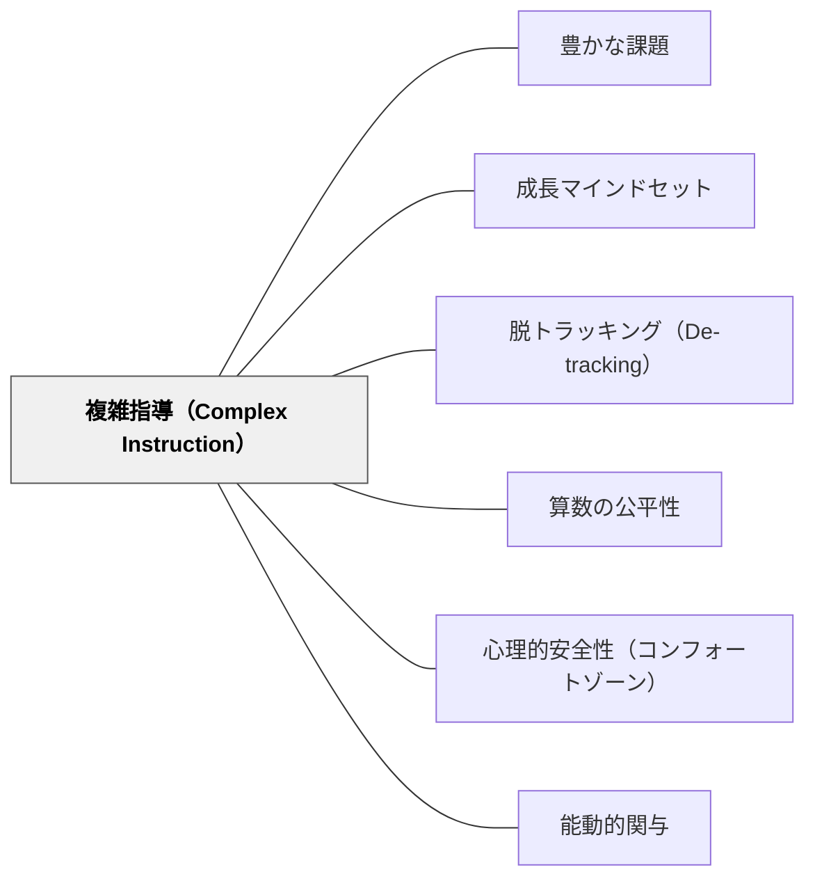

# 複雑指導（Complex Instruction）

> 「誰もがすべての方法が得意なわけではないが、誰もが何かが得意だ」——教室の中の能力を多次元に広げることで、すべての子がグループの知的貢献者になる。

## [Pattern Connection]

Boaler（2016）*Mathematical Mindsets* Ch.7「追跡から成長マインドセットグループへ」は、グループ学習が機能不全に陥る根本原因を「ステータスの一次元性」として診断し、複雑指導（Cohen & Lotan が開発）を算数教育に実装した実践知を提供する。

- **既存パタンとの関連**: [[パタン/豊かな課題]] がLow Floor High Ceilingで「全員が入れる」を設計するなら、複雑指導はグループ内で「全員が貢献できる」を設計する。[[パタン/成長マインドセット]] の「能力は多面的」という信念を、教室の構造レベルで実装したものがこのパタンである
- **補強された点**: グループ学習が「作業の分担」に留まる理由が、タスク設計でなくステータス構造にあることを明示した。教師の言葉一つ（能力の割り当て）がステータスを変えられることを具体的なRailside Schoolの縦断研究で示した
- **修正・拡張された点**: 「グループ活動 = 協力して仲良く」という表面的な理解を超え、「誰が発言するか・誰が黙るか」を決めているのは学力差ではなくステータスだという構造的理解に移行する
- **他のパタンへの波及**: [[パタン/脱トラッキング（De-tracking）]] が「混合グループを作る」ための制度設計なら、複雑指導は「混合グループを機能させる」ための指導設計。[[パタン/心理的安全性（コンフォートゾーン）]] が低ステータス生徒の発言の前提条件を整える

---

## 背景（Context）

グループ学習は多くの教室に導入されているが、「グループで作業している」状態と「グループで学んでいる」状態は別物だ。教室には教師も意識しない「ステータス構造」が存在する。「算数ができる子」「できない子」という一次元的な評価軸が定着すると、グループ内で話す人・沈黙する人が固定化される。

Elizabeth Cohen（スタンフォード大学）が開発した複雑指導（Complex Instruction）は、このステータス問題に正面から取り組む教授法である。Jo BoalerはCaliforniaのRailside Schoolで4年間この実践を追跡調査し（Boaler & Staples, 2008）、人種的・学力的格差の解消を記録した。

## 問題（Problem）

グループ活動の中で、高ステータスの生徒が話し、低ステータスの生徒が沈黙する。「得意な子が教える・苦手な子が受ける」という固定関係が生まれ、グループはペアの「教授関係」の集まりになる。さらに、算数の能力が一次元的に評価される限り——「計算が速い子が賢い」——低ステータスの生徒は常に低ステータスのまま改善の機会を持てない。

## 力のかたち（Forces）

- グループ学習はタスクが難しくなるほど、高ステータス生徒への依存が増す
- ステータスは成績とは別に機能する——人種・性別・話し方・社会的な人気がステータスを作る
- 教師がグループをモニタリングするとき、アウトプットの正確さに注目しがちで、誰が貢献したかを見落とす
- 全員が参加する文化は、一度の介入ではなく継続的な「能力の再定義」によって育つ

## 解決（Solution）

**複雑指導の4つの柱を授業設計に組み込む。**

---

### 1. 多次元性（Multidimensionality）

成功の定義を一次元から多次元に広げる。算数なら「計算が速い」だけが能力ではない。

- **視覚的**: 図・絵・グラフで表現する
- **直観的**: 「なんとなくこうなる気がする」という予感を持てる
- **数式的**: 記号や式で整理する
- **説明的**: 言葉で理由を伝えられる
- **空間的**: 形・位置・変化を捉えられる
- **つながり的**: 他の概念・場面と関連づけられる

タスクを設計するとき、「どの能力タイプが活躍できるか」を意識して複数の経路を用意する。「このグループでは誰が最も貢献できるか」ではなく「このグループでは何種類の能力が光るか」を問う。

---

### 2. 役割の割り当て（Roles）

全員が責任ある役割を持つことで、誰も観客にならない。

| 役割 | 仕事 |
|---|---|
| **Facilitator（進行役）** | 全員が話す機会を持てているか確認。「まだ発言していない人、どう思う？」 |
| **Recorder（記録係）** | グループの考えをまとめて書く |
| **Resource Manager（資料管理）** | 道具・プリント・手引きを管理。教師への質問窓口になる |
| **Team Captain（全体確認）** | 「全員が理解しているか」を最終確認する。わかっていない人がいれば説明する責任を持つ |

- 役割はタスクごとにローテーションする
- Facilitatorには「全員の声を引き出すこと」を明示的に伝える
- Resource Managerが「個人では教師に質問できない」というルールを設けると、グループが機能するようになる

---

### 3. 能力の割り当て（Assigning Competence）

教師が低ステータス生徒の発言を**公に・知的に・具体的に**取り上げる。

この介入は「褒める」とは違う。具体的な知的貢献として取り上げることで、クラス全体のステータス認識を書き換える。

**効果的な言葉の例**:
- 「今Aさんが言ったこと、聞いていた？これが今日のポイントだよ」
- 「この図で最初に□の部分に気づいたのはBさんだったね。これがあとでみんなの助けになる」
- 「Cさんの説明の仕方、数式より分かりやすかった。なぜそう表現したか教えてくれる？」

**失敗しやすいパターン**:
- 「よく言えたね」（努力の褒め = 能力の割り当てではない）
- 「合ってるよ」（正解の確認 = 知的貢献の認定ではない）

**Railside Schoolでの記録**: 教師が意図的に低ステータス生徒への能力の割り当てを実践し続けた結果、4年間で生徒間のステータス格差が縮小し、「誰の意見も聞く価値がある」という文化が生まれた。

---

### 4. 相互責任（Shared Responsibility）

グループ活動後に1枚のみをランダムに選んで採点することを事前に宣言する。

- 「どれが採点されるかわからない」という状況が、全員が理解する責任を生む
- Team Captainの役割（全員の理解確認）が実質的な意味を持つようになる
- 「教えてもらった」ではなく「私もわかるようにグループが機能した」という連帯が生まれる

---

### Participation Quiz（参加評価シート）

複雑指導の規範がグループ内で機能しているかを観察・評価するツール（Boaler, 2016, Ch.8）。

**進め方：**
1. グループ活動中、教師が教室を巡回しながら各グループの「参加の質」を観察する
2. 活動終了後、Participation Quiz シートを用いてグループ単位で評価を返す

**Participation Quiz が記録する観察項目の例：**
- 全員が等しく話す機会を持っていたか
- 誰も「観客」になっていなかったか
- 全員の考えがグループの答えに反映されているか
- Facilitatorが積極的に発言の少ない人に問いかけていたか
- Resource Managerが個人でなくグループとして教師に質問したか

**評価のポイント：**
- 学術的な正確さ（答えの正しさ）ではなく**参加の構造**を評価する
- グループ全体への評価として返す（個人の批判にならない）
- 「今日Aグループはここが特によかった」「Bグループは全員が話せていたか？」と具体的なフィードバックを返す

**A4Lとの接続：** Participation Quiz はグループの参加を診断的に評価する [[パタン/学習のための評価（A4L）]] の実践であり、成績評価のためでなくグループ規範の改善に使う。Boaler は「Participation Quiz の結果がよいグループほど、数学的達成も上がる」と記録している。

---

### Railside Schoolでの結果（Boaler & Staples, 2008）

California、Railside Schoolで4年間の縦断調査。複雑指導を使った混合グループと、通常の能力別クラスを比較。

- 4年後に多くの人種的格差が縮小または解消
- **上位生徒も最も成長した**——通常クラスの上位生徒より高い伸びを示した
- 生徒Rico（Year 1）の言葉：「前の学校では、自分の数学力だけを磨いていた。ここでは社会的にも成長し、人を助けたり助けられたりすることを学んだ」
- 生徒Jasmineの言葉：「数学では全員と関わる必要がある。解き方は一つじゃない。もっと解釈的だ」

## 結果（Consequences）

- グループ内での発言者の固定が減少し、低ステータスの生徒が知的に参加するようになる
- 教師が「誰が答えを出すか」ではなく「どんな考え方が出たか」に注目するようになる
- 生徒が「数学ができる子に聞けばいい」から「グループで考えればわかる」という文化に移行する
- 副次効果として、上位生徒が説明・つなぎ・視点の提供という高次の思考を経験する

## 関連パタン

- [[パタン/豊かな課題]] — 複雑指導が機能するには「グループワークに値する問題」が必要。一問一答型の課題では多次元性が生まれない
- [[パタン/成長マインドセット]] — 多次元性こそ、成長マインドセットの「誰でも成長できる」を学習環境の構造で実装したもの
- [[パタン/脱トラッキング（De-tracking）]] — 混合グループを制度として作る。複雑指導はその混合グループを機能させる
- [[パタン/算数の公平性]] — 人種的・社会的格差の解消のための中核的な実践手法
- [[パタン/心理的安全性（コンフォートゾーン）]] — 低ステータス生徒が発言できる前提条件。複雑指導はその前提を積極的に作る
- [[パタン/能動的関与]] — 全員が役割を持ち参加することで「全員が関与する」を実現
- [[文献/Mathematical Mindsets（Boaler）]] — 一次資料。Ch.7に詳細

---

## クラスター図

## Actionable Insight

- **今日から**: 次のグループ活動で4つの役割（進行役・記録係・資料管理・全体確認）カードを用意し、各自に配る。活動後にローテーションを宣言する
- **今週**: 普段発言が少ない子が何か言ったとき「それが今日の核心です」と公に・具体的に取り上げる。「よく言えたね」ではなく「Aさんが今言った〇〇という視点がポイントです」と言い直す
- **次の単元から**: グループ活動後に「1枚だけランダムに採点する」と事前に伝える。Team Captainが「全員わかってる?」と確認する文化が自然に生まれるか観察する
- **問いとして持ち続ける**: 「今日のグループ活動で、誰が最も貢献した気づきを出したか？」を記録する。それが普段目立たない子であれば、能力の割り当てを実践できている

## 出典

Boaler, J. (2016). *Mathematical Mindsets: Unleashing Students' Potential Through Creative Math, Inspiring Messages and Innovative Teaching*. Jossey-Bass.

Boaler, J., & Staples, M. (2008). Creating mathematical futures through an equitable teaching approach: The case of Railside School. *Teachers College Record*, 110(3), 608–645.

Cohen, E. G., & Lotan, R. A. (2014). *Designing Groupwork: Strategies for the Heterogeneous Classroom* (3rd ed.). Teachers College Press.

> 「誰もがすべての方法が得意なわけではないが、誰もが何かが得意だ」——Jo Boaler, *Mathematical Mindsets* (2016), p.176

> 「前の学校では、自分の数学力だけを磨いていた。ここでは社会的にも成長し、人を助けたり助けられたりすることを学んだ」——Rico（Railside School 生徒）, Boaler & Staples (2008)
