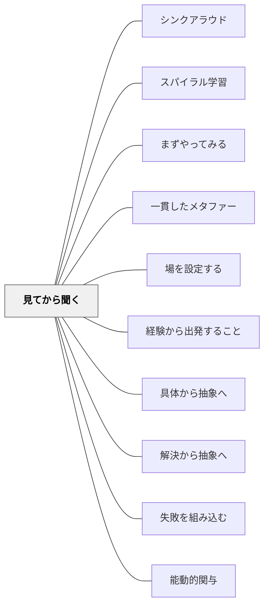

# 見てから聞く

> 聞いたことをスキルに変える前に、まず自分の手と目で出会わせろ。

## [Pattern Connection]

Bergin et al.（2012）の **See Before Hear** パタンは、[[パタン/経験から出発すること]]と同じ地平に立つが、「講義の前に体験を置く」という**授業内の順序**として具体化している点が新しい。

- **補強点**：[[パタン/具体から抽象へ]]の「なぜ抽象を先に言わないか」という理由を、学習者の記憶メカニズム（体験的なものの方が残りやすい）から補強する
- **修正点**：「体験」は必ずしも完全な実験・実習でなくてもよい。部分的なハンズオン、観察、予測でも「見る（See）」フェーズとして機能する
- **他のパタンへの波及**：[[パタン/解決から抽象へ]]・[[パタン/失敗を組み込む]]・[[パタン/具体から抽象へ]]

---

## 背景（Context）

「これを実行すると〜になります」という説明を先に聞いても、学習者は後でその概念を自分のスキルとして使うことが難しい。典型的な講義形式では、教師が現象を先に言葉で語り、学習者はその言葉を概念として受け取る。しかし言葉に先立つ体験がなければ、言葉は宙に浮いたままになる。

## 問題（Problem）

学習者は、聞いたことを後で実際のスキルに転換するのが難しい。「こういうものだ」と聞いても、それを自分の実践に変えられないのは、体験に先立って抽象が与えられているからである。

## 力のかたち（Forces）

- 人は読むより聞く、聞くより見る、見るより体験することで記憶が深まる
- ハンズオンの準備は教師にとって時間がかかる
- 体験ファーストにすると学習者が「何を体験したか」を自分で解釈し、後の講義への質問が具体的になる
- 講義形式は短時間に多くの情報を渡せる効率の良さがある

## 解決（Solution）

**新しい概念を紹介するとき、まず学習者に体験（See）させ、その体験を振り返る機会を設けてから、講義（Hear）を行う。**

Seeフェーズ：
- 詳細な手順書・参考資料を持たせて、ハンズオンの活動をさせる
- 途中で「何が起きた？」「何が不思議だったか？」を記録させる
- 分からないことへの問いが自然に生まれるよう、問いを組み込む
- 小グループで話し合い、疑問を共有する時間を入れる

Hearフェーズ：
- Seeフェーズで出た体験・疑問・気づきを参照しながら講義する
- 「さっきのあの経験はこういうことだったんだ」という形で概念を位置づける
- 抽象的な説明が体験への言語化として機能するため、短くてよい

---

具体例①：算数「かけ算の導入」（小学2年）
先に「1袋に3個のアメが4袋ある。全部で何個か？」という具体的操作をさせる（アメを並べる・数える）。複数のやり方で解いた後に「このような計算を一発でする方法がかけ算です」と名前と記号を教える。

具体例②：国語「段落」の指導
段落の説明をする前に、段落に分かれていない文章を渡し「息継ぎができないと感じる場所に印をつけてみよう」と作業させる。その後で「その印がある場所を段落と呼ぶ。段落分けの役割を自分で体験しましたね」と接続する。

具体例③：特別支援「ルール説明」
ゲームのルールを言葉で説明する前に、まず一度一緒にやってみて、後で「あれはこういうルールだったね」と振り返る。言語処理が難しい子どもほど、体験先行の効果が大きい。

---

## 結果（Consequences）

- 学習者が概念を体験のアンカーと共に学ぶため、記憶への定着が深まる
- 教師の講義が短くて済む（体験のない抽象講義ほど長くなる）
- 学習者の質問が具体的・実質的になる
- 教師はSeeフェーズの準備に時間がかかるが、後の復習・補足の必要が減る

## 関連パタン
- [[パタン/シンクアラウド]]
- [[パタン/スパイラル学習]]
- [[パタン/まずやってみる]]
- [[パタン/一貫したメタファー]]
- [[パタン/場を設定する]]

- [[パタン/経験から出発すること]] — 体験を出発点にする上位の原理
- [[パタン/具体から抽象へ]] — 具体体験から抽象概念へと上昇するシーケンス
- [[パタン/解決から抽象へ]] — 問題を解いてから抽象化する類似パタン
- [[パタン/失敗を組み込む]] — Seeフェーズでの失敗も意図的に活用できる
- [[パタン/能動的関与]] — 体験は最も純粋な能動的関与の形態

## クラスター図

## Actionable Insight

- 単元の最初の授業の冒頭15分を「Seeフェーズ」にする——説明の前に関連する体験・実験・操作をさせ、そこから単元の「問い」を引き出す
- 体験に「気づいたことを書く」欄を必ず入れる——記録することが「見る」を「理解」に変える
- 特別支援級での新しい活動は、説明を最小限にしてまず一緒にやってみる——言語説明よりも経験が手がかりになる子どもへの最良の配慮

## 出典

Bergin, J. et al.（2012）"See Before Hear." *Pedagogical Patterns: Advice For Educators.* Joseph Bergin Software Tools.（原著：Mary Lynn Manns）

> "Learners often find it difficult to convert what they've heard in the classroom into skills they can use outside the classroom."
[[文献/Pedagogical Patterns Advice For Educators（Berginほか）]]
