# 見取ったあとの手を決めておく（データ利用のルール化）

> 効果を分けるのは、見取りの精度ではなく、見取ったあとの行動を先に決めてあるかどうかである。同じ評価をしても、ルールを事前に置いた群は効果量0.92、その場の判断に委ねた群は0.42だった。

## [Pattern Connection]

このWikiの評価関連パタンは、これまでほぼ**見取る側**に集中してきた。[[パタン/形成的評価]] は「途中で見取って調整する」ことを言い、[[パタン/省察的評価]] は見取った後の振り返りを扱い、[[パタン/フィードバック]] は返し方を扱う。しかし「**見取った直後に、教師の側が何をするか**」を独立に設計対象としたパタンは無かった。本パタンはその空白を埋める。

Fuchs & Fuchs（1986）のメタ分析の内訳が示すのは、この空白が実際に効果の大半を決めているということである。**評価の道具の質ではなく、データの使い方をルール化してあるかどうか**が、効果量を0.42から0.92へ動かした。差は二倍を超える。つまりこのWikiが「形成的評価は効果量0.7」と書くとき、その0.7は**ルール化された運用の平均を含んだ値**であって、道具だけを導入したときの値ではない。

接続の要点は三つ。

第一に、これは [[パタン/形成的評価]] の**下位実装**である。上位パタンは「情報が使われて教授が変わること」を定義したが、「使われる」を保証する仕組みは持たなかった。本パタンがその保証を担う。

第二に、[[パタン/進歩の傾きを見る（水準ではなく変化率）]] と対になる。Fuchs & Fuchs の同じメタ分析は、**グラフ化**した研究が0.70、しなかった研究が0.26であることも示している。「何を見るか」（傾き）と「見たあと何をするか」（ルール）は、同じ研究群から取り出された二つの独立した変数であり、両方が揃ったときに効果が最大になる。

第三に、閾値と手立てを書き込む場所は、返却の場面ではなく**単元計画の紙面**である。つまり本パタンは、評価のパタンでありながら**書かれる場所は単元計画の側にある**。[[パタン/目標設定]] が学習者の側で行っていること——到達点を事前に言葉にしておくこと——を、教師の側の意思決定について行うものだと読める。

## 背景（Context）

小テストをする。挙手で確認する。ミニホワイトボードを出させる。ノートを机間指導で見る。エグジットチケットを集める。日本の小学校の教師は、一日のうちに何十回も見取っている。見取りの機会が足りない教室はほとんどない。

問題はその後である。見取った結果を手に持ったまま、教師は次の一手をその場で決める。決め方は経験と勘に依っている。「思ったよりできていないな、もう少し練習させよう」「半分くらいできているから、進んでいいだろう」。この判断は多くの場合そう外れていない。熟練した教師の勘は当たる。

Fuchs & Fuchs（1986）が比較したのは、**この勘を働かせる群と、あらかじめルールを書いておいた群**である。どちらも同じように系統的な評価を行っている。違うのは、データを見たあとに何をするかが**事前に決まっているかどうか**だけである。

結果は、勘の側が0.42、ルールの側が0.92だった。

## 問題（Problem）

**見取りはするが、見取ったあとに何をするかがその場の判断に委ねられている。そして委ねられたとき、教師は「教え方を変える」のではなく「違う問題を出す」で応答してしまう。**

Fuchs et al.（1991）はこれを直接観察している。系統的評価だけを使った教師群は、データを見た結果として**教授方略を変えず、違う問題を出すこと**でフィードバックに応答した。エキスパートシステム（データを解釈して次の手を提案する仕組み）を併用した群だけが、教材と教え方の両方を見直し、子どもの達成を改善した。

この観察は痛い。「違う問題を出す」は、教師の主観としては**確かに手を打っている**。プリントをもう一枚作り、類題を用意し、宿題を出す。労力もかかっている。しかしそれは、**うまくいかなかった教え方を、量を増やして繰り返している**だけである。同じ説明でわからなかった子に、同じ説明で作られた問題をもう一組渡している。

なぜこうなるのか。理由は教師の怠慢ではなく、**その場の判断の構造**にある。授業中に手元にあるのは、いま採点した小テストの束と、次の時間までの数十分である。この条件下で最も早く実行できる手が「違う問題を出す」であり、最も遅い手が「教え方そのものを組み直す」である。時間圧のもとでは、いつも前者が選ばれる。

Black & Wiliam（1998）の結論はこうである——**教師には良い評価道具以上のものが必要である。結果を解釈し、形成的な仕方で応答する方法を develop する助けもまた必要である。**

そして「助け」は、必ずしも外部のシステムである必要はない。**時間の余裕があるうちに、自分で自分に渡しておくこと**ができる。それが本パタンである。

## 力のかたち（Forces）

- **その場の判断の速さ vs 事前の判断の質**：授業中の判断は速いが、選択肢が狭い。単元計画の段階の判断は遅いが、教材・時間配分・他の単元との関係まで見渡せる。同じ教師でも、**いつ判断するか**で使える情報量が違う
- **勘は当たる vs 勘は再現しない**：熟練教師の見取りは正確である。しかしその判断は言語化されず、翌年の自分にも同僚にも引き継がれない。書いておくことは、自分のギルド知識を自分に渡す作業でもある
- **ルールの明快さ vs 子どもの個別性**：閾値は乱暴である。「5人を超えたら戻る」という線は、6人目の子と4人目の子を違う扱いにする。しかし線がなければ「なんとなく進む」が既定値になる
- **進度の圧力**：戻ることは進度を失うことである。ルールを書く時点では戻れると思っていても、実際に閾値を超えたときには年間指導計画が背中を押す。**ルールは、進度の圧力が最も弱い時点で書いておく**必要がある
- **手を打った感 vs 手が効いた事実**：違う問題を出すことは労力を伴うので、教師の側に「対応した」という感覚を残す。この感覚が、教え方を組み直さない言い訳として働く
- **ルールの硬直 vs 目の前の子ども**：書いたルールに従うことが目的化すると、教師は数字を見て子どもを見なくなる。ルールは判断を置き換えるものではなく、**判断を可視化して監査可能にするもの**である

## 解決（Solution）

**単元計画の段階で、「どこで見取るか」「何が起きたら」「何をするか」の三つを、あらかじめ書いておく。授業中の判断を、授業前の判断に前倒しする。**

書く形式は単純でよい。次の三点が揃っていれば足りる。

1. **見取りの地点**——単元のどの時間に、何で見取るか（小テスト・エグジットチケット・ノートの一問・ミニホワイトボード）
2. **閾値**——何が起きたら手を打つか。**人数か割合で書く**。「できていなかったら」ではなく「3問中1問しかできない子が5人を超えたら」
3. **手立て**——そのとき具体的に何をするか。**「違う問題を出す」以外の手を、必ず一つ以上書く**

この三つ目が本パタンの核心である。書く時点で「違う問題を出す」しか思いつかないなら、それは単元計画そのものに代替の教え方が用意されていないということであり、授業中に思いつく見込みはない。

---

### 具体例1：算数「わり算の筆算」の単元計画に三行を書き足す

四年生「わり算の筆算」。単元計画の第3時の欄に、次の三行を書き足す。

> **見取り**：第3時の終わり5分、エグジットチケットで「72÷3」「84÷4」の2問
> **閾値**：2問とも立てる位を間違えた子が**5人を超えたら**
> **手立て**：第4時は進まない。**位取り板とおはじきで、十のまとまりを分ける操作に戻す**。筆算の形は使わず、「10のたばが7つと、ばらが2つ」を実際に3人で分ける。翌時に筆算の形へ戻す

閾値が5人なのは根拠のある数字ではない。四年生の学級で「一斉に戻る」判断が正当化される最小人数として、教師が経験から置いた線である。重要なのは数字の正しさではなく、**線が事前に引かれていること**である。線があると、当日「6人か……まあ次の時間に個別に見よう」という先送りが自動的には通らなくなる。

そして手立てが「もう一枚プリント」でないことが決定的である。位取り板とおはじきに戻ることは、**筆算という説明の仕方そのものを一度降りる**という判断であり、授業中の数十分では出てこない。単元計画の紙の上で、時間があるときにしか書けない。

---

### 具体例2：国語「説明文の要約」で、閾値を「割合」で置く

五年生の説明文単元。要約の第一次原稿を集めた時点で見取る。

> **見取り**：第4時に集めた要約原稿を、「筆者の主張が入っているか」の一点だけで三分類（入っている／部分的／入っていない）
> **閾値**：「入っていない」が**学級の3分の1を超えたら**
> **手立て**：第5時は全体で戻る。**原文に線を引く作業に降りる**——主張の文と例示の文を色を分けて引かせ、「例を消しても残る文はどれか」を問う。要約を書き直させるのは、線引きが終わってから

ここでの手立ては、要約を「書き直させる」ではなく「**書く前の作業に降りる**」である。書き直しは違う問題を出すのと同型で、うまくいかなかった手順をもう一度踏ませることになる。

閾値を人数ではなく割合で置いているのは、少人数学級と大人数学級で同じ計画を使い回すためである。学校を移っても、閾値の意味が変わらない。

---

### 具体例3：ルールに「戻らない」という選択肢も書いておく

閾値は「手を打つ側」だけでなく「**打たない側**」にも要る。書いていないと、一部の子ができていないことが目に入るたびに全体を止めることになり、今度は先に進める子の時間が失われる。

> **閾値（下側）**：できていない子が**2人以下**なら、**全体は進む**。その2人は次の時間の自由課題の間に個別で見る（誰を見るかを、その場でノートに名前を書き出す）

この行があると、当日の判断は「進むか戻るか」の二択ではなく、**あらかじめ三つに分岐した経路のどれに入るか**の確認になる。判断そのものは減り、観察に使える注意が増える。

---

### 具体例4：特別支援学級——ルールは「個別の指導計画」の空白を埋める

特別支援学級の個別の指導計画には、目標と手立てが書かれている。しかし多くの場合、**「どうなったら手立てを変えるか」は書かれていない**。目標に到達しないまま同じ手立てが学期をまたいで続くことは珍しくない。

書き足すのは一行でよい。

> **手立ての変更条件**：この課題を**3週続けて**同じ水準で止まったら、手立てAをやめて手立てBに切り替える（B＝◯◯）

これは目標の下方修正ではない。**手立てを変える判断を、事前に自分に約束しておく**ことである。書いていないと、うまくいかない手立てを続けることが「粘り強い支援」として正当化されてしまう。誰も止めないからである。

そして「3週」という期間には根拠がない。しかし期間が書いてあることで、**3週目に必ず判断が起きる**。判断が起きること自体が、書くことの効果である。

---

### 具体例5：ルールを改訂する——年度末に閾値を見直す

書いたルールは仮説である。仮説なので、外れる。

単元が終わった時点で、閾値の行の横に一言だけ書き足す習慣をつける。「5人で切ったが、実際は3人でも全体が詰まった。次は3人」「3分の1で戻ったが、戻る必要はなかった。半分でよい」。

この一言が翌年の自分に渡る。閾値の根拠は最初から持てないが、**二年目には持てる**。ルールを書くことは、一年目には勘の外在化であり、二年目からは記録に基づく調整になる。

## 結果（Consequences）

**利点**

- **効果量が二倍になる**——同じ評価道具、同じ教師、同じ子どもでも、データの使い方を事前に決めた群は0.92、委ねた群は0.42（Fuchs & Fuchs, 1986）。追加の測定も追加の教材も要らない
- **「違う問題を出す」への自動的な逃避を断つ**——手立ての欄に別の手を書くことを自分に課すため、単元計画の時点で代替の教え方を用意せざるを得なくなる
- **時間圧のもとで判断しなくてよくなる**——授業中の数十分でできるのは経路の確認だけになる。判断に使っていた注意が観察に回る
- **先送りが可視化される**——閾値を超えたのに進んだとき、それは「判断」ではなく「ルールを破った」として本人に見える。破ってよいが、破ったことは記録に残る
- **勘が引き継げる形になる**——熟練教師の判断は暗黙のままでは翌年の自分にも同僚にも渡らない。閾値と手立ては、書けば渡せる（[[パタン/評価的専門性を渡す（ギルド知識のダウンロード）]] と同型の操作を、教師どうしの間で行っている）
- **特別支援で、効かない手立てが延命しなくなる**——変更条件を書いておくことで、判断が必ず起きる

**注意点・リスク**

- **ルールが硬直して子どもを見なくなる**——これが最大のリスクである。数字が閾値を超えたかどうかだけを見るようになると、「人数は足りているが、この子の詰まり方は他と質が違う」という観察が落ちる。**ルールは判断を自動化するためではなく、判断の場所を監査可能にするためにある**。閾値の確認と、個別の観察は、別々に行う
- **閾値の設定根拠は最初は無い**——「5人」「3分の1」「3週」に理論的裏づけはない。ここを気にして書けなくなるのが最も多い失敗である。**根拠がないまま書き、単元末に一言だけ検証する**。二年目から根拠を持てる。根拠が揃うまで待つと、永久に書かれない
- **ルールは改訂されるべきものである**——書いたルールを守ることが目的ではない。守れなかった回・守って失敗した回を記録し、閾値を動かす。改訂されないルールは、一年で形骸化する
- **手立ての欄が空欄になりやすい**——見取りと閾値は書きやすいが、手立てはその場で思いつかないことが多い。空欄のまま提出された単元計画は、実質的にルール化されていない。**手立てが書けない単元は、その単元の教材研究がまだ済んでいない**という信号として読む
- **戻る判断は進度を失う**——年間指導計画との緊張は消えない。現実的には、単元ごとに「戻るための予備の一時間」を最初から確保しておくのが唯一の解になる。予備がないと、閾値を超えても戻れない
- **ルールを増やしすぎない**——全単元に三行書こうとすると続かない。**一学期に二単元**から始める。書かれた二単元の質のほうが、書かれない十単元より効く

## 関連パタン

- [[パタン/形成的評価]] — 上位。あちらは「情報が使われること」を定義し、本パタンは「使われる」を保証する仕組みを担う
- [[パタン/進歩の傾きを見る（水準ではなく変化率）]] — 同じメタ分析から取り出された対の変数。「何を見るか」を扱うあちらと、「見たあと何をするか」を扱う本パタンが揃って効果が最大になる
- [[パタン/目標設定]] — 学習者の側で行う「到達点を事前に言葉にする」操作を、教師の意思決定について行ったもの。閾値は教師にとっての目標記述にあたる
- [[パタン/省察的評価]] — 単元末にルールを検証し閾値を改訂する工程を担う。ルールが仮説であることを保つ装置
- [[パタン/ルーブリック]] — 見取りの記述の粒度を支える。閾値の質は「何ができていないか」をどう言い分けているかに依存する
- [[パタン/誤りフィードバック]] — 見取りの内容を「何ができていないか」から「どんな誤り方か」へ細かくする。閾値の質は、見取りの記述の質に依存する
- [[パタン/即時的なフィードバック]] — 対比。子どもへの返しは速いほどよいが、教師の側の判断は逆に前倒しして遅く（丁寧に）決めておくほうがよい
- [[パタン/フィードバック]] — 親パタン。返し方の設計に対し、見取った教師の側が次に何をするかを事前に決める側面を担う
- [[パタン/評点なしで返す（コメントだけの一巡）]] — 返却の側の設計。評点を外して直す時間を作るという判断も、単元計画に書き込まれていなければ実行されない
- [[パタン/評価的専門性を渡す（ギルド知識のダウンロード）]] — 同型の操作を教師どうしの間で行うもの。閾値と手立てを書くことは、自分の暗黙知を明示化して渡せる形にすることでもある
- [[パタン/段階的手放し]] — ルールの水準を子どもの側へ移す発展形。「何ができたら次へ進むか」を子ども自身が持つ状態へ
- [[パタン/学習のための評価（A4L）]] — 診断コメントと再提出を単元運用に組み込んだ先行実装。本パタンはその判断部分を明文化する
- [[パタン/テストを繰り返す]] — 見取りの機会そのものを増やす。ただし機会を増やしても、使い方が決まっていなければ効果量は0.42側にとどまる
- [[概念/教授学的契約（やり過ごしの均衡）]] — 戻る判断は子どもの側の契約も変える。「できなくても時間が来れば進む」という均衡を崩す操作である
- [[文献/Assessment and Classroom Learning（Black & Wiliam）]] — Fuchs & Fuchs のメタ分析内訳を含む出典レビュー

- [[パタン/理解のしるしを読む（fit と match）]] — 閾値の材料になる「わかった」の判定を、正答率より細かい指標で取る

## クラスター図

```mermaid
flowchart LR
    ne8a68be58f96e381a3e3819fe38182e381a8e381aee6898be38292e6b1bae38281e381a6e3818ae3818fefbc88e38387e383bce382bfe588a9e794a8e381aee383abe383bce383abe58c96efbc89["見取ったあとの手を決めておく（データ利用のルール化）"]
    ne5bda2e68890e79a84e8a995e4bea1["形成的評価"]
    ne980b2e6ada9e381aee582bee3818de38292e8a68be3828befbc88e6b0b4e6ba96e381a7e381afe381aae3818fe5a489e58c96e78e87efbc89["進歩の傾きを見る（水準ではなく変化率）"]
    ne79baee6a899e8a8ade5ae9a["目標設定"]
    ne79c81e5af9fe79a84e8a995e4bea1["省察的評価"]
    ne383abe383bce38396e383aae38383e382af["ルーブリック"]
    ne8aaa4e3828ae38395e382a3e383bce38389e38390e38383e382af["誤りフィードバック"]
    ne58db3e69982e79a84e381aae38395e382a3e383bce38389e38390e38383e382af["即時的なフィードバック"]
    ne38395e382a3e383bce38389e38390e38383e382af["フィードバック"]
    ne8a995e782b9e381aae38197e381a7e8bf94e38199efbc88e382b3e383a1e383b3e38388e381a0e38191e381aee4b880e5b7a1efbc89["評点なしで返す（コメントだけの一巡）"]
    ne8a995e4bea1e79a84e5b082e99680e680a7e38292e6b8a1e38199efbc88e382aee383abe38389e79fa5e8ad98e381aee38380e382a6e383b3e383ade383bce38389efbc89["評価的専門性を渡す（ギルド知識のダウンロード）"]
    ne6aeb5e99a8ee79a84e6898be694bee38197["段階的手放し"]
    ne5ada6e7bf92e381aee3819fe38281e381aee8a995e4bea1efbc8841344cefbc89["学習のための評価（A4L）"]
    ne38386e382b9e38388e38292e7b9b0e3828ae8bf94e38199["テストを繰り返す"]
    ne79086e8a7a3e381aee38197e3828be38197e38292e8aaade38280efbc8866697420e381a8206d61746368efbc89["理解のしるしを読む（fit と match）"]

    ne8a68be58f96e381a3e3819fe38182e381a8e381aee6898be38292e6b1bae38281e381a6e3818ae3818fefbc88e38387e383bce382bfe588a9e794a8e381aee383abe383bce383abe58c96efbc89 --- ne5bda2e68890e79a84e8a995e4bea1
    ne8a68be58f96e381a3e3819fe38182e381a8e381aee6898be38292e6b1bae38281e381a6e3818ae3818fefbc88e38387e383bce382bfe588a9e794a8e381aee383abe383bce383abe58c96efbc89 --- ne980b2e6ada9e381aee582bee3818de38292e8a68be3828befbc88e6b0b4e6ba96e381a7e381afe381aae3818fe5a489e58c96e78e87efbc89
    ne8a68be58f96e381a3e3819fe38182e381a8e381aee6898be38292e6b1bae38281e381a6e3818ae3818fefbc88e38387e383bce382bfe588a9e794a8e381aee383abe383bce383abe58c96efbc89 --- ne79baee6a899e8a8ade5ae9a
    ne8a68be58f96e381a3e3819fe38182e381a8e381aee6898be38292e6b1bae38281e381a6e3818ae3818fefbc88e38387e383bce382bfe588a9e794a8e381aee383abe383bce383abe58c96efbc89 --- ne79c81e5af9fe79a84e8a995e4bea1
    ne8a68be58f96e381a3e3819fe38182e381a8e381aee6898be38292e6b1bae38281e381a6e3818ae3818fefbc88e38387e383bce382bfe588a9e794a8e381aee383abe383bce383abe58c96efbc89 --- ne383abe383bce38396e383aae38383e382af
    ne8a68be58f96e381a3e3819fe38182e381a8e381aee6898be38292e6b1bae38281e381a6e3818ae3818fefbc88e38387e383bce382bfe588a9e794a8e381aee383abe383bce383abe58c96efbc89 --- ne8aaa4e3828ae38395e382a3e383bce38389e38390e38383e382af
    ne8a68be58f96e381a3e3819fe38182e381a8e381aee6898be38292e6b1bae38281e381a6e3818ae3818fefbc88e38387e383bce382bfe588a9e794a8e381aee383abe383bce383abe58c96efbc89 --- ne58db3e69982e79a84e381aae38395e382a3e383bce38389e38390e38383e382af
    ne8a68be58f96e381a3e3819fe38182e381a8e381aee6898be38292e6b1bae38281e381a6e3818ae3818fefbc88e38387e383bce382bfe588a9e794a8e381aee383abe383bce383abe58c96efbc89 --- ne38395e382a3e383bce38389e38390e38383e382af
    ne8a68be58f96e381a3e3819fe38182e381a8e381aee6898be38292e6b1bae38281e381a6e3818ae3818fefbc88e38387e383bce382bfe588a9e794a8e381aee383abe383bce383abe58c96efbc89 --- ne8a995e782b9e381aae38197e381a7e8bf94e38199efbc88e382b3e383a1e383b3e38388e381a0e38191e381aee4b880e5b7a1efbc89
    ne8a68be58f96e381a3e3819fe38182e381a8e381aee6898be38292e6b1bae38281e381a6e3818ae3818fefbc88e38387e383bce382bfe588a9e794a8e381aee383abe383bce383abe58c96efbc89 --- ne8a995e4bea1e79a84e5b082e99680e680a7e38292e6b8a1e38199efbc88e382aee383abe38389e79fa5e8ad98e381aee38380e382a6e383b3e383ade383bce38389efbc89
    ne8a68be58f96e381a3e3819fe38182e381a8e381aee6898be38292e6b1bae38281e381a6e3818ae3818fefbc88e38387e383bce382bfe588a9e794a8e381aee383abe383bce383abe58c96efbc89 --- ne6aeb5e99a8ee79a84e6898be694bee38197
    ne8a68be58f96e381a3e3819fe38182e381a8e381aee6898be38292e6b1bae38281e381a6e3818ae3818fefbc88e38387e383bce382bfe588a9e794a8e381aee383abe383bce383abe58c96efbc89 --- ne5ada6e7bf92e381aee3819fe38281e381aee8a995e4bea1efbc8841344cefbc89
    ne8a68be58f96e381a3e3819fe38182e381a8e381aee6898be38292e6b1bae38281e381a6e3818ae3818fefbc88e38387e383bce382bfe588a9e794a8e381aee383abe383bce383abe58c96efbc89 --- ne38386e382b9e38388e38292e7b9b0e3828ae8bf94e38199
    ne8a68be58f96e381a3e3819fe38182e381a8e381aee6898be38292e6b1bae38281e381a6e3818ae3818fefbc88e38387e383bce382bfe588a9e794a8e381aee383abe383bce383abe58c96efbc89 --- ne79086e8a7a3e381aee38197e3828be38197e38292e8aaade38280efbc8866697420e381a8206d61746368efbc89

    classDef hub fill:#f0f0f0,stroke:#555,color:#000,font-weight:bold
    class ne8a68be58f96e381a3e3819fe38182e381a8e381aee6898be38292e6b1bae38281e381a6e3818ae3818fefbc88e38387e383bce382bfe588a9e794a8e381aee383abe383bce383abe58c96efbc89 hub
```

## Actionable Insight

- **次の単元の指導計画に、三行だけ書き足す**——「どの時間に、何で見取るか」「何人／何割を超えたら」「そのとき何をするか」。三行が埋まらない単元は、教材研究が済んでいないと判断して、そこから手をつける
- **手立ての欄に「違う問題を出す」と書きたくなったら、一度消す**——代わりに「どの説明の仕方に降りるか」を書く。おはじき、図、線引き、実物、身体の動き。降りる先が思いつかないなら、その単元の代替の教え方を先に用意する
- **「戻らない」側の閾値も書く**——できていない子が2人以下なら全体は進み、その2人を次の時間の個別で見る、と決めておく。当日の判断を二択から三分岐に変える
- **単元が終わったら、閾値の横に一言だけ検証を書く**——「5人で切ったが3人で詰まった」。この一言が翌年の閾値の根拠になる。書かないと、三年経っても勘のままである
- **個別の指導計画に「手立ての変更条件」を一行足す**——「3週続けて同じ水準なら手立てを切り替える」。期間に根拠は要らない。期間があることで、判断が必ず起きることが効果である
- **一学期に二単元から始める**——全単元をルール化しようとすると続かない。書かれた二単元のほうが、書かれない十単元より効く

## 出典

Black, P., & Wiliam, D. (1998). Assessment and classroom learning. *Assessment in Education: Principles, Policy & Practice, 5*(1), 7–74.

> 教師がデータのレビューと続く行動についてのルールを事前に設定していた研究の平均効果量は0.92、行動が教師の判断に委ねられた研究は0.42であった。（Fuchs & Fuchs, 1986 のメタ分析の内訳として Black & Wiliam が報告）

> 教師には良い評価道具以上のものが必要である——結果を解釈し、形成的な仕方で応答する方法を develop する助けもまた必要である。

Fuchs, L. S., & Fuchs, D. (1986). Effects of systematic formative evaluation: A meta-analysis. *Exceptional Children, 53*, 199–208.（データ利用のルール化 0.92 対 教師判断 0.42、グラフ化 0.70 対 非グラフ化 0.26）

Fuchs, L. S., Fuchs, D., Hamlett, C. L., & Stecker, P. M. (1991). Effects of curriculum-based measurement and consultation on teacher planning and student achievement in mathematics operations. *American Educational Research Journal, 28*, 617–641.（系統的評価だけを使った教師群は教授方略を変えず「違う問題を出すこと」で応答した。エキスパートシステム併用群だけが両方を見直し達成を改善した）
