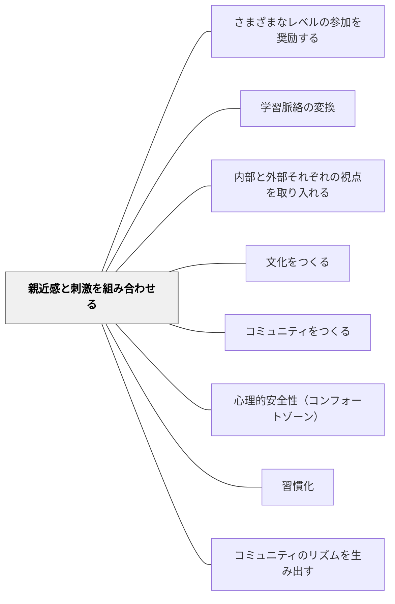

# 親近感と刺激を組み合わせる

> 成功しているコミュニティはメンバーにとって故郷のような心やすい場所であると同時に、興味を引く変化に富んだイベントが行われ、新しいアイデアや人々が流入し続けているところでもある。— ウェンガー（p.107）

## Pattern Connection

本パタンは [[パタン/コミュニティをつくる]] を具体化する子パタンである。コミュニティ設計の原則のうち「安全と挑戦の組み合わせ」を担う。定例の安心（親近感）と非定例の冒険（刺激）の両方が、学習者がリスクを取れるコミュニティを作る。

## 背景（Context）

学習には安全（安心できる場所に戻れること）と挑戦（コンフォートゾーンを超えること）の両方が必要である。どちらかだけでは学びが深まらない。「親近感」は安全基地であり、「刺激」は成長の燃料である。

## 問題（Problem）

安心だけでは変化がなく停滞する。刺激だけでは疲弊し、学習者は防衛的になる。多くの教室はこの両者のバランスを意識せずに、どちらかに偏りがちである。

## 力のかたち（Forces）

- コンフォートゾーンがあってこそ、ストレッチゾーンへの挑戦ができる
- 刺激は予測不可能である必要はない；「楽しみにしていた非日常」でよい
- 親近感のある定例ルーティンが、刺激的なイベントを受け入れる土台になる

## 解決（Solution）

**定期的な定例（親近感）と非定例の冒険的イベント（刺激）を意識的に組み合わせる。**

親近感の例：
- 毎週のリーディングワークショップ（同じ時間・同じ形）
- 朝のミーティング・チェックインの儀式
- 「ここではこうする」という安定したルーティン

刺激の例：
- 外部講師・ゲストの招聘
- 校外学習・フィールドワーク
- 特別なプロジェクト・コンクール参加
- 「いつもと違う何か」を意図的に仕込む

ウェンガーの比喩：親近感＝「地元のバー・カフェ」（安心して率直に話せる場）、刺激＝「一緒に冒険している感覚」

## 結果（Consequences）

- 学習者がリスクを取れるようになる（安心があるから）
- コミュニティに活気と緊張感が共存する
- 「学校は退屈だ」という感覚が薄れ、「次は何があるか」という期待が生まれる

## 関連パタン
- [[パタン/さまざまなレベルの参加を奨励する]]
- [[パタン/学習脈絡の変換]]
- [[パタン/内部と外部それぞれの視点を取り入れる]]

- [[パタン/文化をつくる]] — 親パタン
- [[パタン/コミュニティをつくる]] — 本パタンが具体化するハブパタン（ウェンガー系コミュニティ設計）
- [[パタン/心理的安全性（コンフォートゾーン）]] — 親近感の土台（旧「安心基地」を統合）
- [[パタン/習慣化]] — 親近感を支えるルーティン
- [[パタン/コミュニティのリズムを生み出す]] — 定例と非定例のリズム

## クラスター図

## Actionable Insight

- 毎週同じ時間に同じ形式で行う「定例活動」を1つ決める——これがコミュニティの親近感の土台になる
- 学期に1回「いつもと違う何か（外部講師・校外学習・特別プロジェクト）」を設計する——刺激がないと定例が慣れになり停滞する
- 「安心の定例」と「刺激の非定例」を意識してカレンダーに配置してみる——バランスが見えると計画が立てやすくなる

## 出典

- エティエンヌ・ウェンガー他（2002）『コミュニティ・オブ・プラクティス』翔泳社、第3章 p.107
- 動画記録：[[文献/コミュニティオブプラクティスと文化をつくるパタン（動画記録）]]
