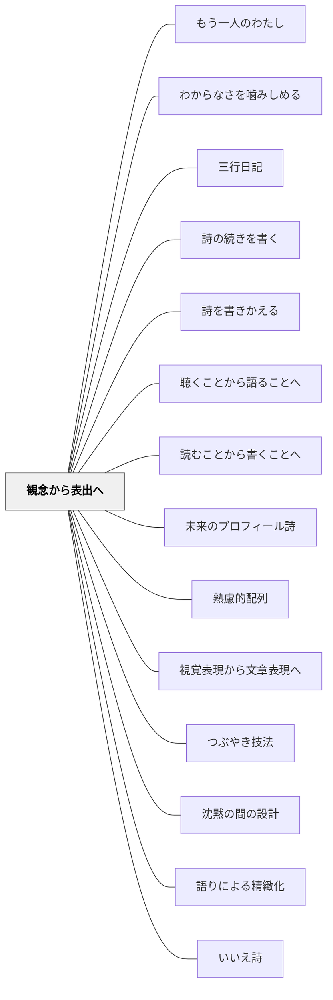

# 観念から表出へ

> まず内側に形が生まれてから、外に向かって言葉や作品が生まれる。

## 背景（Context）

[[パタン/熟慮的配列]] の表出次元。ヴィゴツキーの「内言→外言」の概念に対応する。学習者の中に観念・意図・イメージ・理解が形成されることが先であり、それが十分に育ってはじめて、表出（話す・書く・描く・演じる）が豊かなものになる。

## 問題（Problem）

観念が形成される前に表出を要求すると、学習者は「形式的に正しいが空洞な」表現を産出するか、何も言えずに固まる。特に、感想・意見・論述・創作において、「書かせる」ことが先行すると内容の薄い文章が生まれる。

## 力のかたち（Forces）

- 表出することで観念が整理・明確化される（書くことで考える）という逆の作用もある
- 観念の形成に十分な時間をかけることは、授業設計の余裕を必要とする
- 「沈黙」は観念形成の最中であることが多いが、教師には不安として映りやすい

## 解決（Solution）

**表出活動の前に、観念を育てるための「内側の時間」を意図的に設計する。ペアでの対話・一人での思考時間・ノートへのメモ・視覚化などが、観念形成を助ける。**

実践例：
- 作文の前に「まず絵や図で思ったことを表してみよう」
- 発表の前に「一人で2分間、言いたいことを頭の中で整理する」
- 討論の前に立場と理由をノートに書いてから発言する
- 詩を書く前に、詩の材料になる観察・記憶・感覚を丁寧に引き出す問いをかける

[[パタン/つぶやき技法]] や [[パタン/沈黙の間の設計]] と組み合わせることで、観念形成の時間が授業の中に自然に生まれる。

## 結果（Consequences）

- 表出の質（深さ・個性・論理）が高まる
- 学習者が「自分には言いたいことがある」という感覚を持てる
- 「わからない」という沈黙が観念形成の途中として尊重される

## このパタンが働く教材

| 教材 | どのように観念から表出へ進めるか |
|------|----------------------------------|
| [[教材/6つの部屋の詩ワークシート]] | 詩を書く前に、見たこと・聞いたこと・したこと・感じたこと・思ったことを集め、内側の材料を言葉へ移す |

## クラスター図

## Actionable Insight

- 書く・話す・発表する活動の前に「一人で2分間、頭の中を整理する時間」を意図的に確保する——沈黙を「考える時間」として位置づけることで表出の質が上がる
- 「まず絵や図で表してから言葉にしよう」という二段階の表出活動を一単元に一回取り入れる——観念形成と表出を分離することで内容の薄い形式的な表現が減る
- 学習者が黙っているときに「今考えているね、もう少し待つよ」と声かけする——沈黙への教師の態度が観念形成を尊重する文化をつくる

## 出典

- 一つの教育のパタン・ランゲージ（岩井輝久）

## 関連パタン
- [[実践/詩歌の授業（詩を書く・詩を読む）]]
- [[パタン/もう一人のわたし]]
- [[パタン/わからなさを噛みしめる]]
- [[パタン/三行日記]]
- [[パタン/詩の続きを書く]]
- [[パタン/詩を書きかえる]]
- [[パタン/聴くことから語ることへ]]
- [[パタン/読むことから書くことへ]]
- [[パタン/未来のプロフィール詩]]

- [[パタン/熟慮的配列]] — 上位パタン
- [[パタン/視覚表現から文章表現へ]] — 観念を可視化してから言語化する
- [[パタン/つぶやき技法]] — 観念を外に出す練習
- [[パタン/沈黙の間の設計]] — 観念形成の時間を意図的に作る
- [[パタン/語りによる精緻化]] — 語ることで観念を精緻化する
- [[パタン/いいえ詩]] — 「いいえ」という操作が観念形成の引き金になる詩の技法（白谷明美）
- [[パタン/なりきる詩]] — なりきる対象の特長を観察し内側に貯めてから詩として表出する（白谷明美）
- [[パタン/余計な難しさを外す（構成概念に無関係な分散）]] — 表出の手段が、持っている中身の発揮を妨げていないかを問う
- [[パタン/沈黙に値をつけているのは誰か]] — 表出の手段が限られている子の沈黙に、どの値がつけられているか

