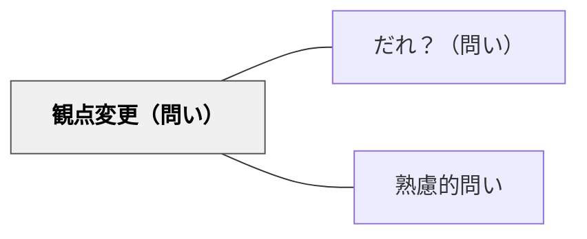

# 観点変更（問い）

> 「別の立場から見ると？」と問うことで、自分の視点の偏りに気づき、多様な理解が開かれる。

## 背景（Context）

人は自分の立場や経験から物事を見がちであり、それが思考の固定化につながる。学習や議論の場でも、参加者はつい自分の視点だけで考え、他の可能性に気づかないまま結論を出してしまうことがある。多様な関係者が関わる問題ほど、一つの視点だけでは不十分である。

## 問題（Problem）

一つの観点だけで考えていると、見えていない要因や影響を見落とす。自分の立場に無意識に引き寄せられた思考では、解決策も偏りを帯びる。相手の視点を想像する機会がないまま議論が進むと、対立や誤解が深まることもある。

## 力のかたち（Forces）

- 自分の立場から離れることは、認知的負荷が高い
- 「相手の立場になる」という指示は、形式的になりやすい
- 強制的な視点移動は、かえって抵抗を生む場合もある
- 問い手が提示する「別の立場」の選択が思考の方向を大きく左右する

## 解決（Solution）

「別の立場から見ると？」「相手の視点では？」「逆の立場なら？」という問いを意図的に挿入する。たとえば、「この授業改善案を、学生の立場から見るとどう感じる？」「反対意見を持つ人なら何と言うか？」などの形で問う。具体的な人物や立場を提示することで、抽象的な「別の視点」ではなく、リアルな視点移動が起きやすくなる。

## 結果（Consequences）

- 自分の思考の偏りや前提に気づくきっかけになる
- より多角的・包括的な理解が生まれやすくなる
- 共感的な思考が促されるが、本当に相手の立場を理解できたかは検証が難しい

## 関連パタン
- [[パタン/だれ？（問い）]]

- [[パタン/熟慮的問い]] — 親パタン

## クラスター図

## Actionable Insight

- 授業中の問題や事例について「これを△△（生徒・保護者・反対側の立場）の目で見るとどう見えるか？」と問う——具体的な人物や役割を指定すると抽象的な「別の視点」より実際の視点移動が起きやすい
- 視点を変えた後に「あなた自身の元の見方と、どこが違っていましたか？」と比較を問う——対比の言語化が自分の偏りへの気づきを深める
- 対立が生まれそうな議論の前に「相手側ならどう言うか、まず考えてみましょう」と先に逆の立場を想定させる——先に相手側を考えることで対立ではなく対話の姿勢が育まれる

## 出典

- [[文献/熟慮的問いのパターンリスト（動画記録）]]
