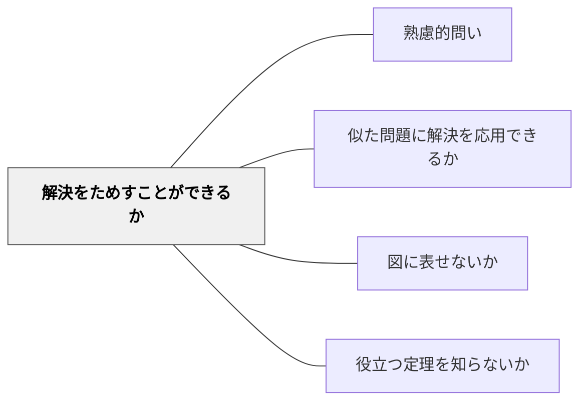

# 解決をためすことができるか

> 答えや解決が本当に正しいか、実際に確かめてみる問い。

## 背景（Context）
問題を解いて答えを出したとき、その答えが正しいかどうかを確認しないまま次に進んでしまうことがある。検証のステップを省略すると、誤った理解がそのまま定着してしまう。学習者が「できた」と思っても、実際には誤解を含んでいる場合は少なくない。

## 問題（Problem）
解答を出した後、その正しさを自分で検証する習慣が身についていない。教師や答え合わせに頼るだけでは、自立した思考力は育たない。自己検証の方法を問わなければ、学習者は解答プロセスの最後のステップを見落とし続ける。

## 力のかたち（Forces）
- 答えを出すことに満足し、確認を怠りがちな心理
- 検証方法を知らないと確かめることができない
- 自己訂正の機会を与えることで深い理解が生まれる
- 別の方法で解いて同じ答えが出れば信頼性が高まる

## 解決（Solution）
「その答え、本当に合っているか試せるか？」「別の方法で確かめてみよう」と問いかけ、検証のプロセスを学習活動に組み込む。たとえば、方程式の解を元の式に代入して確かめる、地図で推測した距離を実測と比べる、実験結果を予測と照合するなど、具体的な検証行動を引き出す。

## 結果（Consequences）
- 自己修正の習慣が身につき、誤りに自ら気づける力が育つ
- 解答への信頼度が高まり、確信をもって次のステップに進める
- 検証という思考習慣が他の場面にも転移する

## 関連パタン
- [[パタン/熟慮的問い]] — 親パタン
- [[パタン/似た問題に解決を応用できるか]] — 検証から応用へ
- [[パタン/図に表せないか]] — 図示による解法の検証
- [[パタン/役立つ定理を知らないか]] — 適切な定理を使って検証する

## クラスター図

## Actionable Insight

- 解答を出した後「その答え、本当に合っているか試せるか？別の方法で確かめてみよう」と問いかける——自己修正の習慣が身につき誤りに自ら気づける力が育つ
- 方程式の解を元の式に代入して確かめる、実験結果を予測と照合するなど、具体的な検証行動を授業に組み込む——解答への信頼度が高まり確信をもって次のステップに進める
- 「別の方法で解いて同じ答えが出るか」を試させる——検証という思考習慣が他の場面にも転移する

## 出典
- [[文献/熟慮的問いのパターンリスト（動画記録）]]
- ジョージ・ポリア（1954）『いかにして問題をとくか』丸善出版
