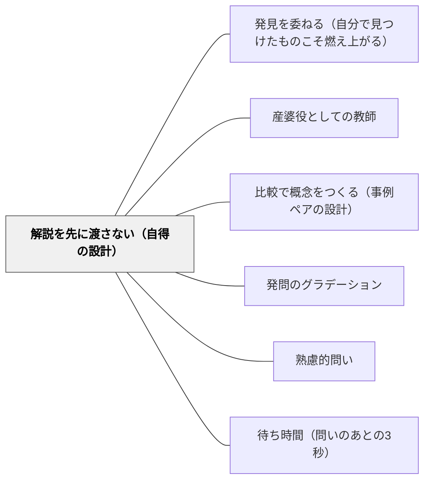

# 解説を先に渡さない（自得の設計）

> ヒントは比べる先を指さすだけでいい。解き方を教えた瞬間、考える機会は消える。

## 背景（Context）

教科書・参考書・学習動画は、問題のすぐ隣に解説を置く構造が標準になっている。学習者はわからない瞬間に解説を「もらう」ことに慣れており、解けない問いと向き合う時間そのものが希薄になっている。一方で、戸田城外（1930）『推理式指導算術』は当時としては異例の編集方針をとった——解答編は「答のみ」、ヒントは〔基本原形と比較せよ〕という比較の指さしに留め、解き方を文字に書き起こさなかった。桝田尚之（2006）はこの編集思想を「順に解けば解き方が自得されるから、解説を書かない」と読み解いた。教師が直面しているのも同型の場面である——目の前で困っている学習者にすぐ説明したい衝動と、考える経路を残したい設計判断とのあいだ。

## 問題（Problem）

解説・答えの出し方を即座に提供すると、学習者は「自分で考える」経路を飛ばして解説を読むだけになる。読んだ瞬間は「わかった気」になるが、同型の問題を自力で解こうとすると手が止まる。これは怠惰ではなく構造の問題で、解説が常に隣にあれば、人間の認知は最短経路（読む）を選ぶようにできている。考える機会を残すには、ヒントの「内容」と「タイミング」と「開示の仕方」を意図的に設計するしかない。

## 力のかたち（Forces）

- **親切心 vs 学習効果**：困っている学習者を放置するのは耐え難い。だが、すぐ助けると学習効果が下がる
- **「今すぐわからせたい」衝動 vs 「自分で発見させる」忍耐**：教師の時間感覚は授業の45分、学習者の自得は数日〜数週かかることがある
- **解説の精密さ vs ヒントの曖昧さ**：解説は精密であるほど受け取りやすいが、考える余地を奪う。ヒントは曖昧であるほど自得を促すが、行き詰まりに耐えられない学習者を取り残す
- **個人差 vs 全員一律**：自力で進める子と完全に詰まる子が同じ教室にいる。同じ濃度のヒントでは両極を救えない

## 解決（Solution）

ヒントは「解き方」ではなく「どの先行問題と比べるか」の指さしに限定する。どうしても必要なときだけ、段階的に開示する（3層フェードイン）。最初から濃いヒントを置かない。学習者の要求と教師の見取りに応じて層を上げる。

**第1層（デフォルト）：比較の指さし**

「前の問題と何が違うか？」「〔基本原形と比較せよ〕」のみを渡す。解き方は示さない。先行問題のページ・番号を指さして「これと見比べて」と言う。学習者は2つを並べて差分を自分で読む。差分の言語化そのものが思考である。

**第2層（要求があれば）：着目点の促し**

第1層で動けない学習者には、着目すべき箇所を指す。「○○の部分に注目」「何が変わったか言葉にしてみて」。まだ解き方は示さない。比較の対象範囲を狭めることで、差分発見の難度を下げる。

**第3層（初学者・行き詰まり時のみ）：worked example**

それでも動けない場合に限り、「一緒に解いてみよう」と worked example を渡す。ただし学習者が「見せてほしい」と選んで開示する形にする（押し付けない）。教師から「これを見ろ」と渡した瞬間、自得の経路は閉じる。第3層は最後の手段であり、第3層が必要だった事実は次の教材設計（先行問題の配列）へのフィードバックになる。

---

**算数の具体例：「分数のたし算」が初めて出てきたとき**

- 第1層：先行問題の「同じ分母どうしのたし算」のページを指さし、「これと何が違う？」とだけ言う
- 第2層：「分母を見て」と着目を促す
- 第3層：通分の手順を一緒にやって見せる

最初から第3層を渡せば3分で「わかった」状態になるが、次の単元で同型の壁にぶつかったとき再び立ち止まる。第1層で15分かけて差分に気づいた子は、次の壁を自分で越えられる。

---

**国語の具体例：物語文の「気持ちの変化」を読み取る**

- 第1層：前の場面と今の場面を並べ、「ここで何が変わった？」と指さす
- 第2層：「人物の言葉と行動に注目」と読みの焦点を絞る
- 第3層：教師が「私はこう読んだ」とモデリングを見せる

第3層のモデリングは強力だが、最初に出すと子どもは「正解の読み」を探す読み方になる。第1層から始めれば、子どもの読みは複数立ち上がる。

## 結果（Consequences）

**利点**
- 自得体験の喜びが学習者に蓄積する——「自分で気づいた」という記憶は転移しやすい
- 同型の問題への応用が容易になる。解き方を教わった子は新しい数字に対応するだけだが、自得した子は新しい構造にも対応できる
- 教師のヒントが「答えに近い物」ではなく「考えるための地図」になる。長期的にヒントへの依存度が下がる
- ヒント設計が次の教材設計へのフィードバックになる——第3層が頻発する単元は先行問題の配列が悪いというサインである

**注意点・リスク**
- 第3層をいつ渡すかの判断は教師の専門性そのものである。早すぎれば自得を奪い、遅すぎれば学習意欲を折る
- 第1層で完全に動けない学習者を放置すると、「考える時間」が「困惑の時間」に変わる。見取りなしの「待つだけ」は無責任に近い
- 学習者・保護者から「もっと丁寧に解説してほしい」という要求が出る場合がある。設計意図（自得のための余白）を言語化して共有する必要がある
- 特別支援が必要な子には、第1層の「比較」自体が高度すぎることがある。比較対象の絞り込み・視覚的補助など、第1層の中での足場が別途必要

## 関連パタン

- [[パタン/発見を委ねる（自分で見つけたものこそ燃え上がる）]] — 「なぜ渡さないか（燃え上がりの所有感）」を担い、本パタンは「では何を渡すか（比較の指さし）」を担う分業関係
- [[パタン/産婆役としての教師]] — 「教師が問うのみ」という姿勢論。本パタンはその姿勢を支える「ヒントの内容設計」という型を提供する
- [[メタパタン/足場は消えるために組む（フェードアウト）]] — 足場の「外し方（時間設計）」を担うメタ原理。本パタンは「足場の中身（何を渡すか）」を担う分業関係
- [[パタン/比較で概念をつくる（事例ペアの設計）]] — 比較を「問題ペアとして設計する」のに対し、本パタンは比較を「ヒントとして渡す」。同じ比較という手法の異なる位置づけ
- [[パタン/発問のグラデーション]] — 発問の難度のグラデーション（教材側）と、ヒントのフェードイン（足場側）は別次元の設計だが、どちらも段階性を持つ
- [[パタン/熟慮的問い]] — 問いの設計という上位概念。本パタンはヒントという問いの応答側の設計
- [[パタン/待ち時間（問いのあとの3秒）]] — 渡さない姿勢の時間的側面。本パタンは渡さない姿勢の内容的側面で、相補関係にある

## クラスター図

## Actionable Insight

- 次の授業で、解説を先に話す前に「前の問題と何が違う？」と1回だけ問いを返してみる。3秒待つ
- 教材プリントを作るとき、解答欄の隣に「ヒント：問題◯番と比べてみよう」とだけ書く（解き方は書かない）
- 子どもが「わからない」と言ってきたら、第1層→第2層→第3層の順に出す。最初から第3層を渡さない
- 第3層（worked example）を出した単元を記録しておく。同じ単元で第3層が頻発したら、先行問題の配列を見直すサインと見る

## 出典

- 戸田城外（1930）『推理式指導算術』
- 桝田尚之（2006）「推理式指導の解明を中心に」『創価教育研究』第5号
