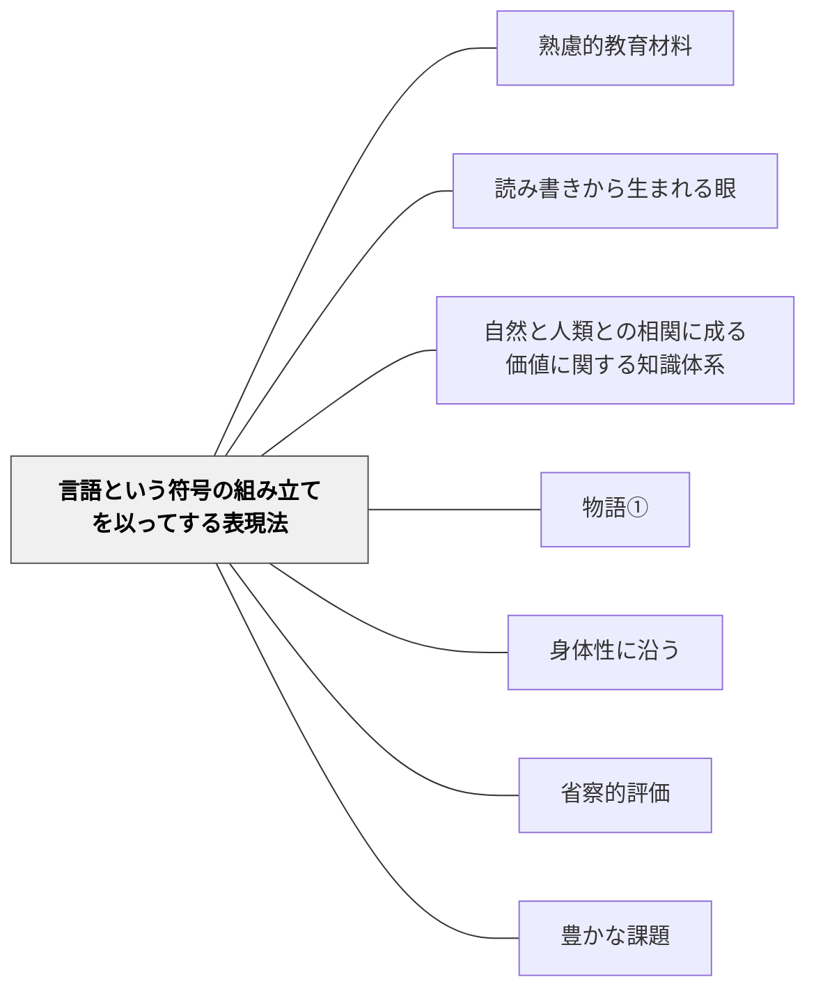

# 言語という符号の組み立てを以ってする表現法

> 歌・談話・文章・数式・音楽——言語的・記号的表現で価値を伝える。

## 背景（Context）

牧口常三郎の表現法分類の第四項目。言語・数式・音楽記号などの記号体系を使って価値を表現する活動。国語・数学・音楽・外国語など多くの教科がここに含まれる。読み書きが「概念装置」となり新しい認識を生む（内田義彦『読書と社会科学』）。

## 問題（Problem）

言語的表現の習得が「記号の習得」だけになると、表現の意味や力が失われる。

## 力のかたち（Forces）

- 言語・記号は人類最大の認知的道具
- 豊かな言語体験が概念形成を支える
- 過度な形式化が表現の喜びを奪う

## 解決（Solution）

**歌・談話・作文・数式・音楽など多様な言語的表現活動を教育材料として設計し、表現の意味と力を体感させる。**

## 結果（Consequences）

- 言語的表現力と概念形成が育つ
- 多様な記号体系を通じた理解が深まる

## 関連パタン

- [[パタン/熟慮的教材教具]] — 親パタン
- [[パタン/読み書きから生まれる眼]] — 読み書きによる概念形成
- [[パタン/自然と人類との相関に成る価値に関する知識体系]] — 上位分類

- [[パタン/物語①]] — 言語表現の典型としての物語・ナラティブ
- [[パタン/身体性に沿う]] — 言語的表現に身体的・感覚的体験を組み合わせる
- [[パタン/省察的評価]] — 表現活動を書いて振り返ることで言語理解が深まる
- [[パタン/豊かな課題]] — 言語表現を核にした豊かな課題設計
## クラスター図

## Actionable Insight

- 同じ内容を「文章で書く・数式で表す・歌や詩で表現する」のうち2種類で表現させる——異なる記号体系で同じ内容を表現する経験が概念の多面的な理解を育てる
- 作文・作詞・数式作成など「表現の創造」を学習の最終課題に位置づける——表現することが理解の深さの確認になる
- 学習者が記号・言語の形式だけを習得して意味を失っていないか、「この表現は何を伝えているか」と問い返す——意味と形式のつながりを意識させることが表現の力と概念形成を支える

## 出典

- 牧口常三郎（1972）『牧口常三郎全集第4巻 創価教育学体系 上』聖教新聞社
