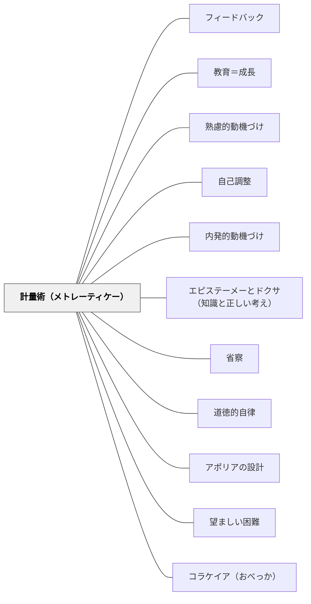

# 計量術（メトレーティケー）

> 近いものは大きく、遠いものは小さく見える。快楽も苦痛も同じように歪む。測り直すことが、正しい選択への唯一の道である。

## [Pattern Connection]

### プラトン『プロタゴラス』（前387年頃）——快楽・苦痛の計量と時間的バイアスの教育論

プラトン『プロタゴラス』（356c〜358d）でソクラテスが論証する「計量術（メトレーティケー）」は、人間の意思決定における時間的歪みを補正する知識の技術である。

**時間的バイアスの構造（356c〜d）：**
> 「同じ大きさの物が近くにあるか遠くにあるかで、より大きく見えたり、より小さく見えたりするように——快楽と苦痛も近くにあれば大きく見え、遠くにあれば小さく見える。」（356c〜d）

目の錯覚と同じく、時間的に**近い快楽は実際より大きく**見え、**遠い将来の利益は実際より小さく**見える。この歪みが誤った選択を生む。

**計量術（metrētikē technē）の役割（356d〜357b）：**
> 「測定術は見かけの力を消し去り、真実を明らかにして、魂を安定させる。」（357b）

快楽と苦痛を**大きさ・長さ・数**で正確に比較する技術——これが「計量術（メトレーティケー）」。人間の救済（ソーテーリア）はこの技術の習得にかかっている。

**「快楽に征服される」＝最大の無知（357e）：**
「快楽に征服される（アクラシア）」という現象は「性格の弱さ」ではなく「誤った計量」——時間的バイアスで近い快楽を過大評価した**無知（アグノイア）**の結果である。逆に言えば、正しく計量できれば誤った選択は起きない。

**教育の核心（358b〜c）：**
人間が誤った選択をするのは「悪いと知りながら欲望に負けた」のではなく「誤って計量した（比較の誤り）」からである。だから教育の役割は「意志力の強化」より「正しい比較・計量の技術を育てること」にある。

---

### プラトン『ゴルギアス』（前380年頃）——快楽と善の根本的相違（495b〜499b）：計量術の哲学的限界と深化

『プロタゴラス』の計量術は「快楽の正確な比較（計量）」によって正しい選択が可能になると論じた。しかし『ゴルギアス』では、カリクレスとの論争を通じて、これよりさらに深い問いが立てられる——「快楽を正確に計量しても、それが善とは限らない」。

**カリクレスの快楽主義と計量術の対決（492c〜499b）：**

カリクレスは「欲望を最大限に肥大化させ、それを満たし続けることが幸福・善・徳だ」と主張する。これは「快楽の最大化 = 最善の計量結果 = 善」という等式を前提にする。

ソクラテスはこれを内的矛盾で論駁する（495b〜499b）：

| ステップ | 内容 |
|---|---|
| 前提1 | 善と悪は同時に存在しない（相互排他的） |
| 前提2 | 快苦は同時に並行して存在する（喉が渇いている＝苦＋水を飲む＝快、同時進行） |
| 結論 | したがって、快楽と善は同一ではない |

**計量術の深化：快楽の計量から善の計量へ**

『プロタゴラス』の計量術は「快楽と苦痛の大きさ・時間・数」を比較する——**快楽の計量**。

しかし『ゴルギアス』は問う：計量の対象を「快楽」から「善」に変える必要があるのではないか？

| 計量の対象 | 内容 | 問題 |
|---|---|---|
| 快楽の計量（プロタゴラス的） | 快楽A vs 快楽B の大きさ・長さ・数を比べる | 最大の快楽が最善とは限らない |
| 善の計量（ゴルギアス的） | 「これは本当に善か（魂にとって）」を問う | より難しいが、真の意味で適切な計量 |

**教育への含意：**
計量術を「快楽の計量」として教えるだけでは、カリクレスの快楽主義と同じ土俵に乗る。「より多くの快楽を選ぶ技術」ではなく「善（魂にとって本当によいこと）を選ぶ技術」として計量術を教えることが、より深い目標になる。

**補強点**：計量術の前提（「快楽を正確に比較すれば正しく選べる」）に、ゴルギアス的問い（「快楽の最大化が本当に善か」）が加わる。「計量する対象の選択」が計量術の最も重要な問いとして浮上する。

**波及するパタン**：[[パタン/道徳的自律]] — 節度（ソーフロシュネー）は欲望の最大化でなく、欲望を適切に制御すること；[[パタン/コラケイア（おべっか）]] — 快楽を最大化する授業 = コラケイア；[[文献/ゴルギアス（プラトン）]] — 本統合の出典

---

## 背景（Context）

教室で子どもたちはしばしば「近くにある快楽（今すぐ楽しいこと）」に引き寄せられ、「将来の利益（学ぶことで得られること）」を後回しにする。「わかってはいるけどできない」「頭では正しいとわかるが行動が変わらない」——これは意志の弱さではなく、近くと遠くの「見かけの差」による判断の歪みかもしれない。

プラトンが前387年頃に記した対話篇『プロタゴラス』でソクラテスは、この「見かけによる誤り」を視覚の錯覚（近いものが大きく見える）と同じ構造として論じた。そして「測定術（計量術）」がこの錯覚を補正し、正しい選択を可能にすると論証した。

## 問題（Problem）

近い報酬（今すぐ楽しいこと・今すぐ楽なこと）は遠い報酬（将来の成果・長期的な喜び）より実際の価値以上に大きく見える。学習者が「今日の宿題より今すぐ遊ぶ」「努力の苦しさより手抜きの快楽」を選ぶとき、その選択が「悪い」ことを知りながら選んでいるとは限らない。正確に比較していないまま選んでいるのかもしれない。

教師が「やる気の問題」「意志力の問題」として扱うと、本当の問題（比較の技術の欠如）は見えないままになる。

## 力のかたち（Forces）

- 時間的近接性が快楽の見かけ上の大きさを歪める——「今」は「将来」よりいつも大きく感じられる
- 「計量なし」の選択は、目を閉じて歩くのと同じ——習慣的・衝動的に選んでしまう
- 「計量あり」の選択は、複数の選択肢を明示し比較する意識的な操作を必要とする
- 計量術は教えられる（テクネー）——性格の問題でなく、技術の問題として扱える
- 心理的安全性がなければ「今の選択を批判された」と感じ、自己評価が下がるリスクがある

## 解決（Solution）

**近い快楽と遠い利益を「測り直す」体験を設計する。時間軸を可視化し、選択肢を並べて比較する操作そのものを教える。「意志が弱い」を「計量が足りない」として扱い直す。**

---

### 計量術の授業設計

**ステップ1：近い快楽の「見かけの大きさ」を自覚させる**

「今すぐ遊ぶ」vs「宿題を先にやって後で遊ぶ」——どちらが「大きく見えるか」をクラスで話し合う。「見かけ上の大きさ」と「実際の大きさ（何分遊べるか・何点取れるか）」を区別する。

**ステップ2：時間軸を可視化する**

タイムラインに「今の快楽」「1時間後」「明日」「1週間後」の各時点での快楽・苦痛・利益を書き出す。「見かけの大きさ」と「実際の合計」がどう違うかを図解する。

**ステップ3：比較の言語を教える**

「今すぐ楽しい（小さな快楽×今）」と「後で大きく嬉しい（大きな快楽×後）」——どちらが「合計で大きいか」を計算する言語（「足したらどっちが多い？」「どっちが長く続く？」）を練習する。

**ステップ4：選択を「計量の誤り」として扱い直す**

うまくいかない選択をした子に「意志が弱い」でなく「どこで計量を間違えたかな？」と問い返す。「次に同じ場面が来たら、何を確かめてから選ぶ？」と計量プロセスの言語化を促す。

---

**具体例1：算数「今日サボる vs 今日やる」**

「今日の計算ドリルをサボって遊ぶ」と「今日やって明日ゆっくり遊ぶ」を天秤図に書く。「サボった場合の今後の苦痛（明日もあさっても溜まる）」を計算させる——「合計の苦痛はどっちが大きい？」

**具体例2：国語「書き直しの誘惑」**

「この文でいいや（楽）」と「もう一度読み返して直す（面倒）」のどちらを選ぶかを、「先生が読んだときの気持ち（将来の快楽）」と「今の楽さ」で比較する。

**具体例3：生活・道徳「友達に嘘をつく場面」**

「今すぐ叱られなくて楽」と「友達との信頼（長期の財産）」を並べて比較する。「今の快楽の大きさ」と「後で失うものの大きさ」を天秤で比べる体験。

## 結果（Consequences）

- 「なぜその選択をしたか」を自分で説明できるようになり、メタ認知的自己調整が育つ
- 「意志が弱い自分」から「計量を学べる自分」への自己観の転換が起きる
- 時間軸を含めた選択の比較が習慣になると、先延ばし・衝動的行動が減る
- 「すぐ楽しいことが悪い」という否定でなく「合計で比べる」という肯定的な視点を教える
- ただし、計量術だけで解決しない場合もある——感情・環境・習慣・社会的プレッシャーによる選択もあり、計量以外の支援が必要な場合がある

## 関連パタン
- [[パタン/フィードバック]]
- [[パタン/教育＝成長]]
- [[パタン/熟慮的動機づけ]] — 計量術は熟慮的動機付けの認識論的基盤
- [[パタン/自己調整]] — 計量術を実践することが自己調整の核心
- [[パタン/内発的動機づけ]] — 外発的・内発的の区別の前に「正しく比較する」計量術が必要
- [[パタン/エピステーメーとドクサ（知識と正しい考え）]] — 計量術は「正しい考え（ドクサ）」を「安定した知識（エピステーメー）」に高める根拠論
- [[パタン/省察]] — 「なぜその選択をしたか」を問い直す省察が計量術の実践形態
- [[パタン/道徳的自律]] — アクラシア（意志の弱さ）を無知として再定義することで、道徳的自律の論理的根拠が変わる
- [[パタン/アポリアの設計]] — 「なぜ正しいと知りながら選ばないのか」というアポリアが計量術の問いの起点
- [[パタン/望ましい困難]] — 遅延報酬を選ぶことの「心地よい難しさ」が成長のエンジン
- [[パタン/コラケイア（おべっか）]] — 快楽を最大化する授業＝コラケイア；善を目指す授業＝テクネー（ゴルギアス的計量の対象転換）

- [[概念/自己調整学習の内側（成長の道とウェルビーイングの道）]] — 意志を「強さ」ではなく「正しい計量」と見る立場。意志的方略の一つの読み方

## クラスター図

## Actionable Insight

- 衝動的な選択（宿題サボる・嘘をつく・手を抜く）をした場面で「今の快楽の大きさ」と「後で払うコスト」を二列で書かせる——計量の実践を1回やることで、次に同じ場面が来たとき「測り直す」習慣が生まれる
- 「意志が弱い」「やる気がない」という言葉を使わず「どこで計量を間違えたか」と問い返す——子どもの自己像を「弱い」から「まだ計量が練習中」に変える一言
- 授業の終わりに「今日学んだことを1週間後の自分が使うとしたら？」と問う——遠い将来の利益を「今」に引き寄せる計量の練習

---

## 出典

プラトン（渡辺邦夫訳）（2022）『プロタゴラス——あるソフィストとの対話』光文社古典新訳文庫（Bフ 2-1）, pp.356c–358d, 357e.

> 「測定術は見かけの力を消し去り、真実を明らかにして、魂を安定させる。」——プラトン『プロタゴラス』357b

プラトン（中澤務訳）（2022）『ゴルギアス』光文社古典新訳文庫（K-Bフ 2-7）, pp.495b–499b.
→ [[文献/ゴルギアス（プラトン）]] — 快楽と善の根本的相違：計量術の対象を「快楽」から「善」へ
