# 記号接地（Symbol Grounding）

> 記号（ことば）の意味は、身体的経験に「根を下ろす」ことで初めて生きた理解になる。経験なき記号は、空中に浮いた記号のままだ。

## [Pattern Connection]

### 今井むつみ・秋田喜美（2023）言語の本質——記号接地問題の教育的含意

認知科学者のスティーブン・ハルナッドが提起した「記号接地問題（Symbol Grounding Problem）」は、本書の中核を貫くテーゼである。

> 「記号を別の記号で表現するだけでは、いつまで経ってもことばの対象についての理解は得られない」

辞書の定義が別の語を使って定義され、その語がまた別の語で定義される——この循環は「記号から記号へのメリーゴーランド」である。そこから降りるには、身体・感覚・経験への接地（grounding）が必要。

**今井の実証データ（教師として衝撃的な事実）：**
- 小学5年生：「1/2と1/3のどちらが大きいか」の正答率が50%を下回る
- 小学5年生：「0.5と1/3のどちらが大きいか」の正答率 28.3%
- 中学2年生：「1＋1/2に最も近い整数は？」で「1」と答えた割合 26.5%

これは「分数という記号が身体・経験に接地できていない」ことの直接的な証拠。計算手続きは覚えていても、「半分」という感覚と「1/2」という記号がつながっていない。記号接地に失敗したまま先に進んでいる。

**AIとヒトの違いとしての記号接地：**
AIは「記号から記号への漂流」を続けながら驚異的な速度で知識を拡大できる。人間はそれができない——人間は記号が身体経験に接地できていないと、本当の意味では学習できない。この違いが、人間の教育に「具体的経験から先に」という順序の根拠を与える。

**補強点**：[[パタン/具体から抽象へ]] が「複数の具体事例→概念の言語化」という順序を示すとすれば、本パタンはその**理由**を提供する——具体から始めるのは単なる「わかりやすさ」のためではなく、記号を身体経験に接地させるための根本的な必要性から来る。

**波及するパタン**：[[パタン/身体的理解]]・[[パタン/半具体物]]・[[パタン/操作物による概念形成]]・[[パタン/具体から抽象へ]]・[[パタン/語彙指導]]・[[メタパタン/アブダクション（仮説形成）]]

---

### ウィトゲンシュタイン（1921）論理哲学論考——写像理論（Bildtheorie）：記号接地の哲学的起源

今井むつみ・秋田喜美（2023）が「記号接地問題（Symbol Grounding Problem）」として現代認知科学の文脈で定式化した問いに、ウィトゲンシュタインは1921年の『論理哲学論考』において哲学的な先行定式化を与えていた。

**写像理論（Bildtheorie）——命題は現実の像である（命題2–3）：**

> 「像（Bild）は現実に対する模型（Modell）である。」（2.12）

> 「名（Name）は対象の代わりをする。」（3.22）

命題（言語）が世界を「写す（abbilden）」ためには、命題と世界が論理形式（logische Form）を共有していなければならない（4.12）。この共有された論理形式が「接地」の哲学的基盤である——名と対象の間に接続がなければ、言語は現実を写せない。

**「接地の構造」の哲学的分析：**

| 現代認知科学（Harnad/今井） | 論理哲学論考（ウィトゲンシュタイン） |
|---|---|
| 記号接地問題：記号は経験に接地しなければ意味を持てない | 名は対象の代わりをする（3.22）：名の「意味（Bedeutung）」は対象そのもの |
| 記号から記号へのメリーゴーランド | 命題は命題によって定義できない——最終的に名と対象の接続に戻る |
| 身体経験への接地が必要 | 命題と世界の共有する論理形式が接地の基盤 |
| AIは接地なしに記号を操作できる | 言語は論理形式を「示す（zeigen）」ことしかできない——接地そのものは語れない |

**「語られえない接地」——Zeigenとしての接地：**
ウィトゲンシュタインが示す重要な逆説：命題と世界を繋ぐ論理形式（接地の条件）は、命題によって語ることができない——それは「示される（sich zeigen）」のみ（4.121）。

これは記号接地の教育的含意として重大である：記号が経験に接地した瞬間（「分かった！」という瞬間）は命題で語れない——それはただ示されるのみ。「理解した」という状態は語れず、示される。教師はその示しの場を設計するしかない。

**補強された点**：記号接地問題が「認知科学的な課題」としてのみ記述されてきたことに加え、「なぜ接地が成立するのか・その構造は何か」という哲学的問いへの答えがウィトゲンシュタインの写像理論から与えられる。名と対象の「代わりをする」という関係（3.22）が接地の哲学的基盤である。

**修正・拡張された点**：記号接地は「できる/できない」の二択ではない——「名が対象の代わりをしている度合い」として捉えられる。完全な接地（名と対象の完全な対応）と記号から記号への漂流（接地の失敗）の間に、程度の連続体がある。

**他のパタンへの波及**：[[パタン/語ることと示すこと（言語の限界）]] — 接地が成立する瞬間は語れず示される——Zeigenとして記号接地を理解する；[[文献/論理哲学論考（ウィトゲンシュタイン）]] — 本統合の出典

---

**堀江真文（2019）難しい数式はまったくわかりませんが、微分積分を教えてください！——「記号の逐次翻訳」という実践技法：**

堀江は、数学が苦手な社会人に微分積分を60分で教えるにあたって、新しい記号が出るたびに必ず日常言語で意味を翻訳するという技法を一貫して使う。

**記号の逐次翻訳（堀江版）：**

| 記号 | 翻訳された意味 | 教え方のポイント |
|---|---|---|
| Δ（デルタ） | 「変化」を表す記号。他の文字（x, t）とセットで使う | 「命令の意味はない——意味さえわかれば怖くない」 |
| lim | limitの略。「命令の意味を持つ道案内係」 | 「下に書いた条件の方向へ限りなく近づけなさい、という命令」 |
| d | differenceの頭文字。「Δの無限に小さい版」 | 「英語でASAPと略すのと同じ」 |
| ∫（インテグラル） | summation（足す）のsが伸びたもの | 「足しなさい、という意味。チンアナゴみたい」 |

記号への恐怖は「意味がわからないまま先に進む」ことから生まれる。逆に言えば、記号の意味を日常言語に落とすことで恐怖は消える——これが本書の核心的洞察である。

> 「数学脳が開花する瞬間があります。数式で書かれた世界と現実世界が突然つながる——その瞬間」——堀江（2019）

**「記号の意味化」が接地を完成させる：**

今井むつみ（2023）が「記号から記号へのメリーゴーランドから降りるには身体・経験への接地が必要」と論じたのに対し、堀江の技法は「記号が出るたびに日常言語（エリさんの歩く速度・グラフ・長方形の面積）への翻訳を行う」という実践的手順として記号接地を実現している。

**数学苦手の構造的診断：**
- 数式への苦手意識は「難しい計算ができない」のではなく、「記号の意味がわからないまま先に進んでしまっている」ことから生まれる
- 記号接地に失敗したままの状態で計算手続きを学ぶ = 「意味のない暗号を操作する」

**補強された点**：記号接地の「なぜ必要か」という理論的根拠（今井・ウィトゲンシュタイン）に対して、「どうやって実践するか」という教授的技法が加わる。「記号が出るたびに日常言語に翻訳する」という一貫した習慣が、記号接地の実践的実装である。

**他のパタンへの波及**：[[パタン/道具の限界から新概念へ（既知の壁を学びの入口に）]]（等速→非等速で記号の必要性を体感）；[[文献/難しい数式はまったくわかりませんが微分積分を教えてください（堀江真文）]]

---

### 数学ガールの物理ノート（結城浩, 2024）——「数式は言葉」という記号接地の新次元

ミルカ（第5章）: 「言葉が考える道具でもあり伝える道具でもあるのと同じだ。数式も考える道具でもあり伝える道具でもある。」

この言葉は、記号接地問題に対して数式固有のアプローチを示す。「数式に意味を接地する」とは、数式を言語として扱うことであり、現実の場面への接地と数学的言語能力の習得が重なり合う。数式は「身体経験に接地した言語」として機能するとき、初めて生きた記号になる。

**「収入と貯金」比喩（第4章）の記号接地分析：** 仕事（フロー）と力学的エネルギー（ストック）の区別を「収入と貯金」という日常的アナロジーで説明する場面。これは記号接地の典型的実践——抽象的な物理量（エネルギー）を身体的経験のある概念（貯金）に接地させることで、記号が意味を持つ。

- **補強された点**:
  - 今井（2023）が「記号から記号へのメリーゴーランドから降りるには身体経験への接地が必要」と論じた内容が、数式に対しても成立する——「数式の意味を別の数式で説明する」循環から降りるには「場面・アナロジー・言語への接地」が必要。
  - 堀江（2019）の「記号の逐次翻訳」と結城（2024）の「数式を言語として扱う」は同じ方向の実践であり、二つを合わせると「記号を出すたびに日常語・アナロジーに翻訳し、かつ数式を言語として継続的に使う」という複層的な接地設計が見える。

- **他のパタンへの波及**:
  - [[パタン/数式は言葉（式を読む・式で語る）]] — 「数式は言語」として扱うことは、記号接地の最終形態——単なる経験への接地ではなく、言語的思考ツールとしての接地。
  - [[パタン/二つの世界の橋（現象と数式を往来する）]] — 橋を渡る行為（現象↔数式の往来）が記号接地の実践形式。橋が架かるとき、記号は現実に接地されている。

→ [[文献/数学ガールの物理ノート・ニュートン力学（結城浩）]]

---

## 背景（Context）

学校では「計算手続き・漢字の書き方・語の定義」を教えることに多くの時間を使う。しかしその後、子どもが実際の場面でその知識を「使えない」という現象が繰り返される。「習ったはずなのに」「理解できているはずなのに」という齟齬。

これは「記号の操作（手続き）」と「記号の意味（概念の接地）」が分離したことによって起きる。分数の計算方法は知っていても、「分数とは何か」の身体的な感覚を持っていない子どもは、新しい文脈に出会ったとき手続きをどこに当てはめていいかがわからない。

ヒトは記号が身体・経験に接地していないとその先に進めない——これは今井ら認知科学者の共通見解であり、教育における「具体から抽象へ」の原則の認知科学的根拠でもある。

## 問題（Problem）

記号（語・数式・公式・定義）を先に教え、後から具体例を添えるという指導順序では、記号は空洞のまま「記号から記号へのメリーゴーランド」に入る。覚えた記号を次の記号に変換する手続きは学べても、それが「何を意味するのか」という接地が起きない。

**典型的な失敗の連鎖：**
1. 分数の計算手続きを教える（記号操作）
2. 分数の大小・小数との変換も手続きで教える
3. 「なぜ1/2 > 1/3か」を説明できない子どもが量産される
4. 中学で文字式に進んでも「記号から記号への漂流」が続く

## 力のかたち（Forces）

- 抽象的な概念ほど、身体経験への接地が難しい——「分数」「電流」「速度」「民主主義」は感覚の届かない場所にある
- 記号が「身体に接地していない」かどうかは、手続きができているうちは見えにくい——できない問題に直面するまで発覚しない
- 授業時間の制約が「まず手続きを教える」選択を促す
- 「接地作業」には時間がかかる——具体物の操作・実験・体験が必要
- AIと人間の学習の違い：AIは接地なしで記号から記号を繋ぎ続けられるが、人間はできない

## 解決（Solution）

**記号（語・数・式・概念）を導入する前に、それが指す「感覚的・身体的経験」を十分に積む。記号は「すでに持っている経験」に名前を与えるものとして後から登場させる。**

---

### 具体例①：分数指導での記号接地

記号「1/2」を書く前に：
- 折り紙を半分に折る（「等しく二つに分けた一つ」の感覚）
- 水を半分ずつ2つのコップに分ける
- リンゴを半分に切り、「これが半分、これも半分。同じ大きさ」を確認
- 「半分」「3分の1」「4分の1」を量として比べる

その後に「この感覚を記号で書くと 1/2 だ」と名前を与える。

---

### 具体例②：語彙指導でのオノマトペ足場

語「ざらざら・つるつる」を学ぶ前に：
- 実際に砂紙とガラスに触る
- 目を閉じて感覚の違いを確かめる
- 「この感覚を言葉で表すと……ざらざら？つるつる？」と問う

語が感覚に接地することで、次に出会う「ざらざら」が身体の記憶と連結する。オノマトペが語彙習得の足場として機能するのは、音と感覚イメージの間にアイコン的類似があるから（今井・秋田, 2023）。

---

### 具体例③：概念語の接地——「民主主義」

「多数決がすべてではない」という概念を記号から教える代わりに：
- クラスの給食メニューを多数決で決める→少数派の不満を体験する
- 「多数が選んでも損をする人がいた、これをどう考える？」と問う
- そこから「民主主義とは何か、多数決とは何か」の問いが生まれる

先に体験を積み、そこから概念語が接地する。

---

### 具体例④：算数「速度」の接地

公式 v = d/t を先に教える代わりに：
- 「同じ10mを1秒で走る人と2秒で走る人、どちらが速い？」を身体で確かめる
- 「速さ」の感覚を積み上げてから「速さ = 距離 ÷ 時間」という記号を与える

公式を「すでに知っている感覚の記号表現」として導入することで接地が起きる。

---

## 結果（Consequences）

- 記号が身体経験に接地することで、新しい文脈でも概念を「使える」ようになる
- 「習ったはずなのにできない」という分離が減る
- 転移（transfer）が起きやすくなる——接地された知識は文脈を超える
- 子どもが「これはあの感覚のことだ」と内側から気づく体験が学習の動機になる
- 記号操作の速度は下がる場合があるが、概念理解の深さは大きく増す

## 関連パタン
- [[パタン/アスペクトの気づき（もう見えていたのに見えていなかった）]]
- [[パタン/概念の芯をつかむ（地力の学び方）]]
- [[パタン/概念の創造（哲学）]]
- [[パタン/語ることと示すこと（言語の限界）]]
- [[パタン/授業と情報の区別]]
- [[パタン/数式は言葉（式を読む・式で語る）]]
- [[パタン/直接見えない対象への類推（認識論的に困難な文脈）]]
- [[パタン/定義から始める（言葉を厳密にする）]]
- [[パタン/二つの世界の橋（現象と数式を往来する）]]

- [[パタン/具体から抽象へ]] — 記号接地の教授論的実装
- [[パタン/身体的理解]] — 身体経験が接地の主要な経路
- [[パタン/半具体物]] — 抽象と具体の橋渡しとしての半具体物
- [[パタン/操作物による概念形成]] — 接地の素材としての実物
- [[パタン/語彙指導]] — 語彙の意味を経験に接地させる指導
- [[パタン/ミメーシス（模倣による学び）]] — 模倣（オノマトペ的な音模写を含む）が接地の出発点
- [[パタン/既知から未知へ]] — すでに接地された知識が新記号の足場になる
- [[パタン/数学語彙の文脈的指導]] — 数学語彙を文脈に接地させる指導
- [[メタパタン/アブダクション（仮説形成）]] — 記号接地に成功した知識からアブダクションが起動する
- [[パタン/誤概念の組み替え（素朴概念を資源にする）]] — 記号操作だけ覚えて概念が経験に接地していない状態が誤概念温存の主因。接地のやり直しが組み替えの中身になる

## クラスター図

```mermaid
flowchart LR
    ne8a898e58fb7e68ea5e59cb0efbc8853796d626f6c2047726f756e64696e67efbc89["記号接地（Symbol Grounding）"]
    ne382a2e382b9e3839ae382afe38388e381aee6b097e381a5e3818defbc88e38282e38186e8a68be38188e381a6e38184e3819fe381aee381abe8a68be38188e381a6e38184e381aae3818be381a3e3819fefbc89["アスペクトの気づき（もう見えていたのに見えていなかった）"]
    ne6a682e5bfb5e381aee88aafe38292e381a4e3818be38280efbc88e59cb0e58a9be381aee5ada6e381b3e696b9efbc89["概念の芯をつかむ（地力の学び方）"]
    ne6a682e5bfb5e381aee589b5e980a0efbc88e593b2e5ada6efbc89["概念の創造（哲学）"]
    ne8aa9ee3828be38193e381a8e381a8e7a4bae38199e38193e381a8efbc88e8a880e8aa9ee381aee99990e7958cefbc89["語ることと示すこと（言語の限界）"]
    ne68e88e6a5ade381a8e68385e5a0b1e381aee58cbae588a5["授業と情報の区別"]
    ne695b0e5bc8fe381afe8a880e89189efbc88e5bc8fe38292e8aaade38280e383bbe5bc8fe381a7e8aa9ee3828befbc89["数式は言葉（式を読む・式で語る）"]
    ne79bb4e68ea5e8a68be38188e381aae38184e5afbee8b1a1e381b8e381aee9a19ee68ea8efbc88e8aa8de8ad98e8ab96e79a84e381abe59bb0e99ba3e381aae69687e88488efbc89["直接見えない対象への類推（認識論的に困難な文脈）"]
    ne5ae9ae7bea9e3818be38289e5a78be38281e3828befbc88e8a880e89189e38292e58eb3e5af86e381abe38199e3828befbc89["定義から始める（言葉を厳密にする）"]
    ne4ba8ce381a4e381aee4b896e7958ce381aee6a98befbc88e78fbee8b1a1e381a8e695b0e5bc8fe38292e5be80e69da5e38199e3828befbc89["二つの世界の橋（現象と数式を往来する）"]
    ne585b7e4bd93e3818be38289e68abde8b1a1e381b8["具体から抽象へ"]
    ne8baabe4bd93e79a84e79086e8a7a3["身体的理解"]
    ne58d8ae585b7e4bd93e789a9["半具体物"]
    ne6938de4bd9ce789a9e381abe38288e3828be6a682e5bfb5e5bda2e68890["操作物による概念形成"]
    ne8aa9ee5bd99e68c87e5b08e["語彙指導"]

    ne8a898e58fb7e68ea5e59cb0efbc8853796d626f6c2047726f756e64696e67efbc89 --- ne382a2e382b9e3839ae382afe38388e381aee6b097e381a5e3818defbc88e38282e38186e8a68be38188e381a6e38184e3819fe381aee381abe8a68be38188e381a6e38184e381aae3818be381a3e3819fefbc89
    ne8a898e58fb7e68ea5e59cb0efbc8853796d626f6c2047726f756e64696e67efbc89 --- ne6a682e5bfb5e381aee88aafe38292e381a4e3818be38280efbc88e59cb0e58a9be381aee5ada6e381b3e696b9efbc89
    ne8a898e58fb7e68ea5e59cb0efbc8853796d626f6c2047726f756e64696e67efbc89 --- ne6a682e5bfb5e381aee589b5e980a0efbc88e593b2e5ada6efbc89
    ne8a898e58fb7e68ea5e59cb0efbc8853796d626f6c2047726f756e64696e67efbc89 --- ne8aa9ee3828be38193e381a8e381a8e7a4bae38199e38193e381a8efbc88e8a880e8aa9ee381aee99990e7958cefbc89
    ne8a898e58fb7e68ea5e59cb0efbc8853796d626f6c2047726f756e64696e67efbc89 --- ne68e88e6a5ade381a8e68385e5a0b1e381aee58cbae588a5
    ne8a898e58fb7e68ea5e59cb0efbc8853796d626f6c2047726f756e64696e67efbc89 --- ne695b0e5bc8fe381afe8a880e89189efbc88e5bc8fe38292e8aaade38280e383bbe5bc8fe381a7e8aa9ee3828befbc89
    ne8a898e58fb7e68ea5e59cb0efbc8853796d626f6c2047726f756e64696e67efbc89 --- ne79bb4e68ea5e8a68be38188e381aae38184e5afbee8b1a1e381b8e381aee9a19ee68ea8efbc88e8aa8de8ad98e8ab96e79a84e381abe59bb0e99ba3e381aae69687e88488efbc89
    ne8a898e58fb7e68ea5e59cb0efbc8853796d626f6c2047726f756e64696e67efbc89 --- ne5ae9ae7bea9e3818be38289e5a78be38281e3828befbc88e8a880e89189e38292e58eb3e5af86e381abe38199e3828befbc89
    ne8a898e58fb7e68ea5e59cb0efbc8853796d626f6c2047726f756e64696e67efbc89 --- ne4ba8ce381a4e381aee4b896e7958ce381aee6a98befbc88e78fbee8b1a1e381a8e695b0e5bc8fe38292e5be80e69da5e38199e3828befbc89
    ne8a898e58fb7e68ea5e59cb0efbc8853796d626f6c2047726f756e64696e67efbc89 --- ne585b7e4bd93e3818be38289e68abde8b1a1e381b8
    ne8a898e58fb7e68ea5e59cb0efbc8853796d626f6c2047726f756e64696e67efbc89 --- ne8baabe4bd93e79a84e79086e8a7a3
    ne8a898e58fb7e68ea5e59cb0efbc8853796d626f6c2047726f756e64696e67efbc89 --- ne58d8ae585b7e4bd93e789a9
    ne8a898e58fb7e68ea5e59cb0efbc8853796d626f6c2047726f756e64696e67efbc89 --- ne6938de4bd9ce789a9e381abe38288e3828be6a682e5bfb5e5bda2e68890
    ne8a898e58fb7e68ea5e59cb0efbc8853796d626f6c2047726f756e64696e67efbc89 --- ne8aa9ee5bd99e68c87e5b08e

    classDef hub fill:#f0f0f0,stroke:#555,color:#000,font-weight:bold
    class ne8a898e58fb7e68ea5e59cb0efbc8853796d626f6c2047726f756e64696e67efbc89 hub
```

## Actionable Insight

- 新しい概念語を導入する前に「この言葉が指す経験・感覚を子どもたちはすでに持っているか？」を問う——持っていない場合は先に体験を設計する
- 算数の単元開始時に「この数・式・記号を使う前に身体でわかることはあるか」を確認する——具体操作で「感覚」を作ってから記号を与える順序にする
- 子どもが「記号は言えるが使えない」状態（記号接地の失敗）を見つけたとき、手続き練習を増やすのでなく「この記号が指す経験」に戻る
- オノマトペ（ざらざら・ふわふわ・ギザギザ）を感覚語彙の入り口として積極的に使う——感覚イメージとの接地がある言葉は語彙習得の足場になる

## 出典

今井むつみ・秋田喜美（2023）．『言語の本質 ことばはどう生まれ、進化したか』中央公論新社（中公新書2756）．

> 「人間は、記号が身体、あるいは自分の経験に接地できていないと学習できない。かたやAIは大量の（そして誤りのない良質な）データを受け取れば受け取るほど、記号から記号への漂流を続けながら、知識を驚異的なスピードで拡大し続けることができるのである。」——今井むつみ・秋田喜美（2023）

Harnad, S. (1990). The symbol grounding problem. *Physica D: Nonlinear Phenomena*, 42(1–3), 335–346.
