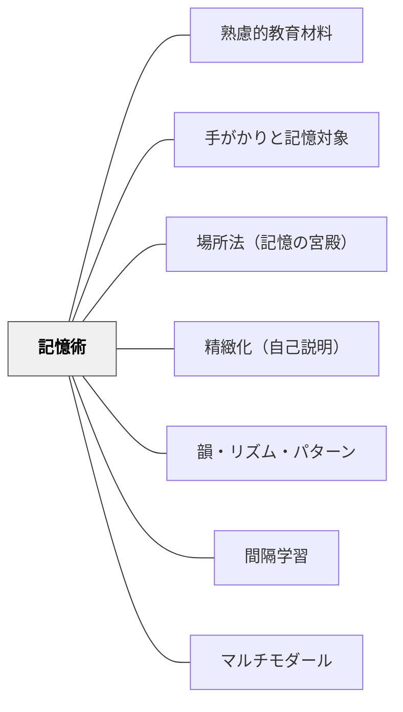

# 記憶術

> 記憶しにくい情報を覚えやすくする技法（ニーモニクス）を教材に組み込む。

---

## [Pattern Connection]

**Jo Rokuhara（年不詳）統合（2026-05-21）：**

『一流の記憶法』は記憶術を「9つの記憶の原則と14の記憶術」として体系化している。本書の統合により、記憶術パタンの「韻・頭字語・イメージ・物語・場所法」というリストが、目的・情報数・習得コストによる選択基準を伴う体系に発展した。

- **既存パタンとの関連**：本パタンの「意味ある連想が記憶の定着を高める」という原則は、本書の核心「記憶はすべて手がかりと記憶対象の連合で成立する」（→ [[パタン/手がかりと記憶対象]]）として理論的に裏づけられた。記憶術は「手がかりと記憶対象の連合を強化する技術」として統一的に理解できる。
- **補強された点**：「情報数による使い分け基準」が明確になった（5個以下→頭文字法、5〜20個→物語法、20個以上→場所法）。また、世界記憶力選手権（5分で520桁の数字、19.41秒でトランプ52枚）の記録が示すように、記憶術は才能でなく習得可能な技術だという根拠が加わった。
- **新しい実装**：場所法（記憶の宮殿）が「最強の記憶術」として独立パタン化された（→ [[パタン/場所法（記憶の宮殿）]]）。
- **他のパタンへの波及**：[[パタン/手がかりと記憶対象]] ——記憶術の理論的基盤。[[パタン/間隔学習]] ——記憶術で覚えた後も、間隔を空けた想起練習で定着させる必要がある。

---

### 記憶術の6分類（Jo Rokuhara, 年不詳）

| 記憶術 | 概要 | 最適情報数 | 習得コスト |
|-------|------|----------|----------|
| **関係法（仲介役）** | 手がかりAと記憶対象Bの間に仲介役Xを置く | 任意 | 低 |
| **語呂合わせ法** | 音韻的な仲介役で数字・固有名詞を変換 | 〜10個 | 低 |
| **頭文字法** | 複数情報の頭文字を組み合わせて語句にする | 〜5個 | 低 |
| **一連法** | 音楽のリズム・物語の流れで情報を覚える | 5〜20個 | 中 |
| **ペグ法** | 身体部位・音韻対応の「ペグ」に情報を結びつける | 〜50個 | 中 |
| **場所法** | 馴染みの場所のポイントに情報を配置する | 20個〜 | 低〜中 |

#### 情報数による選択基準

```
5個以下  → 頭文字法が最も手軽
5〜20個  → 物語法（一連法）が適切
20個以上 → 場所法（記憶の宮殿）が最適解
```

#### 関係法（必ず習得すべき基本技術）

手がかりAから記憶対象Bを直接結びつけられないとき、仲介役Xを設置する。

**仲介役の発見法（3ステップ）**：
1. 記憶対象から連想できることをすべて挙げる
2. 手がかりから連想できることをすべて挙げる
3. 両者の掛け合わせで音韻的・意味的類似を使う

例：「大政奉還（1867年）」→ 語呂合わせ「一発ロック（1867）」が仲介役

## 背景（Context）

韻・頭字語・イメージ・物語・場所法など、記憶を助ける技法（ニーモニクス）の教材への応用。暗記が必要な内容（元素記号・歴史年号・語彙など）に有効。単純な反復記憶より意味のある連想・構造化が定着を高める。

## 問題（Problem）

意味のない情報（記号・固有名詞など）は短期記憶に留まりやすく、反復しないと忘れる。

## 力のかたち（Forces）

- 意味ある連想が記憶の定着を高める
- 韻・リズム・物語は記憶の手がかりになる
- 記憶術への依存が深い理解を妨げることもある

## 解決（Solution）

**暗記が必要な内容に対して、韻・頭字語・イメージ・物語・場所法などの記憶術を教材に組み込む。記憶術は足がかりとし、理解への橋渡しとして使う。**

## 結果（Consequences）

- 必要な情報の記憶定着が改善する
- 学習者が自分なりの記憶術を開発できる

## 関連パタン

- [[パタン/熟慮的教材教具]] — 親パタン
- [[パタン/手がかりと記憶対象]] — 記憶術の理論的基盤（すべての記憶術は手がかり-記憶対象連合の強化技術）
- [[パタン/場所法（記憶の宮殿）]] — 最強の記憶術。20個以上の情報を順序記憶するための独立パタン
- [[パタン/精緻化（自己説明）]] — 意味づけによる記憶
- [[パタン/韻・リズム・パターン]] — 記憶術としての韻律
- [[パタン/間隔学習]] — 記憶術で覚えた後も定着には間隔を空けた想起が必要
- [[パタン/マルチモダール]] — 多感覚的イメージ作成（場所法・ペグ法の基盤）

## クラスター図



## Actionable Insight

- 暗記が必要な内容（年号・元素記号・用語など）に頭字語や韻を1つ考えて提示する——意味ある連想が無意味な反復より長期記憶への定着を高める
- 「この知識を覚えるための自分なりの覚え方を作ってみよう」と学習者に記憶術の創作を促す——自分で作った連想は他者に与えられた連想より強く記憶に残る
- **情報数が20個以上の語彙リストや歴史の流れには「場所法」を1時間で教える**——生徒が「覚えられた！」という成功体験を得ることで主体的な記憶術活用が始まる
- 記憶術はあくまで「入り口」として扱い「なぜそうなるか」という理解へ必ずつなげる——理解なき記憶術への依存が深い学習を妨げないよう橋渡しを意識する

## 出典

- 鈴木克明（2002）『教材設計マニュアル――独学を支援するために』北大路書房
- Jo Rokuhara（年不詳）『一流の記憶法：あなたの頭が劇的に良くなり「天才への扉」がひらく』知之鳥出版（Kindle版）
