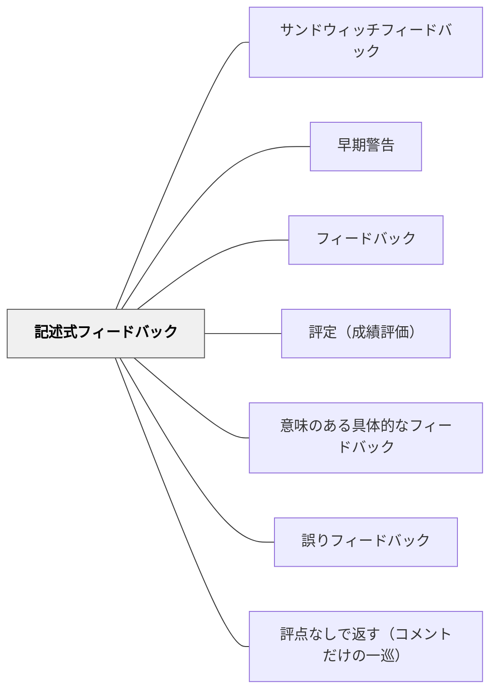

# 記述式フィードバック

> 「B+」ではなく、「この段落の主張は明確だが、根拠が一例しかない。もう一つ追加するとより説得力が増す」と書く。

## 背景（Context）

学習者が作品・課題・パフォーマンスを提出したとき、教師はそれに何らかの応答をする。記号や数値による評定は伝達が速く管理しやすいが、学習者に改善のための情報を届けるという点では限界がある。コメント・文章による記述式フィードバックは、評定に比べてはるかに豊かな情報を持ち、学習改善に直接つながる手段として注目されてきた。

記述式フィードバックは、添削、コメント、ルーブリックへの記入、音声コメント、対話的なやり取りなど多様な形をとる。対面でも書面でもデジタルでも実践できる。

## 問題（Problem）

評定だけでは「結果」しか伝わらず、学習者は次に何をすればよいかわからない。一方、記述式フィードバックを書くにはコストと技術が必要であり、時間がかかる。内容が曖昧だったり、量が多すぎたりすると、かえって学習者が混乱したり、フィードバックを読まなくなったりすることもある。

また、記述が称賛か批評かのどちらかに偏ると、学習改善には結びつかない。「すばらしい作品でした」という称賛も、「ここが間違っています」だけの批評も、それ単体では行動可能な情報とは言いにくい。

## 力のかたち（Forces）

- 記述は評定より多くの情報を含み、学習者の改善を具体的に方向づけられる
- 教師側のコストが大きく、フィードバックの質が教師のスキルと時間に依存する
- 学習者が記述を読まない・活用しないという問題が起きやすい

## 解決（Solution）

記述式フィードバックは、現在の到達点・ギャップ・次の一歩の三要素を含むように意識して書く。「何がよかったか」「何が不十分か」「具体的にどう改善するか」を一つか二つに絞って伝える。全てを指摘しようとせず、最も重要な改善点に焦点を当てる。

フィードバックを受け取った後に学習者が行動できるよう、授業の設計として「受け取ったフィードバックを基に改訂する時間」を確保することが重要である。フィードバックを書くことと同じくらい、それを活用する機会のデザインが必要である。[[パタン/評定（成績評価）]]と分離して、評定なしでコメントのみを返す機会を作ることも有効である。

## 結果（Consequences）

- 学習者が具体的な改善行動をとりやすくなる
- 評定より記述の方が学習改善に効果的であることがメタ分析で示されている（Hattie）
- **ただし、記述に評点を添えると記述の効果は消える**。Butler（1988）では「コメントのみ」群だけが得点を約3分の1上げ、「評点＋コメント」群は「評点のみ」群と同様に低下した。Butler（1987）でも、コメント群だけが評点群・称賛群・無フィードバック群より1標準偏差高かった。つまり本パタンの効果は、[[パタン/評定（成績評価）]] と**同居させないこと**を条件としている（Black & Wiliam, 1998）
- フィードバックが最も効果的なのは、正誤を示すだけでなく**元の学習との関係で誤りへの思慮深いアプローチを促す**よう設計されているとき。鍵は学習者側の応答における「マインドフルネス」である（Bangert-Drowns et al., 1991・平均効果量0.58）
- フィードバックの量・質・タイミングに注意しないと、効果が限定的になる

## 関連パタン
- [[パタン/サンドウィッチフィードバック]]
- [[パタン/早期警告]]

- [[パタン/フィードバック]] — 親パタン
- [[パタン/評定（成績評価）]] — 対比：記述より情報が乏しい総括的フィードバック
- [[パタン/意味のある具体的なフィードバック]] — 記述の内容として求められる質
- [[パタン/誤りフィードバック]] — 誤りに特化した記述式フィードバックの形
- [[パタン/評点なしで返す（コメントだけの一巡）]] — 本パタンが効くための前提条件を制度化したもの。評点と同居させない
- [[概念/自我関与と課題関与（フィードバックが向ける先）]] — 記述が効き、評点と称賛が効かない理由を説明する軸
- [[文献/Assessment and Classroom Learning（Black & Wiliam）]] — 記述式が唯一効いたことを実験で示した系統的レビュー（Black & Wiliam, 1998）

- [[概念/形成的評価の5つの戦略（3×3の枠組み）]] — 戦略③「学習者を前進させるフィードバック」の実装

## クラスター図

## Actionable Insight

- フィードバックを書くとき「何がよかったか・何が不十分か・具体的にどう改善するか」の3要素のうち最も重要な1点に絞る——全部指摘より一点集中が学習者の改善行動を促す
- フィードバックを渡した後に必ず「読んで改善する時間」を授業に設ける——改善機会のないフィードバックは行動に結びつかない
- 評定なしでコメントのみを返す機会を単元に1回作る——評定と分離することで学習者がコメントを真剣に読む

## 出典

Hattie, J. (2009). *Visible Learning*. Routledge.
Black, P. & Wiliam, D. (1998). Assessment and Classroom Learning. *Assessment in Education*, 5(1), 7–74.
